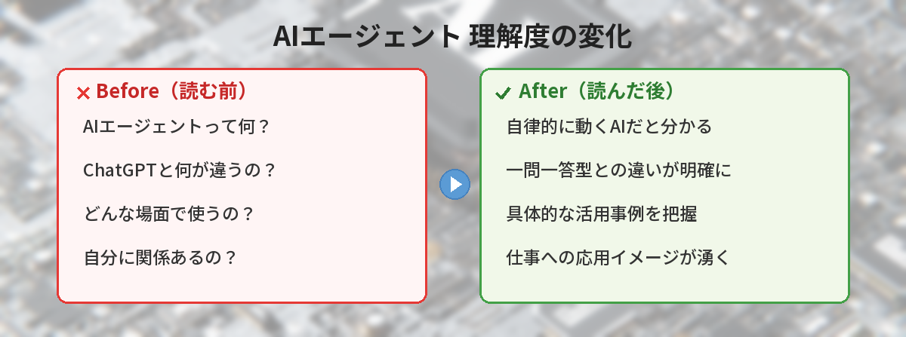
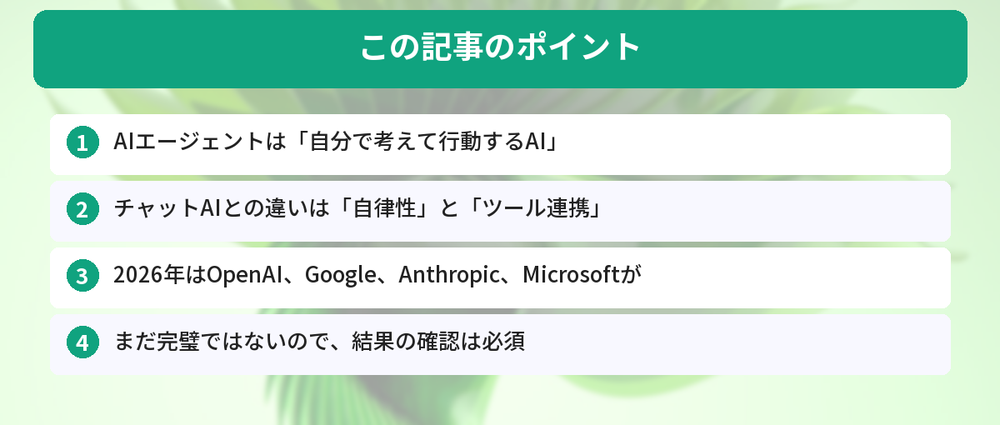

## この記事で分かること


最近「AIエージェント」ってよく聞くんだけど、ChatGPTとは違うの…？何ができるのか全然イメージわかないんだけど。



ざっくり言うと「自分で考えて動いてくれるAI」だよ。ChatGPTは聞かれたことに答えるだけだけど、AIエージェントは目標を伝えるだけで勝手にタスクをこなしてくれるんだ。具体例つきで解説するね。


「AIエージェントって最近よく聞くけど、ChatGPTと何が違うの？」

2026年、AI業界で最も注目されているキーワードが「AIエージェント」です。ChatGPTのようなチャットAIとの違いと、実際にどう使われているのかを解説します。

## AIエージェントとは

AIエージェントを一言で説明すると、**「自分で考えて、自分で行動するAI」** です。

従来のChatGPTのようなAIは、こちらが質問するたびに1回ずつ答えを返す「一問一答型」でした。AIエージェントは違います。

### チャットAIとAIエージェントの違い

| | チャットAI（ChatGPT等） | AIエージェント |
|---|---|---|
| 動き方 | 質問に1回ずつ回答 | 目標に向かって自律的に行動 |
| 操作 | 毎回指示が必要 | 最初の指示だけでOK |
| ツール利用 | 基本はテキスト生成 | Web検索、ファイル操作、API連携など |
| 判断 | 指示された範囲で回答 | 自分で次のステップを判断 |

例えるなら：
- **チャットAI** = 質問に答えてくれる辞書
- **AIエージェント** = 仕事を任せられるアシスタント



## 具体的に何ができるのか


表で見ると違いは分かったけど、実際どんな場面で使うのかイメージしにくいな…。具体例ってある？



もちろん！旅行の計画とデータ分析の2つの例で見てみよう。チャットAIとの違いが一目瞭然だよ。


### 例1：旅行の計画

**チャットAIの場合：**
1. 「沖縄のおすすめホテルは？」→ 回答を受け取る
2. 「那覇空港からの移動手段は？」→ 回答を受け取る
3. 「おすすめの観光スポットは？」→ 回答を受け取る
4. 自分で情報をまとめて計画を作る

**AIエージェントの場合：**
1. 「4月末に沖縄旅行を計画して。予算15万円、2泊3日で」と伝える
2. エージェントが自動で以下を実行：
   - フライトの候補を検索
   - ホテルの空き状況を確認
   - 観光スポットを調べて日程に組み込む
   - 予算内に収まるプランを作成

ChatGPTの基本的な使い方については[ChatGPTの始め方ガイド](/posts/chatgpt-first-step/)を参考にしてください。

### 例2：データ分析

**チャットAIの場合：**
1. データをコピペして「分析して」と依頼
2. 結果を見て「グラフにして」と追加依頼
3. 「前月と比較して」とさらに依頼

**AIエージェントの場合：**
1. 「売上データを分析して、問題点と改善案をレポートにまとめて」と伝える
2. エージェントが自動で以下を実行：
   - データを読み込み
   - 前月・前年との比較分析
   - グラフ作成
   - 問題点の特定
   - 改善案の提案
   - レポートとして出力

## 2026年の主要AIエージェント


なるほど、エージェントって本当に「お任せ」できるんだね。でも実際どの会社のを使えばいいの？



2026年は4大プレイヤーが競争してるよ。それぞれ得意分野が違うから、自分の使い方に合ったものを選ぶのがポイントだね。


### OpenAI「GPTs」と「Operator」

ChatGPTの開発元OpenAIは、カスタムGPTs（特定の目的に特化したAI）に加え、Webブラウザを操作できる「Operator」を提供しています。実際にWebサイトを操作して予約や購入ができます。

### Google「Gemini」のエージェント機能

GoogleのGeminiは、Gmail、Googleカレンダー、Googleドキュメントなど、Googleのサービスと連携して自律的にタスクを実行できます。GeminiとChatGPTの違いについては[Gemini vs ChatGPT比較記事](/posts/gemini-vs-chatgpt/)で詳しく解説しています。

### Anthropic「Claude」のコンピュータ操作

Claudeの開発元Anthropicは、AIがパソコンの画面を見ながら操作する「Computer Use」機能を提供。マウスやキーボードを使って実際にアプリを操作できます。Claudeの特徴については[Claudeとは？ChatGPTとの違いを解説](/posts/claude-what-is-it/)もあわせてご覧ください。

### Microsoft「Copilot」のエージェント

Microsoft 365に組み込まれたCopilotは、Word、Excel、PowerPoint、Teamsなどを横断して作業を自動化できます。

## AIエージェントの注意点

### 1. まだ完璧ではない

AIエージェントは便利ですが、間違った判断をすることもあります。重要な作業は結果を必ず確認しましょう。

### 2. セキュリティに注意

AIエージェントにWebサイトのログイン情報やクレジットカード情報を渡す場合は、セキュリティリスクを理解した上で使いましょう。

### 3. コストがかかる場合がある

多くのAIエージェント機能は有料プランで提供されています。無料で使える範囲を確認してから始めるのがおすすめです。AIを使って副業を考えている方は[AIを使った副業の始め方](/posts/ai-side-job-beginner/)も参考になります。

## 初心者はまず何から始めるべきか

いきなりAIエージェントを使いこなす必要はありません。以下のステップで進めましょう。

1. **まずはChatGPTに慣れる** → 一問一答でAIとのやり取りに慣れる（[ChatGPTの始め方はこちら](/posts/chatgpt-first-step/)）
2. **カスタムGPTsを試す** → 特定の目的に特化したAIを使ってみる
3. **エージェント機能を試す** → 簡単なタスクから自動化を体験する

## 実際にAIエージェントを2週間使ってみた感想

筆者は2週間にわたって、OpenAIのOperatorとGeminiのエージェント機能を日常業務で使い比べてみました。

**使用期間：** 14日間（平日の業務時間中心）

**良かった点：**
- 出張の手配（ホテル検索→比較→候補リスト作成）が従来40分かかっていたのが10分に短縮
- 定例レポートの下書き作成を任せたら、自分で書くより構成が整理されていた
- 「次に何をすべきか」を自分で判断してくれるので、指示出しの手間が激減

**イマイチだった点：**
- たまに的外れな判断をする（沖縄出張なのに北海道のホテルを提案されたことがある）
- 処理に時間がかかる場面があり、簡単なタスクはチャットAIの方が速い

**結論：** 「複数ステップの作業」にはエージェントが圧倒的に便利。ただし結果の確認は必須で、単純な質問には従来のチャットAIで十分。

## 筆者がAIエージェントを使って感じたこと

実際にChatGPTのGPTsやAutoGPTを試してみた感想を書きます。

### 便利だった場面

- **リサーチの自動化**: 「〇〇について調べて、要点を5つにまとめて」と指示するだけで、複数のソースから情報を集めてくれた
- **定型作業の自動化**: 毎週のレポート作成を、データを渡すだけで完成形まで仕上げてくれた

### まだ課題だと感じた点

- **指示が曖昧だと暴走する**: 「いい感じにして」だと予想外の方向に進むことがある
- **途中経過の確認が必要**: 完全に任せきりにすると、意図と違う結果になることがある

結論として、AIエージェントは「優秀だけど放置はできないアシスタント」という印象です。

## よくある質問（FAQ）

### Q: AIエージェントは無料で使えますか？
A: ツールによります。ChatGPTの無料プランでもGPTsは利用できますが、Operatorなどの高度なエージェント機能は有料プランが必要な場合があります。まずは無料枠で試してみるのがおすすめです。

### Q: AIエージェントに仕事を任せて大丈夫ですか？
A: 現時点では、結果の確認は必須です。AIエージェントは便利ですが、間違った判断をすることもあります。重要な意思決定や金銭に関わる操作は、必ず人間がチェックしましょう。

### Q: ChatGPTとAIエージェントは別のツールですか？
A: 別のツールというよりも、ChatGPTが進化してエージェント機能を搭載した形です。ChatGPTの中でGPTsやOperatorを使うことで、エージェント的な動きが可能になります。

### Q: プログラミングの知識がなくてもAIエージェントは使えますか？
A: 使えます。ChatGPTのGPTsやGoogleのGeminiなど、プログラミング不要で利用できるエージェント機能が増えています。自然言語で指示するだけで動いてくれます。

### Q: AIエージェントとAIコーディングアシスタントの違いは何ですか？
A: AIコーディングアシスタントはプログラミング作業に特化したツールです。AIエージェントはより広い範囲のタスクを自律的にこなします。コーディング分野のエージェントについては[AIコーディングアシスタント比較の記事](/posts/ai-coding-assistant/)で詳しく紹介しています。


「仕事を任せられるアシスタント」って例え、すごく分かりやすかった！まずはChatGPTに慣れるところから始めてみるね。



それがベストだよ。ChatGPTで一問一答に慣れてから、カスタムGPTsやエージェント機能にステップアップしていくと自然に使いこなせるようになるよ。


## まとめ

- AIエージェントは「自分で考えて行動するAI」
- チャットAIとの違いは「自律性」と「ツール連携」
- 2026年はOpenAI、Google、Anthropic、Microsoftが競争中
- まだ完璧ではないので、結果の確認は必須
- まずはChatGPTに慣れてから段階的にステップアップ

---

### あわせて読みたい
- [ChatGPTの始め方 ― 初心者向け完全ガイド](/posts/chatgpt-first-step/)
- [Gemini vs ChatGPT ― どっちを使うべき？](/posts/gemini-vs-chatgpt/)
- [Claudeとは？ChatGPTとの違いを解説](/posts/claude-what-is-it/)

