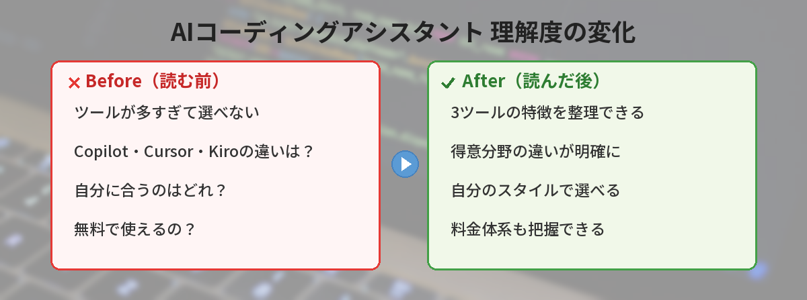

## この記事で分かること


AIがコード書いてくれるツールがいっぱいあるみたいなんだけど、どれを選べばいいの…？違いが分からなくて困ってる。



代表的なのはCopilot・Cursor・Kiroの3つだね。それぞれ得意なことが全然違うから、自分のスタイルに合ったものを選ぶのがポイントだよ。比較しながら見ていこう。


「AIがコードを書いてくれるらしいけど、どれを使えばいいの？」

GitHub Copilot、Cursor、Kiroの3つを比較して、それぞれどんな人に向いているかを整理します。AIツール全般の選び方については[Google検索とChatGPTの使い分けガイド](/posts/ai-vs-google-search/)も参考になります。



## 3つのツールの概要

| ツール | 開発元 | 特徴 |
|---|---|---|
| GitHub Copilot | GitHub（Microsoft） | VS Code等に統合。コード補完が中心 |
| Cursor | Anysphere | AI特化エディタ。チャットでコード生成 |
| Kiro | Amazon | スペック駆動開発。要件→設計→実装を段階的に |

## GitHub Copilot

### 得意なこと

- コードを書いている途中で、次の行を予測して提案してくれる
- 関数名やコメントを書くと、中身を自動生成してくれる
- ほぼすべてのプログラミング言語に対応

### 使い方のイメージ

VS Codeで普通にコードを書いていると、グレーの文字で候補が表示されます。Tabキーを押すだけで採用できます。

### 向いている人

- すでにコードが書ける人
- 補完で作業スピードを上げたい人
- 既存のエディタ環境を変えたくない人

### 料金

- 無料プランあり（月2,000回の補完）
- 個人プラン: 月額10ドル
- ビジネスプラン: 月額19ドル/人

## Cursor


Copilotは補完メインなんだね。もっとガッツリAIに書いてもらいたい場合はどうすればいいの？



それならCursorがぴったり。エディタ全体がAIと一体化してて、「この関数リファクタして」みたいな大きな指示もできるんだ。


### 得意なこと

- エディタ全体がAIと連携している
- チャットで「この関数をリファクタリングして」と指示できる
- ファイルをまたいだ大きな変更もAIが提案してくれる

### 使い方のイメージ

Cmd+K（Ctrl+K）でAIに指示を出すと、コードの変更差分が表示されます。承認するだけで反映されます。

### 向いている人

- AIにガッツリ頼りたい人
- 新しいエディタに抵抗がない人
- 個人開発やプロトタイピングが多い人

### 料金

- 無料プランあり（機能制限あり）
- Proプラン: 月額20ドル
- Businessプラン: 月額40ドル/人

## Kiro

### 得意なこと

- 「スペック」という仕組みで、要件定義→設計→タスク分解→実装を段階的に進められる
- 各ステップでユーザーがレビュー・修正できるので、意図とズレにくい
- ステアリングファイルでプロジェクトのルールをAIに伝えられる
- エージェントフックで、ファイル保存時に自動でlintを走らせるなどの自動化ができる

### 使い方のイメージ

「ログイン機能を作りたい」と伝えると、まず要件を整理し、次に設計を提案し、承認後にタスクを1つずつ実装していきます。

### 向いている人

- 設計からしっかりやりたい人
- チーム開発でAIの出力を管理したい人
- 「AIに丸投げ」ではなく「AIと一緒に考えたい」人

AIエージェントの概念について詳しく知りたい方は[AIエージェントとは？ChatGPTとの違いと活用事例](/posts/ai-agent-what-is-it/)をご覧ください。

### 料金

- 無料で利用可能

## 比較まとめ


表で見ると特徴がはっきりしてるね。でも実際使ってみないと分からない部分もありそう…。



その通り。3つとも無料プランがあるから、まずは1週間ずつ試してみるのがおすすめだよ。自分のコーディングスタイルに合うかどうかは、使ってみないと分からないからね。


| 観点 | Copilot | Cursor | Kiro |
|---|---|---|---|
| メインの使い方 | コード補完 | チャットでコード生成 | スペック駆動開発 |
| 学習コスト | 低い | 中程度 | 中程度 |
| 大規模な変更 | 苦手 | 得意 | 得意 |
| 設計支援 | なし | 限定的 | 充実 |
| 無料プラン | あり | あり | あり |
| エディタ | VS Code等に統合 | 専用エディタ | 専用IDE |

## 3つのツールを1ヶ月ずつ試した正直な感想

筆者はCopilot→Cursor→Kiroの順に、それぞれ1ヶ月間メインのコーディングツールとして使いました。

**Copilot（1ヶ月目）：**
- タイピング量が体感で30%減った
- 補完の精度は8割くらい。残り2割は的外れで消す作業が発生
- 既存のVS Code環境をそのまま使えるのが楽

**Cursor（2ヶ月目）：**
- Cmd+Kでの指示が快適すぎて戻れなくなった
- ファイルをまたいだリファクタリングが一発でできたときは感動
- ただし月20ドルの出費は個人開発者には少し重い

**Kiro（3ヶ月目）：**
- 要件定義から設計まで一緒に考えてくれるのが新鮮
- 「何を作るか」が曖昧なプロジェクトで特に威力を発揮
- 無料で使えるのが地味にありがたい

**結論：** 日常のコーディングにはCopilot、新機能の設計にはKiro、プロトタイプの高速開発にはCursorという使い分けに落ち着きました。

## 筆者が3ヶ月使い比べた感想

GitHub Copilot、ChatGPT、Claudeを3ヶ月間使い比べた正直な感想です。

### GitHub Copilot

- コード補完の精度が高く、タイピング量が体感30%減った
- ただし複雑なロジックは的外れな提案をすることもある

### ChatGPT（コード生成）

- 「こういう機能を作りたい」と伝えると、動くコードを一発で出してくれることが多い
- デバッグも得意。エラーメッセージを貼るだけで原因を特定してくれる

### Claude

- 長いコードの理解力が高い。既存コードを渡して「ここを改善して」が得意
- 回答が丁寧で、なぜそう書くべきかの説明が分かりやすい

使い分けとしては、日常のコーディングはCopilot、設計相談はChatGPT、コードレビューはClaudeという形に落ち着きました。

## よくある質問（FAQ）

### Q: プログラミング初心者でもAIコーディングアシスタントは使えますか？
A: 使えます。特にCursorはチャットで日本語の指示を出せるので、コードの書き方を学びながら活用できます。ただし、AIの出力を理解するために基本的なプログラミング知識はあった方がよいです。プログラミングをAIで始めたい方は[バイブコーディング入門](/posts/vibe-coding-beginner/)も参考にしてください。

### Q: 無料プランだけで十分ですか？
A: 個人の学習や小規模なプロジェクトなら、無料プランでも十分に活用できます。業務で本格的に使う場合は、有料プランの方が回数制限やモデルの制約が緩和されて快適です。

### Q: AIが書いたコードの品質は大丈夫ですか？
A: AIが生成したコードは必ず自分でレビューしてください。動作するコードを出してくれることが多いですが、セキュリティ上の問題や非効率な実装が含まれる場合もあります。

### Q: 複数のツールを同時に使うことはできますか？
A: できます。たとえば、日常のコーディングにはCopilotを使い、新機能の設計にはKiroを使うという組み合わせは実用的です。

## 結局どれがいい？

- **とりあえず試したい** → GitHub Copilot（今のエディタに入れるだけ）
- **AIにガンガン書いてほしい** → Cursor
- **設計から丁寧にやりたい** → Kiro

どれか1つに決める必要はありません。Copilotで日常のコーディングを加速しつつ、新機能の設計にはKiroを使う、という組み合わせもありです。

まずは無料プランで試してみて、自分のスタイルに合うものを見つけてください。AIを活用した副業に興味がある方は[AIを使った副業の始め方](/posts/ai-side-job-beginner/)もチェックしてみてください。

---

## 実際にAIコーディングアシスタントを使ってみた！（筆者の体験）

筆者がGitHub CopilotとChatGPTを併用してコーディングするようになって3ヶ月。テストコードの生成が最も効率化されました。関数を書いた後に「テストを書いて」と依頼するだけで、カバレッジの高いテストが即座に生成されます。手動で書いていた頃の1/5の時間で完了するようになりました。

### AIに任せていい作業 / ダメな作業

- 任せてOK: ボイラープレート、テスト、リファクタリング提案、ドキュメント生成
- 自分でやる: アーキテクチャ設計、ビジネスロジック、セキュリティ判断

### 今日から試せるアクション

1. VS Codeに「GitHub Copilot」拡張をインストール（無料プランでOK）
2. 新しいファイルを作って、コメントで「//ファイルを読み込んで行数を数える関数」と書く
3. Tabキーを押してAIの提案を受け入れる体験をする
4. 慣れたらCopilot Chatで「このコードのバグを教えて」と聞いてみる

### AIコーディングの未来

2026年時点では「AIが書いたコードを人間が確認する」フローが主流ですが、今後は「AIが書いてAIがテストしてAIがデプロイする」流れに向かいつつあります。まずは今日から1つのツールを試して、AIとの協業に慣れていきましょう。

