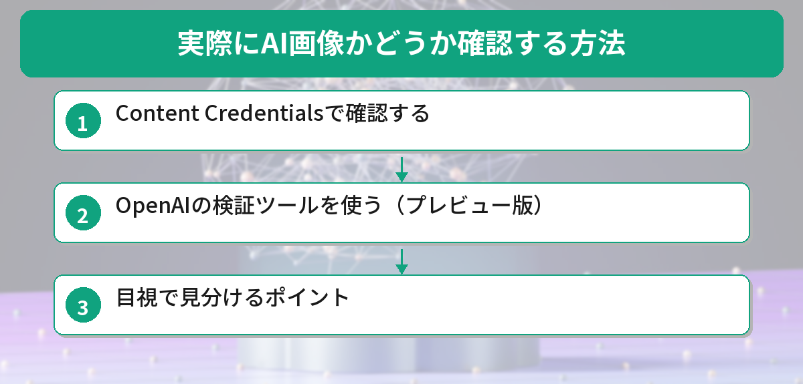
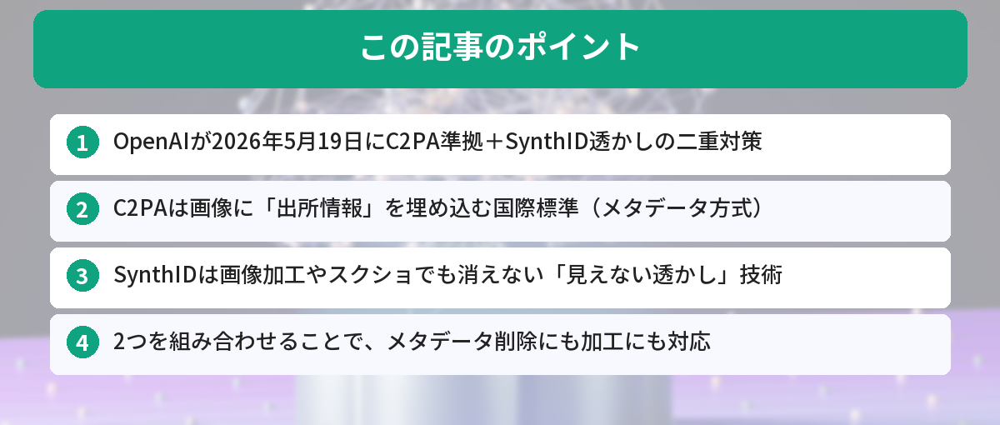

## この記事で分かること


最近SNSでAIが作った画像をよく見るんだけど、本物かどうかってどうやって見分けるの…？



実は2026年5月19日にOpenAIが新しい対策を発表したんだ。画像に「これはAIが作りました」という情報を埋め込む仕組みが強化されたよ。詳しく解説するね。


「SNSで見た画像がAI生成かどうか分からない」「フェイク画像に騙されたくない」——そんな不安を解消するための技術が進化しています。

この記事では、OpenAIが2026年5月に発表したC2PA準拠とSynthID透かしの仕組み、実際にAI画像を確認する方法を解説します。



## OpenAIが発表した新しいAI画像対策

2026年5月19日、OpenAIは以下の3つの対策を発表しました。

1. **C2PA準拠の強化** — 画像に「出所情報」を埋め込む国際標準への対応
2. **SynthID透かしの導入** — Googleと提携した「見えない透かし」技術
3. **公開検証ツールのプレビュー** — 誰でもAI画像かどうか確認できるツール

### なぜ2つの技術を組み合わせるのか

C2PAとSynthIDはそれぞれ弱点があります。

| 技術 | 強み | 弱点 |
|------|------|------|
| C2PA（メタデータ） | 詳細な出所情報を記録できる | SNS投稿時にメタデータが削除されることがある |
| SynthID（透かし） | 画像を加工しても残る | 記録できる情報量が少ない |

2つを組み合わせることで、メタデータが消えてもSynthIDで検出でき、SynthIDだけでは分からない詳細情報はC2PAで確認できる——という二重の安全網を実現しています。

## C2PAとは — AI画像の「出生証明書」

C2PA（Coalition for Content Provenance and Authenticity）は、画像や動画の「出所」を証明するための国際標準規格です。

### 分かりやすく言うと

写真に「いつ、どこで、誰が、どうやって作ったか」という情報を埋め込む仕組みです。食品の産地表示のようなものだと考えてください。

### C2PAで記録される情報

- 画像を生成したツール（ChatGPT、DALL-Eなど）
- 生成日時
- 編集履歴（トリミング、フィルター適用など）
- 暗号署名（改ざん防止）

### 確認方法

C2PA情報が埋め込まれた画像は、以下のツールで確認できます。

- [Content Credentials（Adobe）](https://contentcredentials.org/verify) — 画像をアップロードして出所情報を確認
- OpenAIの検証ツール（プレビュー版） — OpenAI製の画像かどうかを判定


でもSNSに投稿したら情報が消えちゃうんでしょ？それじゃ意味なくない…？



そこでSynthIDの出番なんだ。SynthIDは画像の中に「見えない透かし」を入れるから、SNSに投稿してもスクショしても残るんだよ。


## SynthIDとは — 消えない「見えない透かし」

SynthIDは、Google DeepMindが開発した電子透かし技術です。OpenAIがGoogleと提携して、ChatGPTで生成した画像にもSynthIDを埋め込むようになりました。

### 仕組み

画像のピクセルデータに、人間の目には見えない微細なパターンを埋め込みます。このパターンは以下の加工を経ても残ります。

- スクリーンショット
- トリミング（切り抜き）
- 圧縮（JPEG変換など）
- リサイズ
- フィルター適用

### 従来の透かしとの違い

| 項目 | 従来の透かし | SynthID |
|------|-------------|---------|
| 視認性 | 目に見える（ロゴなど） | 目に見えない |
| 除去 | 画像編集で消せる | 消すのが極めて困難 |
| 画質への影響 | あり | ほぼなし |
| 加工耐性 | 低い | 高い |

## 実際にAI画像かどうか確認する方法


仕組みは分かったけど、実際に自分で確認するにはどうすればいいの？難しいツールとか必要？



全然難しくないよ！Webサイトに画像をアップロードするだけ。3つの方法を紹介するから、自分に合ったやり方を試してみて。


### 方法1: Content Credentialsで確認する

1. [Content Credentials Verify](https://contentcredentials.org/verify)にアクセス
2. 確認したい画像をアップロード
3. C2PA情報が埋め込まれていれば、生成ツールや日時が表示される

### 方法2: OpenAIの検証ツールを使う（プレビュー版）

OpenAIが公開予定の検証ツールでは、画像がOpenAIのツール（ChatGPT、DALL-Eなど）で生成されたかどうかを判定できます。

### 方法3: 目視で見分けるポイント

技術的な検証ツールが使えない場合、以下のポイントをチェックします。

- **手や指** — AI画像は指の本数や関節が不自然なことがある
- **文字** — 画像内のテキストが意味不明な文字列になっている
- **背景の整合性** — 建物や風景の構造が物理的に不自然
- **左右対称性** — 顔や体が過度に左右対称
- **質感の均一性** — 肌や布の質感が全体的に均一すぎる

ただし、最新のAI画像生成技術は急速に進化しており、目視だけでの判別は年々難しくなっています。技術的な検証ツールの活用が重要です。

AI画像生成ツールの仕組みについては[AI画像生成ツールの記事](/posts/ai-image-generator-free/)も参考になります。


目で見て分からないこともあるんだ…。ツールを使うのが確実なんだね。



そうだね。特にニュースや重要な情報に使われている画像は、ツールで確認する習慣をつけるといいよ。


## SNSでのフェイク画像対策


個人で確認する方法は分かったけど、SNSで流れてくる画像はどうなの？プラットフォーム側は何かしてくれてるの？



主要SNSもAI画像の表示対応を進めてるよ。ただしまだ完璧じゃないから、個人でも対策を知っておくと安心だね。


### プラットフォーム側の対応状況

主要SNSでのAI画像表示対応状況は以下の通りです。

| プラットフォーム | C2PA対応 | AI画像ラベル表示 |
|----------------|---------|----------------|
| X（Twitter） | 一部対応 | 一部表示 |
| Instagram/Facebook | 対応 | 「AI生成」ラベル表示 |
| YouTube | 対応 | 申告制 |
| TikTok | 対応 | 「AI生成」ラベル表示 |

### 個人でできる対策

1. **出所を確認する** — 画像の元ソースを辿る。公式アカウントからの投稿か確認
2. **検証ツールを使う** — Content Credentialsで画像をチェック
3. **複数ソースで確認** — 同じ画像が他のニュースサイトでも使われているか確認
4. **違和感を信じる** — 「何かおかしい」と感じたら拡散しない

## 今後の展望

### OpenAIの取り組み

- C2PA準拠の画像生成を全モデルに拡大
- SynthIDの動画への適用
- 公開検証ツールの正式リリース
- 他のAI企業との連携強化

### 業界全体の動き

- Adobe、Google、Microsoft、OpenAIなどがC2PA連合に参加
- EUのAI規制法でAI生成コンテンツの表示義務化が進行中
- 日本でも総務省がAI生成コンテンツの表示ガイドラインを検討中

AI文章の検出については[AI文章検出ツールの記事](/posts/ai-writing-detection/)も参考になります。

## 検証ツールを1週間使って分かったこと

筆者はContent Credentialsの検証サイトを1週間、日常的に使ってみました。SNSで見かけた「怪しい画像」を片っ端からチェックした結果です。

**検証した画像数：** 23枚（SNSで見かけた画像）

**良かった点：**
- C2PA情報が埋め込まれている画像は、生成ツールや日時が一発で分かる
- 操作が簡単で、画像をドラッグ&ドロップするだけ
- 「AI生成」と確認できた画像が23枚中7枚あり、意外と多かった

**イマイチだった点：**
- C2PA非対応ツールで作られた画像は「情報なし」としか表示されない
- スクリーンショットで保存された画像はメタデータが消えていることが多い

**結論：** 万能ではないが「確認する習慣」をつけるだけで、フェイク画像に騙されるリスクは確実に減る。特にニュース系の画像は必ずチェックするようになった。

## 実際にAI画像検出を試してみた

Content Credentialsの検証ツールとHive Moderationを実際に試してみました。

### Content Credentials（C2PA検証）

- Adobe Fireflyで生成した画像 → 正しく「AI生成」と検出された
- Stable Diffusionで生成した画像 → C2PA情報が埋め込まれていないため検出不可

### Hive Moderation

- DALL-E 3の画像 → 98%の確率で「AI生成」と判定
- 実写写真にフィルターをかけたもの → 誤検出（AI生成と判定）されるケースもあった

現時点では「完璧な検出方法はない」というのが正直な結論です。C2PAのような埋め込み型と、SynthIDのような透かし型を組み合わせるのが現実的な対策になりそうです。

## よくある質問（FAQ）

### Q: C2PAやSynthIDは全てのAI画像に入っていますか？

A: いいえ。現時点ではOpenAI（ChatGPT、DALL-E）、Google（Imagen）、Adobe（Firefly）など、対応しているツールで生成された画像のみです。対応していないツールで作られた画像には埋め込まれません。

### Q: 自分で撮った写真にもC2PA情報は入りますか？

A: 対応カメラ（一部のソニー、ニコン製カメラ）で撮影した場合は入ります。スマホのカメラは現時点では大半が未対応ですが、今後対応が広がる見込みです。

### Q: SynthIDを自分で確認する方法はありますか？

A: 現時点では一般ユーザー向けのSynthID検出ツールは公開されていません。プラットフォーム側（SNS、検索エンジンなど）が内部的に検出する仕組みです。OpenAIの検証ツールが正式リリースされれば、一般ユーザーも確認できるようになります。

### Q: AI画像を使うこと自体は問題ですか？

A: AI画像の使用自体は問題ありません。問題になるのは「AI画像を本物の写真だと偽って使う」場合です。ブログやSNSでAI画像を使う際は「AI生成」と明記するのがマナーです。

### Q: 古いAI画像（C2PA対応前に生成されたもの）は検出できますか？

A: C2PAやSynthIDが埋め込まれていない古い画像は、これらの技術では検出できません。目視での判断や、別のAI検出ツール（Hive Moderation、Illuminartyなど）を使う必要があります。


完璧じゃないけど、だんだん見分けやすくなってきてるんだね。



そうだね。大事なのは「怪しいと思ったら確認する」習慣をつけること。ツールも進化してるから、上手に活用していこう。


## まとめ

- OpenAIが2026年5月19日にC2PA準拠＋SynthID透かしの二重対策を発表
- C2PAは画像に「出所情報」を埋め込む国際標準（メタデータ方式）
- SynthIDは画像加工やスクショでも消えない「見えない透かし」技術
- 2つを組み合わせることで、メタデータ削除にも加工にも対応
- Content Credentialsサイトで誰でもC2PA情報を確認できる
- 目視での判別は年々難しくなっており、技術的な検証ツールの活用が重要

---
### あわせて読みたい
- [AI画像生成ツール無料で使えるおすすめまとめ](/posts/ai-image-generator-free/)
- [AI文章検出ツールの仕組みと精度を解説](/posts/ai-writing-detection/)
