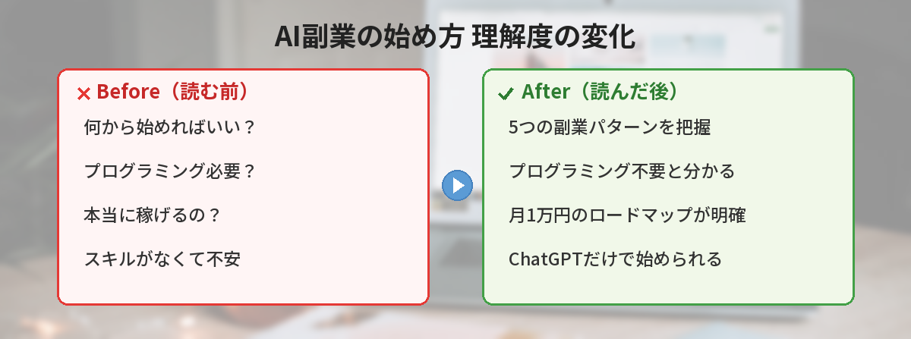
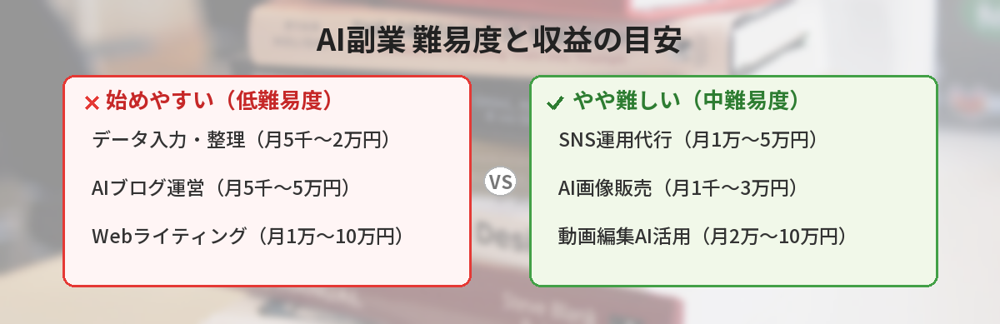
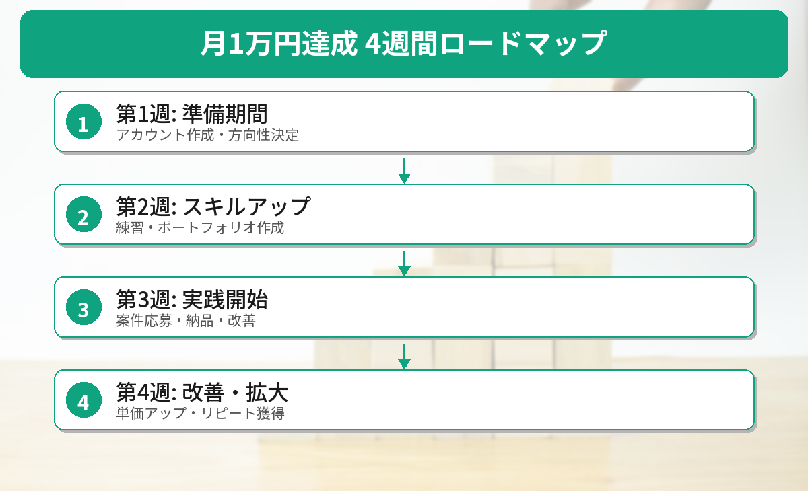

## この記事で分かること


AIで副業できるって聞いたんだけど、何から始めればいいの？プログラミングとか必要？



プログラミングは不要だよ。ChatGPTが使えれば始められる副業がたくさんあるんだ。月1万円を目指すロードマップを一緒に見ていこう。


「AIを使って副業を始めたいけど、何から手をつければいいか分からない」という方は多いのではないでしょうか。

この記事では、特別なスキルがなくても**月1万円**を目指せるAI副業の始め方を、具体的なロードマップ付きで解説します。

## AIを使った副業5選

### 1. AIブログ運営

ChatGPTやClaudeを使って記事の構成案や下書きを作成し、自分で編集・公開するブログ運営です。

- **収益の目安：** 月5,000円〜5万円（アフィリエイト・広告収入）
- **必要なもの：** ブログ（WordPress等）、AI（ChatGPT等）
- **難易度：** ★★☆☆☆

AIで下書きを作り、自分の経験や知識を加えてオリジナルの記事に仕上げるのがポイントです。

### 2. Webライティング

クラウドソーシングサイトでライティング案件を受注し、AIを使って効率的に記事を作成します。

- **収益の目安：** 月1万円〜10万円
- **必要なもの：** クラウドソーシングアカウント、AI
- **難易度：** ★★☆☆☆

クラウドワークスやランサーズで「ライティング」案件を探してみましょう。

### 3. SNS運用代行

企業や個人のSNSアカウントの投稿文をAIで作成し、運用を代行します。

- **収益の目安：** 月1万円〜5万円（1アカウントあたり）
- **必要なもの：** SNSの基本知識、AI
- **難易度：** ★★★☆☆

投稿文の作成だけでなく、ハッシュタグの提案やキャプションの作成もAIで効率化できます。具体的な方法は[ChatGPTでSNS投稿を作成する方法](/posts/chatgpt-sns-post/)で紹介しています。

### 4. AI画像販売

画像生成AI（DALL·E、Midjourney、Stable Diffusion等）で作成した画像をストックフォトサイトで販売します。

- **収益の目安：** 月1,000円〜3万円
- **必要なもの：** 画像生成AI、ストックフォトアカウント
- **難易度：** ★★☆☆☆

PIXTAやAdobe Stockなど、AI生成画像の投稿を受け付けているサイトを利用しましょう。画像生成ツールの選び方は[無料でAI画像生成を試せるサービス5選](/posts/ai-image-generator-free/)で解説しています。

### 5. データ入力・整理

AIを使ってデータ入力や情報整理の作業を効率化し、クラウドソーシングで案件を受注します。

- **収益の目安：** 月5,000円〜2万円
- **必要なもの：** Excel/スプレッドシートの基本操作、AI
- **難易度：** ★☆☆☆☆

単純作業をAIで効率化することで、時給を大幅にアップできます。



## 月1万円を目指す4週間ロードマップ


5つもあると迷っちゃう…。決めたらどうすればいいの？



4週間のロードマップを用意したよ。1週間ごとにやることが決まってるから、迷わず進められるはず。


### 第1週：準備期間

1. **ChatGPTのアカウントを作成する**（無料）（[ChatGPTの始め方はこちら](/posts/chatgpt-first-step/)）
2. **基本的な使い方を覚える**（プロンプトの書き方を練習）（[プロンプトテンプレート集](/posts/chatgpt-prompt-template/)が参考になります）
3. **副業の方向性を決める**（上記5つから1つ選ぶ）
4. **必要なアカウントを作成する**（クラウドソーシング、ブログ等）

### 第2週：スキルアップ期間

1. **AIを使った作業を練習する**（記事作成、画像生成等）
2. **ポートフォリオを作る**（サンプル記事やサンプル画像を3〜5個）
3. **プロンプトのテンプレートを整備する**
4. **先輩副業ワーカーの事例を調べる**

### 第3週：実践開始

1. **案件に応募する**（最初は低単価でもOK）
2. **実際に納品してみる**（フィードバックをもらう）
3. **作業フローを改善する**（AIの使い方を最適化）
4. **実績を積み上げる**

### 第4週：改善・拡大

1. **単価を上げる交渉をする**（実績をアピール）
2. **リピート案件を獲得する**
3. **作業効率をさらに改善する**
4. **月1万円の達成を確認する**

## 筆者がAI副業を始めて感じたリアルな話

実際にAIを使ったブログ運営を始めて感じたことを正直に書きます。

### 最初の1ヶ月は収益ゼロだった

ブログを開設して記事を10本書いても、最初の1ヶ月はアクセスがほぼゼロでした。検索エンジンにインデックスされるまでに時間がかかるためです。「すぐに稼げる」と思って始めると挫折しやすいので、最低3ヶ月は続ける覚悟が必要です。

### AIの下書きをそのまま使うと品質が低い

最初はChatGPTの出力をほぼそのまま記事にしていましたが、読み返すと「どこかで見たような内容」ばかりでした。自分の体験や具体的な数字を入れるようになってから、アクセスが伸び始めました。

### 時給換算すると最初はバイト以下

正直に言うと、最初の3ヶ月は時給換算で200〜300円程度でした。ただし、記事が蓄積されるにつれて「何もしなくても収益が発生する」状態になるのがブログの強みです。4ヶ月目以降は作業時間に対する収益が右肩上がりになりました。

### それでも続けてよかった理由

- AIの使い方が上達して、本業でも効率が上がった
- 文章力が身についた
- 「自分で稼ぐ」経験が自信になった

## 重要な注意点

### 1. AIの出力をそのまま納品しない

AIが生成した文章をそのまま納品するのは**絶対にNG**です。

- 事実関係の誤りがないかチェックする
- 自分の言葉で書き直す・加筆する
- コピペチェックツールで確認する

AIはあくまで「下書きツール」として使い、最終的な品質は自分で担保しましょう。

### 2. クライアントのAIポリシーを確認する

案件を受注する前に、クライアントがAIの使用を許可しているか必ず確認してください。

- AI使用を禁止している案件もある
- AI使用OKでも「AI使用の旨を明記」が条件の場合がある
- 不明な場合は事前に質問する

### 3. 著作権に注意する

AI生成コンテンツの著作権は、まだ法的にグレーな部分があります。AI生成コンテンツの検出リスクについては[AI生成コンテンツはバレる？検出ツールと対策](/posts/ai-writing-detection/)も確認しておきましょう。

- AI生成画像をそのまま販売する場合、プラットフォームの規約を確認する
- 他人の著作物をAIに入力して生成したコンテンツは、著作権侵害のリスクがある
- 最新の法的動向をチェックしておく

### 4. 確定申告を忘れずに

副業の所得が**年間20万円を超える**場合、確定申告が必要です。

- 収入と経費の記録をつけておく
- AI関連のサブスクリプション費用は経費にできる
- 不安な場合は税理士に相談する

## よくある質問（FAQ）

### Q: AI副業を始めるのに初期費用はかかりますか？
A: ChatGPTの無料プランとクラウドソーシングの無料アカウントがあれば、初期費用ゼロで始められます。ブログ運営の場合はサーバー代（月1,000円程度）がかかりますが、noteなど無料プラットフォームを使う方法もあります。

### Q: AI副業は会社にバレますか？
A: 住民税の納付方法を「普通徴収（自分で納付）」にすれば、会社に通知されにくくなります。ただし、就業規則で副業が禁止されている場合は事前に確認してください。

### Q: AIで書いた記事は検索エンジンに評価されますか？
A: Googleは「AI生成コンテンツ自体は問題ない」としています。大切なのはコンテンツの品質です。AIの出力をそのまま使うのではなく、自分の経験や知識を加えてオリジナリティを出しましょう。

### Q: どの副業が一番稼ぎやすいですか？
A: 短期的にはWebライティングが案件を見つけやすく、収益化が早いです。長期的にはブログ運営が安定した収入源になる可能性があります。自分の得意分野や使える時間に合わせて選んでみてください。


月1万円なら私にもできそう…！まずはChatGPTのアカウント作って、ライティングから始めてみようかな。



その意気だよ！最初は低単価でも実績を積むのが大事。AIの出力をそのまま使わず、自分の言葉で仕上げることだけ忘れないでね。4週間ロードマップ通りにやれば着実に進めるよ。


---

## 実際にAI副業を始めてみた！（筆者の体験）

筆者がAIを活用した副業として「ブログ運営」を始めて3ヶ月。実際の収益とかかった時間を正直にお伝えします。

### 3ヶ月の実績

- **1ヶ月目**: 収益0円。記事を書く+ChatGPTの使い方を覚えるのに集中
- **2ヶ月目**: 収益500円程度。アドセンス申請通過
- **3ヶ月目**: 収益2,000円程度。検索流入が少しずつ増加

### AIを使って実際に短縮できた作業

- 記事構成の作成: 30分 → 5分
- リサーチ・情報整理: 1時間 → 20分
- 文章の校正: 20分 → 5分

**AIを使っても「楽して稼げる」わけではない**ですが、作業効率は確実に上がります。

### 始める前に知っておくべきこと

- **初月から稼げることはほぼない**。3〜6ヶ月は投資期間と割り切る
- **AIは道具であって魔法ではない**。人間の判断・編集・オリジナリティが必要
- **継続が最重要**。AIで効率化しても、毎日コツコツ作業する姿勢がないと結果は出ない

### AI副業の現実的なタイムライン

| 期間 | やること | 期待収益 |
|------|---------|---------|
| 1ヶ月目 | ツール選定・基盤作り | 0円 |
| 2〜3ヶ月目 | コンテンツ作成・公開 | 0〜1,000円 |
| 4〜6ヶ月目 | 改善・集客 | 1,000〜5,000円 |
| 7〜12ヶ月目 | 安定化・拡大 | 5,000〜30,000円 |

## まとめ

AIを使った副業は、特別なスキルがなくても始められます。大切なのは、**まず小さく始めて、実践しながら学ぶ**ことです。

最初の1万円を稼ぐまでが一番大変ですが、一度コツをつかめば収入を伸ばしていくことは十分可能です。今日からさっそく第1週のステップを始めてみましょう。

---
### あわせて読みたい
- [ChatGPTの始め方 ― 登録から最初の質問まで5分で完了](/posts/chatgpt-first-step/)
- [AIでプレゼン資料を自動作成する方法 ― 無料ツール3選](/posts/ai-presentation-maker/)

---

