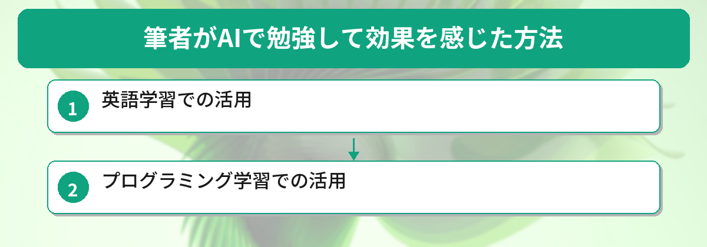
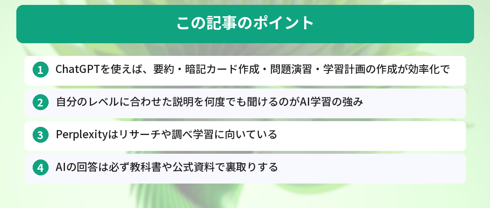

## この記事で分かること


勉強してるのに全然頭に入らないの…。AIで効率よく勉強できる方法ってあるの？



あるよ！ChatGPTに要約してもらったり、問題を出してもらったり、学習計画を立ててもらったり。使い方次第で勉強の効率がグッと上がるんだ。具体的なプロンプトつきで紹介するね。



「勉強しているのに頭に入らない」「効率よく学習する方法が知りたい」

AIツールを活用すれば、教科書の要約、暗記カードの作成、問題演習、学習計画の立案まで、勉強のあらゆる場面を効率化できます。この記事では、ChatGPTを中心に具体的なプロンプト付きで勉強法を紹介します。



## なぜAIが勉強に役立つのか

AIを勉強に使うメリットは大きく3つあります。

### 自分のレベルに合わせた説明が得られる

教科書や参考書は、読者のレベルを想定して書かれています。自分に合わないレベルの本だと、理解に時間がかかります。

ChatGPTなら「中学生にもわかるように説明して」「大学の経済学部2年生向けに説明して」と指定するだけで、自分のレベルに合った説明が返ってきます。

### 24時間いつでも質問できる

深夜の勉強中に疑問が出ても、先生や友人には聞けません。AIなら時間を問わず、何度でも質問できます。「こんな基本的なことを聞いていいのかな」と遠慮する必要もありません。

### アウトプットの練習相手になる

勉強で大切なのはインプットだけでなくアウトプットです。AIに問題を出してもらったり、自分の理解を説明してフィードバックをもらったりすることで、知識の定着が進みます。

ChatGPTをまだ使ったことがない方は[ChatGPTの始め方ガイド](/posts/chatgpt-first-step/)で登録しておきましょう。

## インプットを効率化するテクニック


AIが勉強に役立つのは分かったけど、具体的にどうやって使えばいいの？プロンプトとか教えてほしい！



OK！まずは「インプット」を効率化するテクニックから紹介するね。教科書の要約、暗記カード作成、難しい概念の説明、全部コピペで使えるプロンプト付きだよ。


まずは「理解する」「覚える」というインプット面でAIを活用する方法を紹介します。

### 教科書・参考書を要約する

分厚い教科書を最初から最後まで読むのは大変です。ChatGPTに内容をコピーして貼り付ければ、重要なポイントだけを抽出できます。

```
以下のテキストを、重要なポイントを5つに絞って箇条書きで要約してください。
専門用語には簡単な説明を添えてください。

[テキストを貼り付け]
```

ChatGPT（有料プラン）では、PDFファイルを直接アップロードして要約することも可能です。PDFの要約についてもっと詳しく知りたい方は[ChatGPTでPDFを要約する方法](/posts/chatgpt-pdf-summary/)を参考にしてください。長い文書の要約には[Claudeで長文ドキュメントを処理する方法](/posts/claude-long-document/)も選択肢になります。

### 暗記カード・フラッシュカードを自動作成する

暗記が必要な科目では、フラッシュカードが効果的です。ChatGPTに作ってもらえば、カード作成の手間を省けます。

```
以下の内容から、暗記用のフラッシュカードを10枚作成してください。
表面に質問、裏面に答えの形式でお願いします。

[学習内容を貼り付け]
```

暗記アプリ「Anki」を使っている方は、タブ区切り形式で出力してもらえばそのままインポートできます。

### 難しい概念をかみ砕いて説明してもらう

教科書を読んでもピンとこない概念は、ChatGPTに別の角度から説明してもらいましょう。

```
「機会費用」の概念を、高校生が日常生活で経験する具体例を使って説明してください
```

「小学生向け → 高校生向け → 大学生向け」のように段階的に説明してもらうと、自分の理解度に合ったレベルから着実に深められます。

## アウトプットと学習計画で知識を定着させる

インプットだけでは知識は定着しません。ChatGPTに問題を作ってもらい、アウトプットの練習をしましょう。

### 選択式・記述式の問題を作る

```
以下の内容から、4択の問題を5問作成してください。
各問題の後に正解と解説をつけてください。

[学習内容を貼り付け]
```

記述式の問題も作れます。

```
日本史の「明治維新」について、大学入試レベルの記述問題を3問作成してください。
各問題は200字程度で回答する形式にしてください。
模範解答と採点のポイントも添えてください。
```

### 自分の回答を採点してもらう

```
以下の問題に対する私の回答を採点してください。
100点満点で点数をつけて、改善点を具体的に教えてください。

問題：[問題文]
私の回答：[自分の回答]
```

フィードバックをもらうことで、自分では気づけなかった弱点が見えてきます。

### 学習計画を立てる

目標から逆算した学習計画をAIに作ってもらうと、何をいつまでにやるべきかが明確になります。

```
以下の条件で学習計画を作成してください。

目標：TOEIC 800点（現在のスコア：600点）
期限：3ヶ月後
1日に使える勉強時間：平日1時間、休日2時間
苦手分野：リスニングのPart3とPart4

週単位のスケジュールと、各週の具体的な学習内容を提案してください。
```


## Perplexityでリサーチ・調べ学習をする


ChatGPTで問題演習や学習計画ができるのは分かったけど、レポートの調べ物とかはどうすればいいの？



調べ学習にはPerplexityが便利だよ。出典付きで回答してくれるから、レポートの参考文献としても使いやすいんだ。


ChatGPTは学習のサポートに優れていますが、最新情報のリサーチにはPerplexityが便利です。Perplexityはインターネット検索と回答生成を組み合わせたAIツールで、情報源のURLも一緒に表示してくれます。

### Perplexityが向いている場面

- レポートや論文のための情報収集
- 最新の研究動向の調査
- 統計データや数値の確認

ChatGPTとPerplexityの違いについては[PerplexityとChatGPTの比較記事](/posts/perplexity-vs-chatgpt/)で詳しく解説しています。目的に応じて使い分けると、学習の質がさらに上がります。

## 注意点・AIに頼りすぎないために

AIは強力な学習ツールですが、使い方を間違えると逆効果になります。

### AIの回答を鵜呑みにしない

ChatGPTは時々間違った情報を自信満々に回答します（ハルシネーションと呼ばれる現象です）。特に歴史の年号や数値データは、教科書や公式資料で必ず裏取りしてください。

### 考える前にAIに聞かない

問題を見てすぐAIに答えを聞くのは、答えを丸写しするのと同じです。まず自分で考えて、行き詰まったときにヒントをもらう、という順番を守りましょう。

### レポートや課題の丸投げはNG

学校のレポートや課題をAIに丸投げするのは、学習の意味がなくなるだけでなく、不正行為として処分される可能性があります。AIはあくまで「学習を助けるツール」として使いましょう。

### 個人情報を入力しない

成績表や個人が特定できる情報をChatGPTに入力するのは避けてください。入力した内容がAIの学習データに使われる可能性があります。

## TOEIC対策にAIを使って2ヶ月で100点アップした話

筆者は実際にChatGPTをTOEIC対策に活用し、2ヶ月間の学習で600点→700点にスコアアップしました。

**学習期間：** 2ヶ月（平日30分、休日1時間）

**やったこと：**
- ChatGPTに毎日Part5形式の問題を10問作ってもらい、通勤中に解いた
- 間違えた問題の解説を「中学生にも分かるように」説明してもらった
- 週末にChatGPTで1週間の学習計画を立て直した

**良かった点：**
- 自分の弱点に合わせた問題が無限に出てくる
- 「なぜこの答えになるのか」を何度聞いても嫌な顔されない
- 学習計画の見直しが毎週できるので、モチベーションが維持しやすい

**イマイチだった点：**
- リスニング対策はAIだけでは不十分（音声教材との併用が必要）
- たまに文法的に微妙な問題が生成される（5%くらい）

**結論：** AIは「問題演習」と「弱点分析」に最強。ただしリスニングや実践的な英語力は別途トレーニングが必要。

## 筆者がAIで勉強して効果を感じた方法



英語学習とプログラミング学習でAIを活用した体験談です。

### 英語学習での活用

- ChatGPTに「英語の先生役」をお願いして、毎日10分の英会話練習をした
- 文法ミスをその場で指摘してくれるので、独学でも上達を実感できた
- 3ヶ月続けた結果、TOEICのリーディングスコアが50点上がった

### プログラミング学習での活用

- エラーメッセージをそのまま貼って「なぜこのエラーが出るのか」を聞く
- 「この概念を小学生に説明するように教えて」と聞くと、噛み砕いた説明が返ってくる
- ただし、AIの回答をコピペするだけでは身につかない。必ず自分で書き直すことが大事

## よくある質問（FAQ）



### Q: 無料プランのChatGPTでも勉強に使えますか？
A: 使えます。要約、問題作成、概念の説明など、基本的な学習サポートは無料プランで十分対応できます。PDFのアップロードなど一部機能は有料プランが必要です。

### Q: AIを使った勉強は「ズル」になりませんか？
A: 使い方次第です。AIに答えを丸写しするのは学習になりませんが、理解を深めるための説明を求めたり、問題演習の相手にしたりするのは、効果的な学習法です。電卓や辞書と同じように、ツールとして賢く使うことが大切です。

### Q: どの教科・分野にAI学習が向いていますか？
A: 語学、プログラミング、社会科学、資格試験の勉強に特に向いています。数学の証明や理系の計算問題は、ChatGPTが間違えることがあるので、回答を必ず検算してください。

### Q: 中学生や高校生でもAIを勉強に使えますか？
A: 使えます。ChatGPTは年齢制限（13歳以上、18歳未満は保護者の同意が必要）がありますが、条件を満たせば利用可能です。保護者と一緒に使い方のルールを決めておくと安心です。

### Q: ChatGPT以外におすすめの学習用AIツールはありますか？
A: 調べ学習にはPerplexity、長い文書の読解にはClaudeが向いています。目的に応じて使い分けると効率的です。それぞれの特徴は[PerplexityとChatGPTの比較](/posts/perplexity-vs-chatgpt/)で解説しています。


問題作ってもらうのいいね！今度の資格試験の勉強で早速やってみたい。ただ、AIの答えを鵜呑みにしないように気をつけなきゃ…。



えらい、ちゃんと注意点も覚えてるね。まずは教科書の内容をChatGPTに貼り付けて要約してもらうところから始めてみて。「自分で考えてから聞く」を意識すれば、知識の定着が全然違うよ。


## まとめ

- ChatGPTを使えば、要約・暗記カード作成・問題演習・学習計画の作成が効率化できる
- 自分のレベルに合わせた説明を何度でも聞けるのがAI学習の強み
- Perplexityはリサーチや調べ学習に向いている
- AIの回答は必ず教科書や公式資料で裏取りする
- 考える前にAIに頼らず、まず自分で取り組んでからサポートとして使う

---
### あわせて読みたい

- [ChatGPTでPDFを要約する方法 ― 長文レポートも一瞬で把握](/posts/chatgpt-pdf-summary/)

