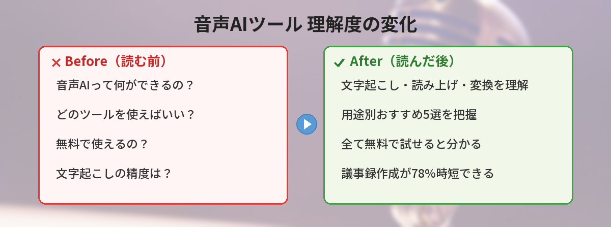
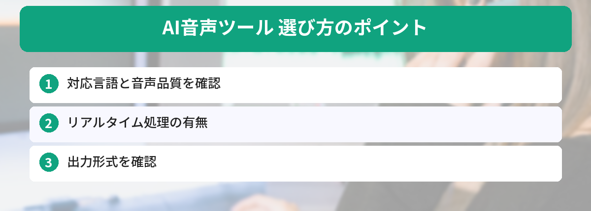

## この記事で分かること


音声をテキストにしたり、テキストを読み上げてくれたり…音声AIっていろいろあるんだね。どれから試せばいいの？



用途によって使うツールが違うんだ。文字起こし・読み上げ・声の変換、それぞれのおすすめを紹介するよ。全部無料で試せるから安心してね。


「音声をテキストにしたい」「テキストを読み上げてほしい」「自分の声を変えたい」

音声に関するAIツールが増えていますが、どれを使えばいいか分からない。この記事では、無料で使える音声AIを用途別に5つ紹介します。

## 会議の文字起こしを1ヶ月間AIに任せてみた結果

筆者は1ヶ月間、すべての会議の文字起こしをWhisper（ChatGPT経由）とCLOVA Noteで行いました。

**処理した会議数：** 週3回 × 4週 = 12回分

**良かった点：**
- 議事録作成の時間が1回あたり45分→10分に短縮（約78%削減）
- 「言った・言わない」問題がゼロになった
- ChatGPTに文字起こし結果を渡して「議事録にまとめて」と頼むと、さらに5分で完成

**イマイチだった点：**
- 複数人が同時に話す場面は精度が落ちる（特にオンライン会議）
- 専門用語の変換ミスが時々ある（「API」が「えーぴーあい」になるなど）

**結論：** 文字起こしAIは「使わない理由がない」レベルで便利。議事録作成の負担が劇的に減るので、まだ手作業でやっている人は今すぐ試してほしい。



## 1. Whisper（文字起こし）

OpenAIが開発した音声認識AI。音声ファイルをテキストに変換します。

- 日本語対応：◎
- 精度：非常に高い
- 使い方：ChatGPTに音声ファイルをアップロードするだけ

会議の録音、インタビュー、講義の文字起こしに最適です。

### 使い方

1. ChatGPTを開く
2. 音声ファイル（mp3、wav等）をアップロード
3. 「この音声を文字起こしして」と指示

数分で全文がテキストになります。

## 2. CLOVA Note（文字起こし）

LINEが開発した文字起こしアプリ。スマホで録音しながらリアルタイムで文字起こしできます。

- 日本語対応：◎（日本語に特化）
- 精度：高い
- 使い方：アプリをインストールして録音ボタンを押すだけ

話者の識別もできるので、会議で「誰が何を言ったか」が分かります。

## 3. ElevenLabs（テキスト読み上げ）

テキストを入力すると、人間のような自然な声で読み上げてくれるAI。

- 日本語対応：○
- 無料枠：月10,000文字まで
- 使い方：https://elevenlabs.io でテキストを入力

ブログ記事の音声版を作ったり、動画のナレーションに使えます。ブログ記事の書き方については[ChatGPTでブログ記事を効率的に書く方法](/posts/chatgpt-blog-writing/)で紹介しています。


文字起こしは分かったけど、逆にテキストを読み上げてくれるツールもあるの？動画のナレーションとかに使いたいんだけど…。



あるよ！ElevenLabsは英語が特に自然だけど、日本語専用ならVOICEVOXがおすすめ。どっちも無料で試せるから、用途に合わせて選んでみて。


## 4. VOICEVOX（テキスト読み上げ）

日本発の無料テキスト読み上げソフト。キャラクターの声で読み上げてくれます。

- 日本語対応：◎（日本語専用）
- 完全無料（商用利用もOK）
- 使い方：ソフトをダウンロードしてテキストを入力

YouTube動画のナレーションによく使われています。

## 5. RVC（声の変換）

自分の声を別の声に変換するAI。リアルタイムでの変換も可能です。

- 日本語対応：◎
- 完全無料（オープンソース）
- 使い方：やや技術的な知識が必要

配信者やVTuberに人気のツールです。初心者にはハードルが高いですが、興味がある方は「RVC 使い方」で検索してみてください。AIを使った副業に興味がある方は[AIを使った副業の始め方](/posts/ai-side-job-beginner/)も参考になります。

## 比較表

| ツール | 用途 | 日本語 | 無料枠 | 難易度 |
|---|---|---|---|---|
| Whisper | 文字起こし | ◎ | ChatGPT経由 | 簡単 |
| CLOVA Note | 文字起こし | ◎ | 無料 | 簡単 |
| ElevenLabs | 読み上げ | ○ | 月10,000文字 | 簡単 |
| VOICEVOX | 読み上げ | ◎ | 完全無料 | 簡単 |
| RVC | 声の変換 | ◎ | 完全無料 | やや難 |


5つもあると迷っちゃうな…。結局、最初に何から試せばいいの？



まずはChatGPTに音声ファイルをアップロードして文字起こしを試すのが一番手軽だよ。それだけで「音声AIってこんなに便利なんだ」って実感できるはず。


## 筆者が実際に使っているAI音声ツール

仕事と副業で実際に使っているツールを紹介します。

### 文字起こし: Whisper（OpenAI）

- 1時間の会議音声を5分で文字起こしできる
- 日本語の精度も高く、専門用語以外はほぼ正確
- 無料で使える（ローカル実行）のが最大のメリット

### 音声合成: VOICEVOX

- YouTube動画のナレーションに使用中
- 無料で商用利用OK。キャラクターの声が豊富
- 感情表現の調整ができるので、単調にならない

### 使ってみて分かった注意点

- 文字起こしは「話者分離」ができないツールだと、誰の発言か分からなくなる
- 音声合成は長文だと不自然になりやすい。1文ずつ区切って生成するのがコツ

## よくある質問（FAQ）

### Q: 文字起こしの精度はどのくらいですか？
A: Whisper（ChatGPT経由）の場合、静かな環境で録音された音声なら90%以上の精度が期待できます。雑音が多い環境や複数人が同時に話す場面では精度が下がることがあります。

### Q: 音声AIツールは日本語に対応していますか？
A: Whisper、CLOVA Note、VOICEVOXは日本語に強いです。ElevenLabsも日本語に対応していますが、英語ほどの自然さはまだ発展途上です。

### Q: 文字起こしした内容をそのまま議事録として使えますか？
A: そのままでは「えー」「あのー」などのフィラーや言い間違いが含まれるため、編集が必要です。ChatGPTに文字起こし結果を貼り付けて「議事録形式に整理して」と指示すると効率的です。

### Q: 音声AIツールで作ったナレーションは商用利用できますか？
A: ツールによって規約が異なります。VOICEVOXは商用利用OKですが、キャラクターごとに利用規約があります。ElevenLabsは有料プランで商用利用が可能です。必ず各ツールの利用規約を確認してください。


会議の文字起こし、手作業でやってたから助かる…！まずはChatGPTに音声ファイルをアップロードしてみるね。



それが一番手軽だよ。文字起こし結果をそのままChatGPTに「議事録にまとめて」って頼めば、一気に整理できるからやってみて。


---

## 実際にAI音声ツールを使ってみた！（筆者の体験）

筆者が実際にAI音声ツール（文字起こし+要約）を使ってみた結果です。

### 議事録作成で使ってみた

1時間の会議を録音して、AI文字起こしツール（Whisper/Notta等）にかけてみました。

- **精度**: 90%以上は正確に文字起こし。固有名詞や専門用語は若干間違いあり
- **所要時間**: 1時間の音声が5分で文字起こし完了
- **要約**: ChatGPTに文字起こし結果を貼って「箇条書きで要約して」→ 即完了

### Before/After

- **Before**: 会議中にメモ → 会議後に議事録整理（30分）→ 参加者に共有
- **After**: 録音 → AI文字起こし（5分）→ AI要約（1分）→ 軽く修正して共有（5分）

議事録作成にかかる時間が30分→10分に短縮されました。

議事録作成を30分→10分に短縮できた体験は、筆者にとって「AIすごい」と実感した最初のきっかけでした。音声→テキスト→要約の流れを一度体験すると、手動で議事録を書く気がなくなります。まずは短い録音（5分程度）で試してみてください。

## まとめ

- 文字起こし → Whisper（ChatGPT経由）かCLOVA Note
- テキスト読み上げ → ElevenLabsかVOICEVOX
- 声の変換 → RVC

まずはChatGPTに音声ファイルをアップロードして文字起こしを試してみるのが、一番手軽な始め方です。ChatGPTの使い方は[ChatGPTの始め方ガイド](/posts/chatgpt-first-step/)で解説しています。

---
### あわせて読みたい

- [無料でAI画像生成を試せるサービス5選](/posts/ai-image-generator-free/)

