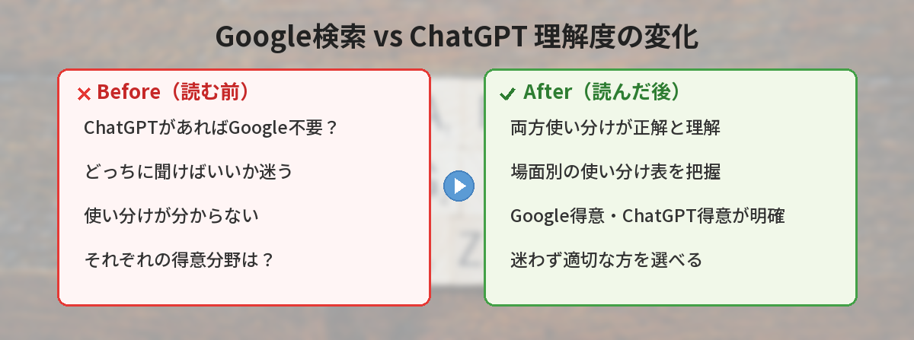
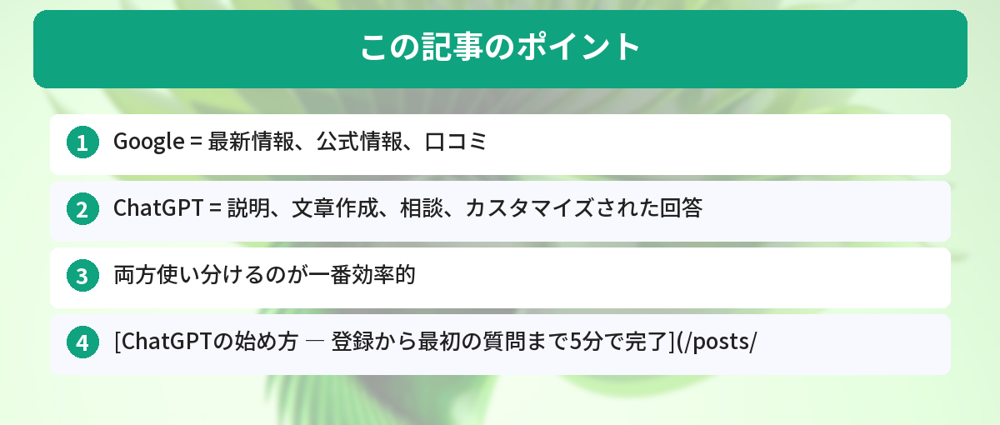

## この記事で分かること


ChatGPTがあればもうGoogle検索いらないの…？最近どっちに聞けばいいか迷うことが多くて。



実はそれぞれ得意なことが全然違うんだ。両方使い分けるのが正解だよ。どんな場面でどっちを使うべきか、一覧表つきで解説するね。




「ChatGPTがあればもうGoogle検索いらないの？」

結論から言うと、両方使い分けるのが正解です。それぞれ得意なことが違います。



## 使い分け早見表

| やりたいこと | Google | ChatGPT | おすすめ |
|---|---|---|---|
| 最新ニュースを知りたい | ◎ | △ | Google |
| 公式サイトにアクセスしたい | ◎ | × | Google |
| 概念や仕組みを理解したい | ○ | ◎ | ChatGPT |
| 文章を書いてほしい | × | ◎ | ChatGPT |
| 比較・検討したい | ○ | ◎ | ChatGPT |
| エラーメッセージを調べたい | ◎ | ◎ | どちらでも |
| 料理のレシピを知りたい | ◎ | ◎ | どちらでも |
| 計算や変換をしたい | ○ | ◎ | ChatGPT |

## Googleが得意なこと

### 最新情報

ChatGPTの知識には時期的な限界があります。今日のニュースや最新の価格情報はGoogleで検索した方が確実です。

### 公式情報へのアクセス

「〇〇の公式サイト」「〇〇の申し込みページ」など、特定のWebページにたどり着きたいときはGoogleが確実です。

### 口コミ・レビュー

実際のユーザーの声を知りたいときは、Googleで検索してレビューサイトや掲示板を見る方が生の情報が得られます。

## ChatGPTが得意なこと


Googleが得意なことは分かった！じゃあ逆にChatGPTの方が向いてる場面ってどんなとき？



「答えが1つじゃない質問」はChatGPTの出番だよ。説明してもらう、文章を作る、相談する…この3つが特に強いんだ。


### 説明・解説

「〇〇って何？」「〇〇の仕組みを教えて」という質問は、ChatGPTの方が分かりやすく答えてくれます。Googleだと複数のサイトを読み比べる必要がありますが、ChatGPTは1回で要点をまとめてくれます。ChatGPTとGeminiの違いについては[Gemini vs ChatGPT比較記事](/posts/gemini-vs-chatgpt/)で詳しく解説しています。

### 文章作成

メール、レポート、企画書など、文章を作る作業はChatGPTの独壇場です。Googleで「メール 書き方 テンプレート」と検索するより、ChatGPTに直接書いてもらう方が速いです。メール作成の具体的な方法は[ChatGPTでメールテンプレートを作る方法](/posts/chatgpt-email-template/)で紹介しています。

### 壁打ち・相談

「こういう状況なんだけど、どうすればいい？」という相談は、ChatGPTが得意です。対話形式で深掘りしてくれるので、自分の考えを整理するのにも使えます。

### カスタマイズされた回答

Googleの検索結果は万人向けですが、ChatGPTは「自分の状況」に合わせた回答をくれます。

```
私は30代の会社員で、プログラミング未経験です。
週末だけ使える時間で、3ヶ月後にWebサイトを作れるようになりたいです。
学習プランを作ってください。
```

こういう個別の相談は、Googleでは答えが見つかりにくいです。

## 両方使うのが最強


それぞれの得意分野は分かったけど、実際の作業ではどう組み合わせればいいの？



「ChatGPTで概要を掴む→Googleで裏取り」が鉄板パターンだよ。この流れを覚えるだけで情報収集の効率が段違いになるんだ。


おすすめの使い方：

1. まずChatGPTに聞いて概要を理解する
2. 具体的な情報（価格、最新版、公式ページ）はGoogleで確認する
3. 分からないことがあればChatGPTに追加で質問する

## 1週間「ChatGPT→Google」の流れを徹底してみた感想

筆者は1週間、すべての調べ物を「まずChatGPTに聞く→Googleで裏取り」の流れで統一してみました。

**調べ物の回数：** 1日平均8回 × 7日 = 56回

**良かった点：**
- 調べ物にかかる時間が平均で40%短縮された（体感）
- ChatGPTで全体像を掴んでからGoogleで深掘りすると、検索キーワードが的確になる
- 「何を調べればいいか分からない」状態がなくなった

**イマイチだった点：**
- ChatGPTの回答をそのまま信じて失敗したことが2回あった（古い情報だった）
- 単純な事実確認（営業時間、電話番号など）はGoogle直接の方が速い

**結論：** 「概要理解はChatGPT、事実確認はGoogle」の使い分けが最強。ただし最新情報や公式情報は必ずGoogleで確認する癖をつけるべき。

## 1週間「AI検索だけ」で生活してみた結果

1週間、調べものを全てChatGPTとPerplexityだけで行う実験をしました。

### AIだけで十分だった場面

- 概念の説明（「〇〇とは？」系の質問）
- 比較・要約（「AとBの違いは？」）
- コードのエラー解決

### Google検索が必要だった場面

- 最新のニュース（AIの情報が古いことがある）
- 特定の店舗情報（営業時間、住所など）
- 公式サイトへのアクセス（URLを直接知りたいとき）
- 画像検索

### 結論

日常の調べものの7割はAIで済むようになった。ただし「最新情報」「場所」「公式サイト」はまだGoogle検索の方が確実。両方使い分けるのがベスト。

## よくある質問（FAQ）



### Q: ChatGPTの情報は正確ですか？
A: ChatGPTは学習データに基づいて回答するため、最新情報や細かい数字は間違っていることがあります。重要な情報はGoogle検索で裏取りすることをおすすめします。

### Q: Perplexityなどの検索特化AIはどうですか？
A: Perplexityは検索とAIを組み合わせたツールで、出典付きの回答が得られます。Google検索とChatGPTの中間的な存在です。詳しくは[Perplexity vs ChatGPT比較記事](/posts/perplexity-vs-chatgpt/)をご覧ください。

### Q: Google検索にもAI機能が追加されていますか？
A: はい。GoogleにはGeminiが統合されており、検索結果の上部にAIによる要約が表示されることがあります。ただし、従来の検索結果も引き続き表示されます。

### Q: ChatGPTは無料で使えますか？
A: 無料プランがあります。基本的な質問や文章作成は無料プランで十分です。始め方は[ChatGPTの始め方ガイド](/posts/chatgpt-first-step/)で解説しています。


なるほど、両方使い分けるのが一番なんだね！まずChatGPTで概要を聞いて、細かい情報はGoogleで確認する…やってみる！



その流れが最強だよ。特に最新の価格や公式サイトのURLはGoogleで確認する癖をつけておくと、間違った情報に振り回されなくなるよ。



---

## 実際にAI検索とGoogle検索を使い比べてみた！（筆者の体験）

筆者が同じ質問をAI（ChatGPT/Perplexity）とGoogle検索の両方で調べて比較した結果です。

### AI検索が優れていた場面

- 「○○と△△の違いを表にまとめて」→ AIは一発で比較表を生成。Google検索だと複数サイトを読む必要あり
- 「初心者向けに○○を説明して」→ AIは読者レベルに合わせた回答をくれる

### Google検索が優れていた場面

- 「○○ 公式サイト」→ 公式情報に直接アクセスしたいとき
- 「○○ 口コミ」→ 実際のユーザーの生の声を読みたいとき
- 画像検索 → 「こんなデザインを探したい」とき

### 筆者の使い分けルール

- 「答えが1つ」の質問 → AI
- 「いろんな意見を見たい」とき → Google
- 「最新情報を確実に知りたい」とき → Google（AIは古い情報を返す可能性あり）

AI検索とGoogle検索は敵同士ではなく、補完関係。「答えが1つの質問はAI、多様な意見を見たいときはGoogle」と覚えておけばOKです。どちらか一方だけ使うのではなく、質問の性質に合わせて使い分けるのが2026年のリサーチのベストプラクティスです。


### AI検索を使うときの注意点

- **AIの回答が常に正しいとは限らない**: 特に数字や日付は要確認
- **出典を確認する習慣をつける**: Perplexityなら出典リンクが表示される。ChatGPTは出典なしのことが多い
- **最新情報はGoogle検索で確認**: AIの学習データには時間差がある
- **著作権に注意**: AIが生成した要約をそのまま転載するのはNG

### 2026年の検索トレンド

GoogleもAI Overviewを導入し、検索結果の上部にAI生成の要約が表示されるようになりました。「AI検索 vs Google検索」ではなく、**Google自体がAI検索を取り込んでいる**のが2026年の現状です。


### 今日から試せるアクション

1. 今日調べたいことを1つ決める
2. まずChatGPT（またはPerplexity）に聞いてみる
3. 次にGoogle検索で同じことを調べる
4. どちらが速く・正確に答えにたどり着けたか比較する
5. 「この質問はAI向き」「この質問はGoogle向き」の感覚を養う


### 質問の種類別：AI vs Google 早見表

| 質問の種類 | 最適なツール | 理由 |
|-----------|------------|------|
| 「○○とは？」（定義） | AI | 噛み砕いた説明が一発で出る |
| 「○○ 公式サイト」 | Google | 公式への直リンクが必要 |
| 「○○ vs △△」（比較） | AI | 表で整理して一目で分かる |
| 「○○ 口コミ」 | Google | 実ユーザーの生の声が見える |
| 「○○ のやり方」（手順） | AI | ステップバイステップで教えてくれる |
| 「○○ エラー」（トラブル） | Google→AI | まずググって、解決しなければAIに聞く |

## まとめ

- Google = 最新情報、公式情報、口コミ
- ChatGPT = 説明、文章作成、相談、カスタマイズされた回答
- 両方使い分けるのが一番効率的

---
### あわせて読みたい
- [ChatGPTの始め方 ― 登録から最初の質問まで5分で完了](/posts/chatgpt-first-step/)
- [ChatGPTとGemini、結局どっちがいい？違いを比較](/posts/gemini-vs-chatgpt/)

