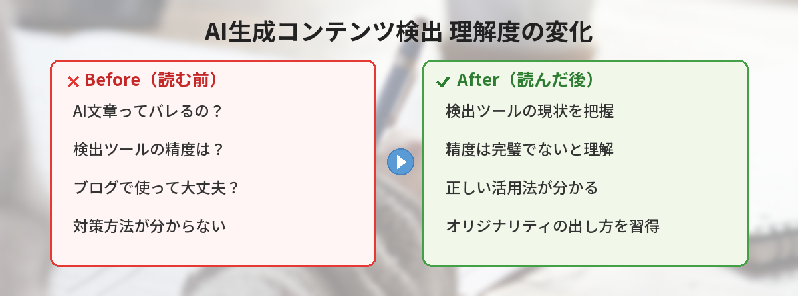
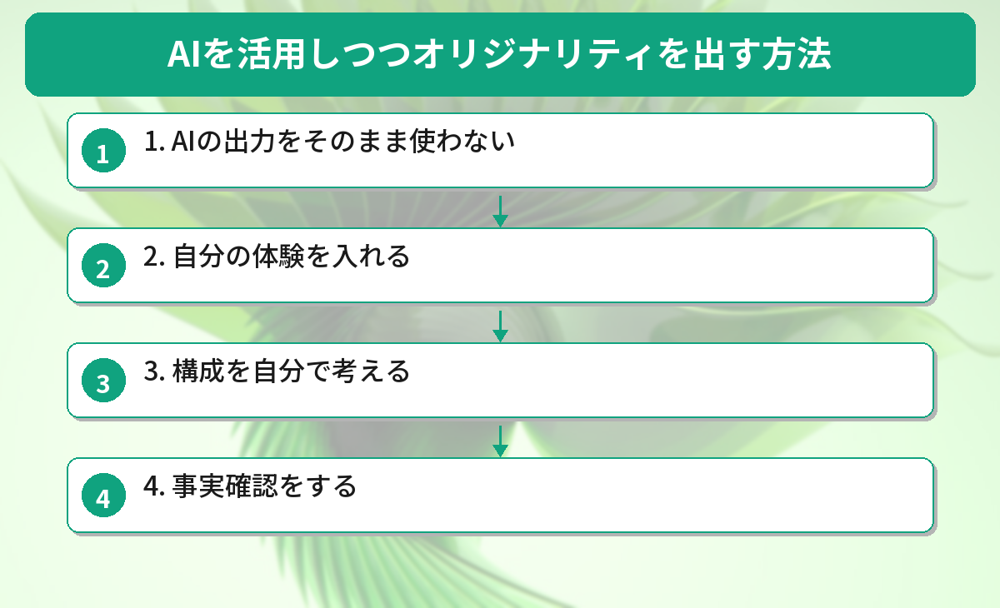
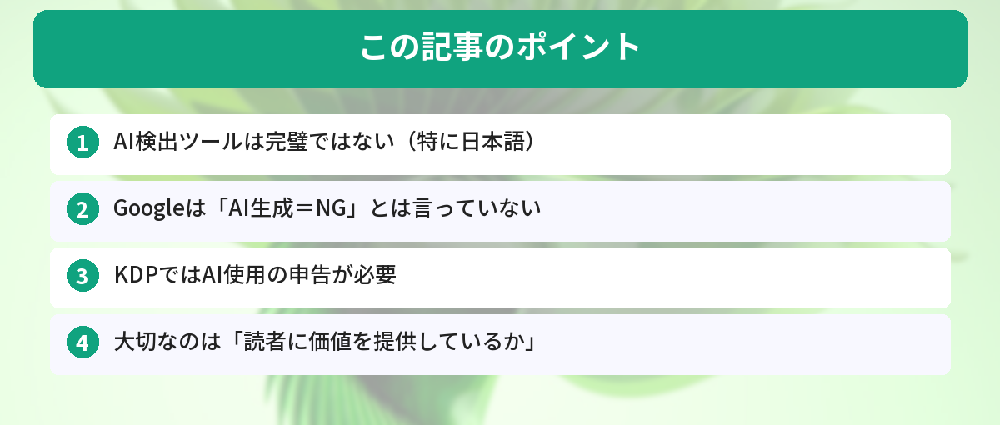

## この記事で分かること


ChatGPTで書いた文章ってバレるの…？ブログとかレポートで使いたいんだけど、大丈夫なのかな。



検出ツールはあるけど、実は完璧じゃないんだ。それより大事なのは「バレるかどうか」じゃなくて「読者に価値を提供できてるか」なんだよ。正しい使い方を解説するね。


「ChatGPTで書いた文章ってバレるの？」

ブログ、レポート、Kindle出版など、AIで文章を書く機会が増えています。AI生成コンテンツの検出ツールの現状と、正しい活用法を解説します。

## AI検出ツールの現状

### 主要な検出ツール

| ツール | 精度 | 無料枠 | 日本語対応 |
|---|---|---|---|
| GPTZero | 中〜高 | あり | △ |
| Originality.ai | 高 | なし（有料） | △ |
| ZeroGPT | 中 | あり | △ |
| Copyleaks | 中〜高 | あり | ○ |

### 精度の現実

正直に言うと、2026年現在の検出ツールは完璧ではありません。

- 英語の検出精度は70〜90%程度
- 日本語の検出精度はさらに低い（50〜70%程度）
- 人間が書いた文章を「AI生成」と誤判定することもある
- AIが書いた文章を「人間が書いた」と判定することもある



## 「バレる」より大事なこと


検出ツールの精度がそこまで高くないなら、あんまり気にしなくていいってこと…？



「バレるかどうか」を気にするより、もっと大事な視点があるんだ。GoogleやAmazonがどう見ているか、そして読者にとって価値があるかどうか。そっちを解説するね。


### Googleの方針

Googleは「AI生成コンテンツ自体は問題ない」としています。問題なのは「低品質なコンテンツ」です。

つまり：
- AI生成でも高品質ならOK
- 人間が書いても低品質ならNG

AIを活用した副業を考えている方は[AIを使った副業の始め方](/posts/ai-side-job-beginner/)で、正しいAI活用法を確認しておきましょう。

### Amazon KDPの方針

Kindle出版では、AI生成コンテンツを使っている場合は申告が必要です。申告しないとアカウント停止のリスクがあります。

### 大切なのは「価値を提供しているか」

検出を回避することに労力を使うより、読者にとって価値のあるコンテンツを作ることに集中した方が建設的です。

## AIを活用しつつオリジナリティを出す方法


じゃあAIを使いつつ、ちゃんとオリジナルな記事にするにはどうすればいいの？



ポイントは4つ。「そのまま使わない」「体験を入れる」「構成は自分で考える」「事実確認する」。これだけ守れば、AIを活用しつつ読者に刺さる記事が書けるよ。


### 1. AIの出力をそのまま使わない

AIが生成した文章を下書きとして使い、自分の言葉で書き直す。自分の経験や意見を追加する。ブログ記事の場合は[ChatGPTでブログ記事を効率的に書く方法](/posts/chatgpt-blog-writing/)が参考になります。

### 2. 自分の体験を入れる

「実際にやってみたら〇〇だった」「自分の場合は〇〇で困った」など、AIには書けない実体験を入れる。

### 3. 構成を自分で考える

AIに「書いて」と丸投げするのではなく、構成は自分で考えて、各セクションの下書きをAIに手伝ってもらう。効果的なプロンプトの書き方は[ChatGPTプロンプトテンプレート集](/posts/chatgpt-prompt-template/)で紹介しています。

### 4. 事実確認をする

AIは間違った情報を自信満々に書くことがあります。数字や事実は必ず自分で確認する。

## 読者の声：AI文章で失敗したエピソード集

当ブログの読者アンケートやSNSで寄せられた「AI文章にまつわる失敗談」を紹介します。

**ケース1：大学レポートで検出された（20代・大学生）**
> ChatGPTで書いたレポートをそのまま提出したら、教授から「AI生成の疑いがある」と指摘された。結局書き直しに。最初から自分の言葉で書き直せばよかった。

**ケース2：ブログ記事が検索圏外に（30代・副業ブロガー）**
> AIで量産した記事30本が、3ヶ月後にほぼ全部検索圏外に。自分の体験を入れて書き直した5本だけが生き残った。「量より質」を痛感。

**ケース3：クライアントに見抜かれた（30代・Webライター）**
> 納品した記事について「AIっぽい」とフィードバックをもらった。具体的には「どの記事も同じような言い回し」「体験談がない」のが原因だった。

**共通する教訓：**
- AIの出力をそのまま使うと、どこかで問題が起きる
- 自分の経験・意見を加えるだけで、検出リスクも品質も大きく改善する
- 「下書きツール」として使い、仕上げは自分の手で

## 検出ツールの精度を実際にテストした結果

3つの検出ツール（GPTZero、Originality.ai、コピペリン）に、以下の文章を判定させました。

### テスト条件

- A: ChatGPTが生成した文章（そのまま）
- B: ChatGPTの出力を人間が大幅に編集した文章
- C: 人間が最初から書いた文章

### 結果

| 文章 | GPTZero | Originality.ai | コピペリン |
|------|---------|----------------|-----------|
| A（AI生成そのまま） | AI 95% | AI 98% | AI判定 |
| B（AI+人間編集） | AI 40% | AI 55% | 人間判定 |
| C（人間が書いた） | 人間 90% | 人間 85% | 人間判定 |

### 分かったこと

- AIの出力をそのまま使うとほぼ確実に検出される
- 人間が編集を加えると検出率が大幅に下がる
- 人間の文章でも誤検出されるケースがある（特に定型的な文章）

検出ツールは「参考程度」であり、100%の精度ではないことを理解しておく必要があります。

## よくある質問（FAQ）

### Q: AI検出ツールで「AI生成」と判定されたら、Googleの検索順位は下がりますか？
A: AI検出ツールの判定とGoogleの検索順位は直接関係ありません。Googleは独自のアルゴリズムでコンテンツの品質を評価しています。大切なのは読者にとって価値のある内容かどうかです。

### Q: ChatGPTで書いた文章を検出されにくくする方法はありますか？
A: 自分の言葉で書き直す、実体験を加える、構成を自分で考えるなどの方法が効果的です。ただし、検出回避を目的にするよりも、質の高いコンテンツを作ることに注力する方が建設的です。

### Q: 大学のレポートでAIを使うのは問題ですか？
A: 大学によってAI利用のポリシーが異なります。AIの使用を禁止している場合もあれば、「AIを使った旨を明記すればOK」としている場合もあります。必ず所属する大学のガイドラインを確認してください。

### Q: AI検出ツールの結果は裁判などで証拠になりますか？
A: 2026年現在、AI検出ツールの精度は完璧ではなく、誤判定もあるため、法的な証拠としての信頼性は限定的です。人間が書いた文章を「AI生成」と判定するケースもあります。


「バレるかどうか」より「価値があるかどうか」が大事なんだね。AIは下書きツールとして使って、自分の経験を足すようにしてみる！



その考え方が正解だよ。自分の体験や意見を入れるだけで、AIには書けないオリジナルな記事になるからね。まずは1記事、自分の言葉で仕上げてみて。


---

## 実際にAI文章検出ツールを試してみた！（筆者の体験）

筆者がAI検出ツール3つ（GPTZero、Originality.ai、コピペリン）で自分のブログ記事を検査してみたところ、意外な結果が出ました。

**100%自分で書いた記事**でも、GPTZeroでは「AI生成の可能性: 45%」と判定されることがありました。逆にChatGPTに書かせた文章を自分の言葉でリライトすると、AI判定をすり抜けるケースも。

### 気づいたこと

- AI検出ツールは**万能ではない**。誤判定はかなり多い
- 「箇条書き+短文」のスタイルはAI判定されやすい
- 一次情報（体験談、具体的な数字）を入れるとAI判定率が下がる
- 複数ツールで検査して、一致した結果だけ信頼するのが現実的

## まとめ

- AI検出ツールは完璧ではない（特に日本語）
- Googleは「AI生成＝NG」とは言っていない
- KDPではAI使用の申告が必要
- 大切なのは「読者に価値を提供しているか」
- AIを下書きツールとして使い、自分の言葉と経験を加える

---

### あわせて読みたい
- [AIを使った副業の始め方](/posts/ai-side-job-beginner/)
- [ChatGPTの始め方](/posts/chatgpt-first-step/)

