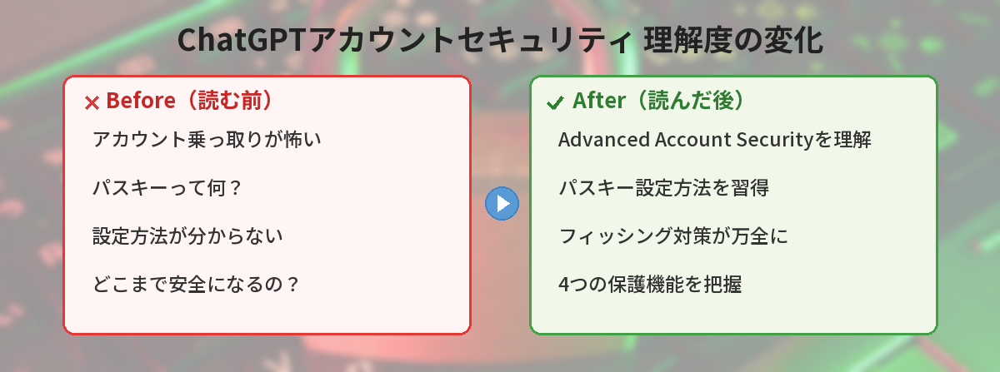
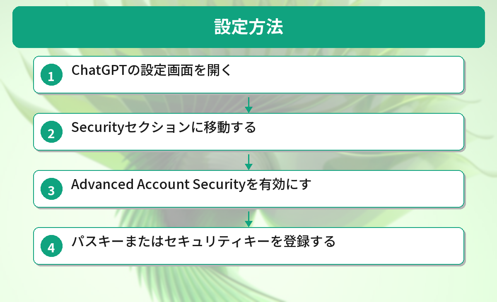
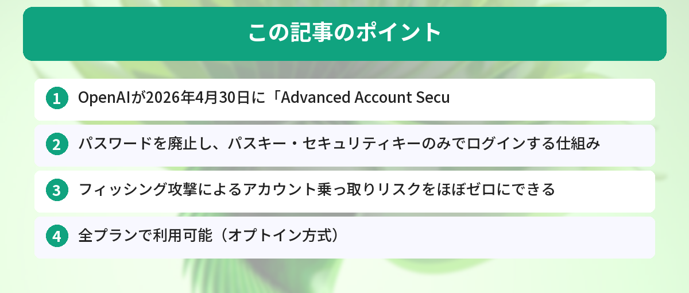

## この記事で分かること

}
ChatGPTのアカウントが乗っ取られたらどうしよう…メモリに色々保存してるし怖い。


}
OpenAIが「Advanced Account Security」っていう新機能を出したよ。パスキーを使えばフィッシング攻撃をほぼ完全に防げるんだ。設定方法を教えるね。


「ChatGPTのアカウントが乗っ取られたらどうしよう」「メモリに保存した個人情報が漏れないか心配」——そんな不安を解消します。2026年4月30日にOpenAIが発表した「Advanced Account Security」を使えば、パスワードを廃止してパスキーだけでログインする超強力なセキュリティ設定が可能です。



## Advanced Account Securityとは

OpenAIが提供する、ChatGPTアカウント向けのオプションセキュリティ機能です。有効にすると、従来のパスワードによるログインが無効化され、パスキーまたは物理セキュリティキーでのみサインインできるようになります。

この機能はChatGPTとCodexの両方に適用されます。

## なぜアカウントセキュリティが重要なのか

ChatGPTには多くの個人情報が蓄積されています。

- **メモリ機能**: あなたの名前、仕事、好みなどを記憶している
- **会話履歴**: 過去のすべてのやり取りが保存されている
- **接続アプリ**: Gmail連携をしている場合、メールの内容にもアクセスできる
- **Codex**: コードリポジトリへのアクセス権がある

パスワードが漏洩すると、これらすべてが第三者に見られる可能性があります。特にフィッシング攻撃（偽のログインページに誘導する手口）は年々巧妙になっています。

## Advanced Account Securityの4つの保護機能


4つも保護機能があるんだ！具体的にどんな仕組みで守ってくれるの？



一番大きいのはパスキーだね。パスワードを完全に廃止するから、フィッシング詐欺に引っかかる可能性がゼロになるんだ。4つの機能を順番に見ていこう。


### 1. パスキー・セキュリティキーによるログイン

パスワードを完全に廃止し、パスキー（指紋認証・顔認証）または物理セキュリティキー（YubiKeyなど）でのみログインできるようにします。フィッシングサイトに騙されてパスワードを入力してしまうリスクがゼロになります。

### 2. 強化されたアカウント復旧

メールやSMSによるアカウント復旧を無効化します。攻撃者がメールアカウントを乗っ取っても、ChatGPTアカウントには侵入できません。

### 3. セッション時間の短縮

ログイン状態の有効期間が短くなります。万が一デバイスを紛失しても、短時間で自動ログアウトされるため被害を最小限に抑えられます。

### 4. アカウントアクティビティの可視化

いつ・どこからログインされたかを確認できます。不審なアクセスがあればすぐに気づけます。

## 設定方法


仕組みは分かった！で、実際にどうやって設定するの？難しくない？



5ステップで完了するよ。スマホの指紋認証を使えば、設定自体は5分もかからないから安心して。


### ステップ1: ChatGPTの設定画面を開く

ChatGPT（Web版）にログインし、左下のプロフィールアイコン → 「Settings」をクリックします。

### ステップ2: Securityセクションに移動する

設定画面の中から「Security」タブを選択します。

### ステップ3: Advanced Account Securityを有効にする

「Advanced Account Security」のトグルをオンにします。有効化の確認ダイアログが表示されます。

### ステップ4: パスキーまたはセキュリティキーを登録する

最低2つのパスキーまたは物理セキュリティキーを登録する必要があります。1つだけだと紛失時にアカウントにアクセスできなくなるためです。

**パスキーの場合:**
- iPhoneならFace ID / Touch ID
- AndroidならGoogle パスワードマネージャー
- PCならWindows Hello（指紋・顔認証）

**物理セキュリティキーの場合:**
- YubiKeyなどのFIDO2対応キーをUSBポートに挿して登録

### ステップ5: 設定完了を確認する

登録が完了すると、次回以降のログインはパスキーのみになります。パスワードでのログインは無効化されます。

## パスキーとは何か

}
パスキーってパスワードと何が違うの…？難しそう。


}
指紋や顔認証でログインする仕組みだよ。パスワードを覚える必要もないし、偽サイトに騙される心配もゼロになるんだ。


パスキーは、パスワードに代わる新しい認証方式です。スマホやPCに保存された暗号鍵を使って本人確認を行います。

| 項目 | パスワード | パスキー |
|------|-----------|---------|
| フィッシング耐性 | ❌ 弱い | ✅ 強い |
| 覚える必要 | あり | なし |
| 使い回しリスク | あり | なし |
| 認証方法 | 文字列入力 | 指紋・顔・PIN |

パスキーはサイトごとに固有の鍵が生成されるため、偽サイトでは認証が通りません。これがフィッシング対策として最も効果的な理由です。

ChatGPTの基本的な使い方については[はじめてのChatGPTガイド](/posts/chatgpt-first-step/)で解説しています。

## こんな人におすすめ

- ChatGPTに仕事の情報を入力している人
- メモリ機能に個人情報を保存している人
- Gmail連携を使っている人
- Codexでコードリポジトリを接続している人
- 過去にパスワード漏洩の被害に遭ったことがある人

逆に、共有PCからログインすることが多い人や、パスキー対応デバイスを持っていない人は、まだ従来のログイン方式のままで問題ありません。

## 注意点

}
設定したら元に戻せなくなったりしない…？ちょっと怖い。


}
設定画面からオフにすれば戻せるよ。ただしパスキーは必ず2つ以上登録してね。1つだけだとデバイス紛失時に詰むから。


- **パスキーを2つ以上登録すること**。1つだけだとデバイス紛失時に詰みます
- 有効化すると**パスワードでのログインは完全に無効**になります。元に戻すには設定画面からオフにする必要があります
- **2026年6月1日以降**、Trusted Access for Cyber（高度なAIモデルへのアクセス権）を持つユーザーはAdvanced Account Securityが必須になります
- アカウント復旧手段が制限されるため、バックアップ用のセキュリティキーを安全な場所に保管してください

AIツールのセキュリティ全般については[AI活用の注意点まとめ](/posts/chatgpt-custom-instructions/)も参考になります。

## 読者の声：アカウントセキュリティにまつわる体験談

当ブログの読者から寄せられた、ChatGPTアカウントのセキュリティに関する体験談を紹介します。

**ケース1：不審なログイン通知が来た（30代・会社員）**
> ある日突然「新しいデバイスからログインがありました」というメールが届いた。自分ではログインしていない。慌ててパスワードを変更したが、メモリに保存していた仕事の情報が見られたかもしれないと思うとゾッとした。

**ケース2：パスキー設定で安心感が段違いに（40代・フリーランス）**
> Advanced Account Securityを設定してから、フィッシングメールが来ても「パスキーだから関係ない」と余裕で無視できるようになった。設定は3分で終わったし、もっと早くやればよかった。

**ケース3：セキュリティキーを1つしか登録せず焦った（20代・エンジニア）**
> パスキーを1つだけ登録して満足していたら、スマホが故障。ログインできなくなって2日間アカウントにアクセスできなかった。バックアップ用のキーは絶対に2つ以上登録すべき。

**共通する教訓：**
- ChatGPTにはメモリや会話履歴など、想像以上に個人情報が蓄積されている
- パスキーの設定は数分で終わるので、後回しにしない
- バックアップ用のキーは必ず2つ以上登録する

## アカウントセキュリティで実際にやっておくべきこと

ChatGPTアカウントのセキュリティ設定を見直した際に気づいたポイントです。

### 設定して良かったこと

- 二段階認証を有効にしたら、不審なログイン試行の通知が来るようになった
- セッション管理で「知らないデバイス」からのログインを発見して強制ログアウトできた

### 意外と知られていない設定

- 「チャット履歴とトレーニング」をオフにすると、入力内容がAIの学習に使われなくなる
- データエクスポート機能で、過去の会話を全てダウンロードできる
- 共有リンクの管理画面で、過去に共有した会話を一覧確認・削除できる

## よくある質問（FAQ）

### Q: 無料プランでも使えますか？

A: はい。Advanced Account Securityは全プランで利用可能です。

### Q: スマホを機種変更したらどうなりますか？

A: パスキーはクラウド同期されるため、同じApple ID / Googleアカウントの新しいスマホでそのまま使えます。物理セキュリティキーの場合は、キー自体を新しいスマホに登録し直す必要があります。

### Q: YubiKeyはどれを買えばいいですか？

A: USB-A / USB-C / NFC対応の「YubiKey 5」シリーズがおすすめです。PCとスマホの両方で使えます。

### Q: 設定後にパスワードログインに戻せますか？

A: はい。設定画面からAdvanced Account Securityをオフにすれば、パスワードログインに戻せます。

### Q: 家族と共有しているアカウントでも使えますか？

A: 使えますが、全員がパスキーを登録する必要があります。共有アカウントの場合は物理セキュリティキーを共有するか、各自のデバイスにパスキーを登録してください。

}
パスキー2つ登録するの忘れないようにしなきゃ…！やってみる！


}
スマホの指紋認証 + バックアップ用のセキュリティキーがおすすめだよ。5分で設定できるから、今日やっちゃおう。


## まとめ

- OpenAIが2026年4月30日に「Advanced Account Security」を発表
- パスワードを廃止し、パスキー・セキュリティキーのみでログインする仕組み
- フィッシング攻撃によるアカウント乗っ取りリスクをほぼゼロにできる
- 全プランで利用可能（オプトイン方式）
- パスキーは必ず2つ以上登録すること
- 6月1日以降、一部ユーザーは必須化される予定

---
### あわせて読みたい

- [はじめてのChatGPT完全ガイド](/posts/chatgpt-first-step/)

