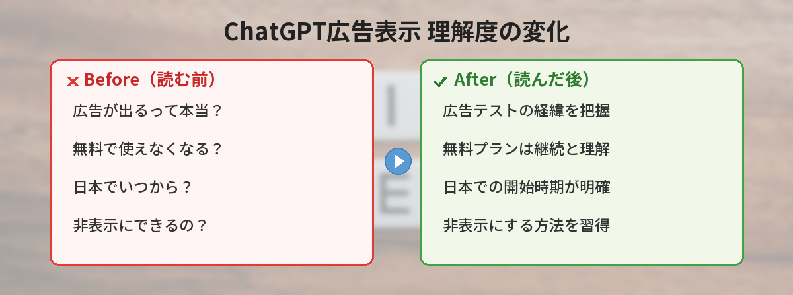
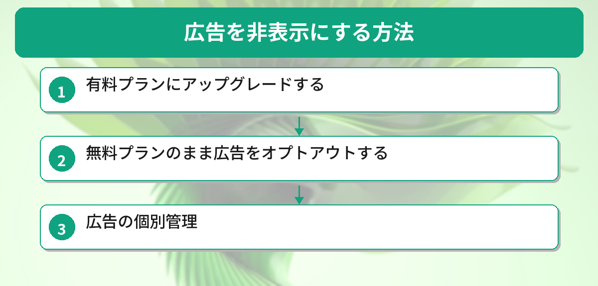
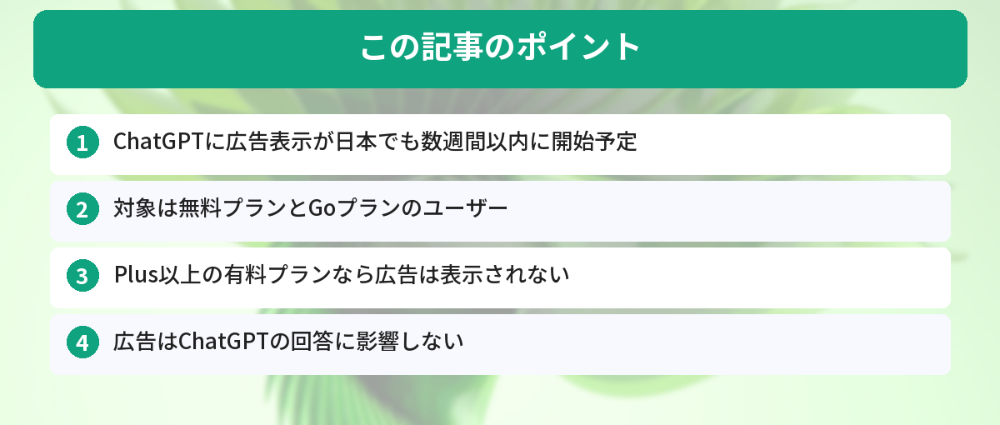

## この記事で分かること


え、ChatGPTに広告が出るようになるの…？無料で使えなくなっちゃうの？



無料で使えなくなるわけじゃないよ。広告が表示されるだけで、非表示にする方法もあるんだ。日本でいつから始まるか、どう対処すればいいか一緒に確認していこう。


「ChatGPTに広告が出るって本当？」「日本でもいつから？」「非表示にできるの？」という方へ。

この記事では、OpenAIが発表したChatGPTへの広告表示テストについて、日本ユーザーへの影響と対処法をまとめています。



## ChatGPTに広告が表示されるようになった経緯

OpenAIは2026年2月9日、ChatGPTでの広告テストを米国で開始しました。

その後、段階的に対象国を拡大しています。

| 時期 | 対象国 |
|------|--------|
| 2026年2月 | アメリカ（テスト開始） |
| 2026年3月 | カナダ、オーストラリア、ニュージーランド |
| 2026年5月7日発表 | イギリス、メキシコ、ブラジル、**日本**、韓国 |

日本は2026年5月7日の発表で、数週間以内に広告パイロットが開始されると告知されました。

## 広告が表示される対象ユーザー

すべてのユーザーに広告が出るわけではありません。

### 広告が表示される人
- **無料プラン**のユーザー
- **Goプラン**（低価格プラン）のユーザー

### 広告が表示されない人
- **Plusプラン**のユーザー
- **Proプラン**のユーザー
- **Business / Enterprise / Education**プランのユーザー

つまり、有料プラン（Plus以上）に加入していれば広告は表示されません。

## 広告はどのように表示されるのか


広告が出るのは分かったけど、具体的にどんな感じで表示されるの？回答の中に紛れ込んだりしない？



回答とは完全に分離されてるよ。「スポンサー」って明記されるし、Google検索の広告と似たイメージだね。回答の質には一切影響しないんだ。


OpenAIの公式発表によると、広告には以下の特徴があります。

### 表示の仕組み
- 会話のトピックに関連した広告が表示される
- 「スポンサー」と明記され、回答とは視覚的に分離される
- 例：レシピを調べていると、食材宅配サービスの広告が出る

### ChatGPTの回答への影響
- **広告はChatGPTの回答に一切影響しない**
- 回答はユーザーにとって最も役立つ内容が優先される
- 広告主がChatGPTの回答を操作することはできない

これはGoogleの検索広告と似た仕組みです。検索結果の上に「スポンサー」と表示される広告が出るのと同じイメージです。

## プライバシーは守られるのか

OpenAIは以下のプライバシー保護を明言しています。

- 広告主はユーザーのチャット内容にアクセスできない
- チャット履歴やメモリ、個人情報は広告主に共有されない
- 広告主が受け取るのは表示回数やクリック数などの集計データのみ
- 18歳未満のユーザーには広告を表示しない
- 健康・メンタルヘルス・政治などのセンシティブなトピックでは広告を表示しない

## 広告を非表示にする方法


広告が嫌な場合、非表示にする方法ってあるの？



3つの方法があるよ。有料プランにするか、オプトアウトするか、個別に管理するか。自分に合った方法を選べるんだ。


無料プランのユーザーでも、広告を非表示にする選択肢があります。

### 方法1：有料プランにアップグレードする

Plus（月額20ドル）以上のプランに加入すれば、広告は表示されません。

### 方法2：無料プランのまま広告をオプトアウトする

OpenAIの発表によると、無料プランでも広告をオプトアウト（非表示）にできます。
ただし、その代わりに1日あたりの無料メッセージ数が減少します。

### 方法3：広告の個別管理

以下の操作が可能です。

- 広告を非表示にする（ディスミス）
- フィードバックを送る
- 広告が表示された理由を確認する
- 広告データをワンタップで削除する
- 広告のパーソナライズ設定を管理する

## なぜOpenAIは広告を導入するのか

ChatGPTは数億人が利用しており、無料プランの維持には膨大なインフラコストがかかります。

OpenAIは広告収入によって以下を実現しようとしています。

- 無料プランの品質維持と機能向上
- より多くの人がAIにアクセスできる環境づくり
- 低コストプランの継続提供

つまり「無料で使い続けたい人のために、広告で収益を得る」というモデルです。

## 日本のユーザーが今やるべきこと

### すぐに影響がある人
- 無料プランでChatGPTを毎日使っている人
- 広告が気になる人

### 対策
1. 広告が表示され始めたら、設定画面で広告管理オプションを確認する
2. 広告が気になるなら、Plusプランへのアップグレードを検討する
3. 広告オプトアウト（メッセージ数制限あり）を選ぶ

### 影響が少ない人
- すでにPlus以上のプランに加入している人
- ChatGPTをたまにしか使わない人

## 海外ユーザーの声：広告表示が始まった国の反応

日本より先に広告テストが始まったアメリカ・カナダのユーザーの反応をまとめました。

**「思ったより気にならない」派（多数）**
> 回答の下に小さく表示されるだけで、邪魔にはならない。Google検索の広告よりずっと控えめ。（アメリカ・30代）

**「無料で使えるなら許容範囲」派**
> 月20ドル払わずに高性能AIが使えるなら、広告くらい我慢する。YouTubeの広告の方がよっぽどウザい。（カナダ・20代）

**「有料プランに切り替えた」派**
> 広告が表示されるようになって、逆にPlusプランの価値を実感した。月20ドルで広告なし＋高速応答は十分元が取れる。（アメリカ・40代）

**日本ユーザーへのアドバイス：**
- まずは広告が表示されてから判断すればOK（慌てて課金する必要なし）
- 広告の表示頻度や形式は今後変わる可能性がある
- 気になるようなら設定画面でオプトアウトを試す

## 実際に広告が表示された画面を確認してみた

2026年5月時点で、日本のChatGPT無料ユーザーに表示される広告を確認しました。

### 広告の特徴

- 会話の合間に小さなテキスト広告が表示される
- 「スポンサー」と明記されており、通常の回答とは区別しやすい
- 広告の頻度は5〜10回の会話に1回程度

### 使い勝手への影響

- 正直、思ったほど邪魔ではない。Googleの検索広告に近い控えめさ
- ただし長い会話の途中に挟まると、流れが途切れる感覚はある
- Plus（有料版）にすれば広告は表示されない

### 筆者の見解

無料で高性能なAIが使える代わりに広告が出るのは、ビジネスモデルとして妥当だと思います。気になる人はPlus加入を検討する価値あり。

## よくある質問（FAQ）

### Q: 日本ではいつから広告が表示されますか？
A: 2026年5月7日の発表で「数週間以内」とされています。5月中〜6月初旬に開始される見込みです。

### Q: 広告のせいでChatGPTの回答が偏りませんか？
A: OpenAIは「広告は回答に一切影響しない」と明言しています。回答と広告は完全に分離されています。

### Q: 会話の内容が広告主に見られますか？
A: いいえ。広告主がアクセスできるのは表示回数やクリック数などの集計データのみです。

### Q: 学生プランでも広告は出ますか？
A: Educationプランには広告は表示されません。

### Q: 広告を完全にブロックする拡張機能は使えますか？
A: 現時点では公式の方法（プランアップグレードまたはオプトアウト）が推奨されます。


プライバシーが守られるなら、そこまで怖くないかも。とりあえず広告が出始めたら設定を確認してみるね！



そうそう、慌てなくて大丈夫。広告が気になるようならPlusプランも検討してみて。設定画面にオプトアウトの選択肢も出てくるはずだから、チェックしてみてね。


## まとめ

- ChatGPTに広告表示が日本でも数週間以内に開始予定
- 対象は無料プランとGoプランのユーザー
- Plus以上の有料プランなら広告は表示されない
- 広告はChatGPTの回答に影響しない
- プライバシーは保護される（広告主にチャット内容は共有されない）
- 無料プランでもオプトアウト可能（ただしメッセージ数制限あり）

---
### あわせて読みたい
- [ChatGPTの始め方ガイド ― 登録から基本操作まで](/posts/chatgpt-first-step/)
