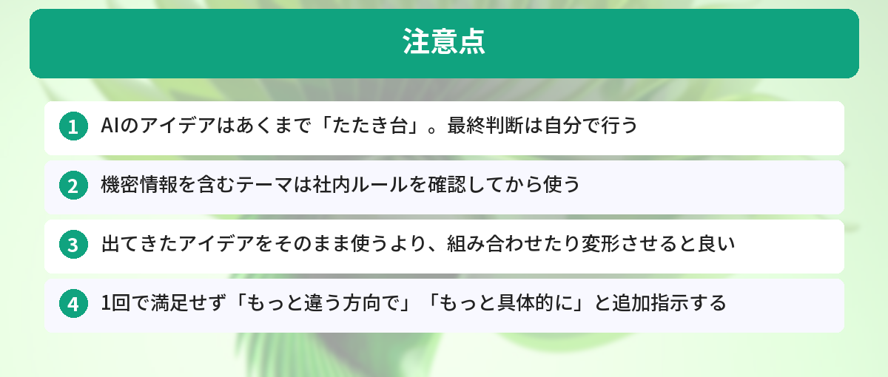
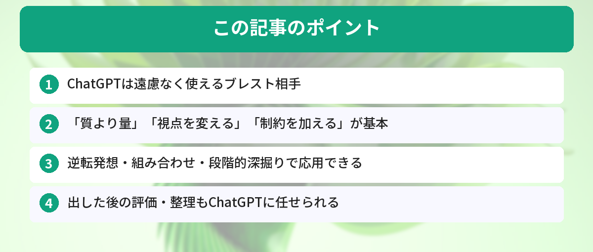

## この記事で分かること


アイデア出しなきゃいけないのに、何も浮かばなくて困ってるの…。一人でブレストってできるの？



ChatGPTを相手にすれば、一人でも大量にアイデアが出せるよ。遠慮なく「もっと出して」って言えるのが最大の強みなんだ。すぐ使えるプロンプトを紹介するね。



「アイデアを出さなきゃいけないのに、何も浮かばない…」

ChatGPTをブレスト相手にすれば、一人でも短時間で大量のアイデアを出せます。すぐ使えるプロンプトを紹介します。



## なぜChatGPTがブレストに向いているのか

- 遠慮なく何度でも聞ける（人間相手だと気を使う）
- 異なる視点を瞬時に出してくれる
- 「もっと出して」と言えば追加してくれる
- 深夜でも早朝でも付き合ってくれる

## 基本のプロンプト

### まずは量を出す

```
以下のテーマについて、アイデアを20個出してください。
質より量を重視してください。突飛なものも歓迎です。

テーマ：社内の会議を効率化する方法
```

ポイントは「質より量」と明示すること。ChatGPTは丁寧に絞り込もうとする傾向があるので、あえて量を求めると幅が広がります。プロンプトの書き方のコツは[ChatGPTプロンプトテンプレート集](/posts/chatgpt-prompt-template/)でも紹介しています。

### 視点を変える

```
以下のテーマについて、それぞれの立場からアイデアを3つずつ出してください。

テーマ：新入社員の研修を改善する

立場：
1. 新入社員本人
2. 教育担当の先輩
3. 人事部長
4. 他社の人事コンサルタント
5. 全く別の業界（飲食店の店長）
```

異なる視点を指定すると、自分では思いつかない角度のアイデアが出てきます。

### 制約を加える

```
以下の条件でアイデアを10個出してください。

テーマ：チームの交流を深めるイベント
制約：
- 予算は1人500円以内
- オンラインでも参加できる
- 準備時間は30分以内
- 全員が楽しめる（お酒が飲めない人も）
```

制約があるほど、具体的で実行可能なアイデアが出やすくなります。

## 応用テクニック


基本のプロンプトは分かった！もっと面白いアイデアを出すテクニックってあるの？



あるよ！逆転発想、組み合わせ、段階的深掘り、評価マトリクスの4つを紹介するね。これを使うと、普通じゃ思いつかないアイデアが出てくるんだ。


### テクニック1: 逆転発想

```
「最悪の会議」を作るとしたら、どんな要素がありますか？
10個挙げてください。

その後、それぞれの逆を「理想の会議の条件」として整理してください。
```

あえて最悪を考えることで、理想が明確になります。

### テクニック2: 組み合わせ

```
以下の2つのリストから、1つずつ組み合わせて新しいサービスのアイデアを10個作ってください。

リストA（技術）：AI、AR、ブロックチェーン、IoT、音声認識
リストB（業界）：教育、医療、農業、観光、介護
```

強制的に組み合わせることで、意外な発想が生まれます。

### テクニック3: 段階的に深掘り

```
ステップ1: 「リモートワークの課題」を10個挙げてください
```

出てきた中から気になるものを選んで：

```
ステップ2: 「コミュニケーション不足」について、解決策を10個出してください
```

さらに絞り込んで：

```
ステップ3: 「非同期コミュニケーションツールの導入」について、
具体的な実行計画を作ってください
```

広げてから絞る。この流れが最も実用的です。

### テクニック4: 評価してもらう

```
以下のアイデアを「実現しやすさ」と「インパクト」の2軸で評価して、
4象限のマトリクスに分類してください。

1. 週1回の雑談タイム導入
2. 社内SNSの開設
3. オフィスのレイアウト変更
4. 外部講師を招いたワークショップ
5. メンター制度の導入
```

アイデアを出した後の整理・評価もChatGPTに任せられます。

## 使う場面の例


テクニックはたくさんあるけど、実際の仕事ではどの場面でどのテクニックを使えばいいの？



場面ごとにおすすめの組み合わせがあるよ。一覧表にまとめたから参考にしてみて。


| 場面 | プロンプトの方向性 |
|---|---|
| 企画会議の事前準備 | 量を出す → 評価で絞る |
| ブログのネタ出し | ターゲット × 悩みの掛け合わせ |

ブログのネタ出しについては[ChatGPTでブログ記事を効率的に書く方法](/posts/chatgpt-blog-writing/)でさらに詳しく解説しています。
| 商品名・キャッチコピー | 制約付きで大量生成 → 投票 |
| 問題解決 | 逆転発想 → 深掘り |
| 新規事業 | 組み合わせ → 段階的に深掘り |

## 注意点



- AIのアイデアはあくまで「たたき台」。最終判断は自分で行う
- 機密情報を含むテーマは社内ルールを確認してから使う
- 出てきたアイデアをそのまま使うより、組み合わせたり変形させると良い
- 1回で満足せず「もっと違う方向で」「もっと具体的に」と追加指示する

毎回同じ条件を伝えるのが面倒な場合は[ChatGPTカスタム指示の設定方法](/posts/chatgpt-custom-instructions/)で事前に設定しておくと効率的です。

## 新規事業のアイデア出しにChatGPTを使った実例

筆者は実際に社内の新規事業企画で、ChatGPTをブレスト相手として活用しました。

**お題：** 「AIを活用した新しいサービスのアイデア」
**所要時間：** 2時間（従来のチームブレストでは半日かかっていた）

**やったこと：**
1. まず「質より量」で50個のアイデアを出してもらった（10分）
2. 気になる5個を選んで「組み合わせ」テクニックで発展させた（20分）
3. 「逆転発想」で既存サービスの弱点から新アイデアを3つ追加（15分）
4. 全8個を「実現しやすさ×インパクト」のマトリクスで評価してもらった（10分）

**結果：**
- 最終的に3つの有望なアイデアに絞り込めた
- そのうち1つが実際にプロトタイプ開発に進んだ
- チームメンバーからも「事前にここまで整理されていると議論が早い」と好評

**学んだこと：** ChatGPTは「量を出す」フェーズで圧倒的に強い。人間は「選ぶ」「判断する」フェーズに集中できるので、役割分担が明確になる。

## ChatGPTブレストで実際に良いアイデアが出た事例

副業のコンテンツ企画でChatGPTとブレストした実例です。

### お題: 「プログラミング初心者向けのYouTubeチャンネル企画」

### ChatGPTに出してもらったアイデア（抜粋）

1. 「エラーメッセージ読み上げASMR」（エラーを怖くなくする）
2. 「1分コーディングチャレンジ」（短尺で完結）
3. 「プログラマーの1日vlog」（日常に寄せる）
4. 「コードレビュー実況」（他人のコードを読む）

### 自分では思いつかなかったもの

4番の「コードレビュー実況」は自分では絶対に出てこなかった。実際にこの企画を採用して動画を作ったところ、再生数が通常の3倍になりました。

### ブレストのコツ

- 「実現可能性は無視して」と前置きすると、突飛なアイデアが出やすい
- 出てきたアイデアに「これを発展させて」と深掘りすると、さらに具体的になる

## よくある質問（FAQ）



### Q: ChatGPTの無料プランでもブレストに使えますか？
A: 使えます。無料プランでもアイデア出し、視点の切り替え、評価・整理など、ブレストに必要な機能は十分に活用できます。

### Q: ChatGPTが出すアイデアはありきたりではないですか？
A: 「質より量」「制約を加える」「逆転発想」などのテクニックを使うと、意外なアイデアが出てきます。プロンプトの工夫次第で、出力の質は大きく変わります。

### Q: チームでのブレストにもChatGPTは使えますか？
A: 使えます。事前にChatGPTでアイデアを大量に出しておき、チームミーティングではその中から選ぶ・組み合わせるという使い方が効率的です。

### Q: ChatGPT以外にブレストに向いているAIツールはありますか？
A: Claudeは長い文脈を保持するのが得意で、深い議論に向いています。Geminiは最新情報を踏まえたアイデア出しに強いです。ツールの比較は[Gemini vs ChatGPT比較記事](/posts/gemini-vs-chatgpt/)をご覧ください。


逆転発想とか組み合わせとか、こんなにやり方あるんだ…！まずは「質より量」で20個出してもらうところからやってみる！



その意気！出てきたアイデアは「たたき台」だから、気に入ったものを組み合わせたり変形させたりしてみて。「もっと違う方向で」って追加指示するのも忘れずにね。


## まとめ

- ChatGPTは遠慮なく使えるブレスト相手
- 「質より量」「視点を変える」「制約を加える」が基本
- 逆転発想・組み合わせ・段階的深掘りで応用できる
- 出した後の評価・整理もChatGPTに任せられる

---

### あわせて読みたい
- [ChatGPTプロンプトテンプレート集 ― コピペで使える実用プロンプト](/posts/chatgpt-prompt-template/)
- [ChatGPTの始め方 ― 登録から最初の質問まで5分で完了](/posts/chatgpt-first-step/)


