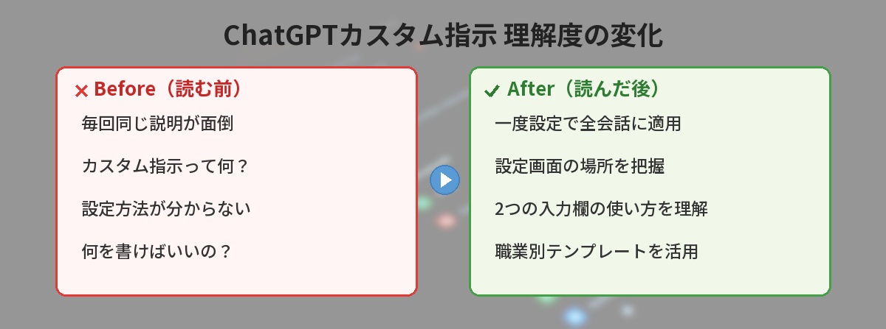
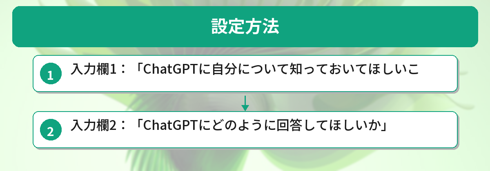
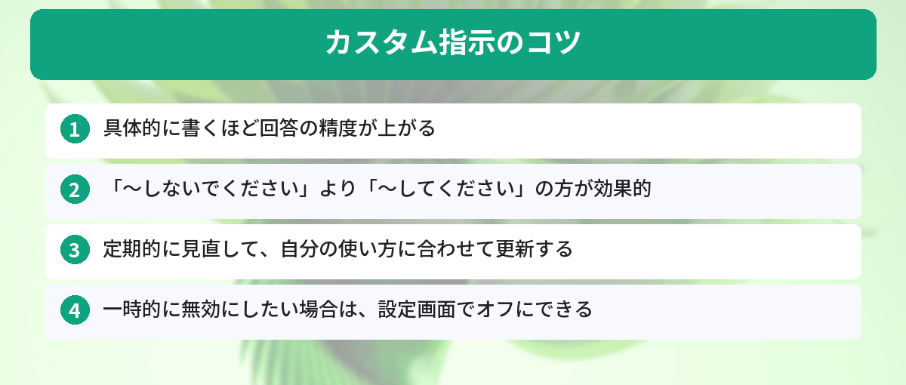

## この記事で分かること


ChatGPTに毎回「日本語で答えて」「箇条書きで」って言うの面倒なの…。なんとかならないの？



それ、カスタム指示を設定すれば一発で解決するよ。一度設定するだけで、全部の会話に自動で適用されるんだ。設定方法を教えるね。




ChatGPTを使うたびに「私は初心者です」「日本語で答えてください」「箇条書きで」と毎回伝えるのが面倒。

カスタム指示（Custom Instructions）を設定すれば、一度設定するだけで毎回自動的に適用されます。



## カスタム指示とは

ChatGPTに「自分はこういう人間で、こういう回答がほしい」と事前に伝えておく機能です。設定すると、すべての会話に自動で適用されます。ChatGPTをまだ使ったことがない方は、まず[ChatGPTの始め方ガイド](/posts/chatgpt-first-step/)からどうぞ。

## 設定方法



1. ChatGPTを開く
2. 左下のアカウントアイコンをクリック
3. 「カスタム指示」または「Custom Instructions」を選択
4. 2つの欄に入力して保存

### 入力欄1：「ChatGPTに自分について知っておいてほしいこと」

ここに自分の情報を書きます。

例：

```
私は日本の会社員で、IT部門で働いています。
プログラミングは初心者レベルです。
主にPythonとExcelを使っています。
英語は読めますが、日本語での回答を希望します。
```

### 入力欄2：「ChatGPTにどのように回答してほしいか」

ここに回答のスタイルを書きます。

例：

```
- 日本語で回答してください
- 専門用語を使う場合は簡単な説明を添えてください
- 回答は箇条書きを多用して読みやすくしてください
- コードを書く場合はコメントを日本語で入れてください
- 長すぎる回答は避けて、要点を絞ってください
```

## 活用例


設定方法は分かったけど、具体的に何を書けばいいか迷うな…。みんなどんなこと書いてるの？



職種や目的によって全然違うんだ。ビジネスパーソン、プログラマー、ライターの3パターンを紹介するから、自分に近いものを参考にしてみて。


### ビジネスパーソン向け

入力欄1：
```
営業部のマネージャーです。部下10人のチームを管理しています。
ITに詳しくありません。
```

入力欄2：
```
- ビジネス用語は使ってOKですが、IT用語は避けてください
- メールの文面を作るときは、ビジネスマナーに沿った丁寧な文体で
- 提案は3つ以内に絞ってください
```

### プログラミング学習者向け

入力欄1：
```
Pythonを独学で勉強中の大学生です。
基本的な文法は理解していますが、実践経験はありません。
```

入力欄2：
```
- コードには必ず日本語コメントをつけてください
- なぜそう書くのか理由も説明してください
- エラーが出たときは、原因と解決方法を両方教えてください
- 初心者が陥りやすい注意点があれば教えてください
```

データ分析の場面でChatGPTを活用したい方は[ChatGPTでデータ分析する方法](/posts/chatgpt-data-analysis/)も参考になります。

### ライター向け

入力欄1：
```
フリーランスのWebライターです。
SEO記事とコラムを主に書いています。
```

入力欄2：
```
- 文章は「です・ます」調で統一
- 1文は60文字以内
- 見出しにはキーワードを含める
- 冗長な表現は避けて簡潔に
```

ライターの方でブログ記事の書き方を効率化したい場合は[ChatGPTでブログ記事を効率的に書く方法](/posts/chatgpt-blog-writing/)もあわせてご覧ください。

## カスタム指示のコツ




活用例を見て書いてみたけど、もっと効果を上げるコツってある？



あるよ！「具体的に書く」「否定形より肯定形」「定期的に見直す」の3つを意識するだけで、回答の精度がグッと上がるんだ。


- 具体的に書くほど回答の精度が上がる
- 「〜しないでください」より「〜してください」の方が効果的
- 定期的に見直して、自分の使い方に合わせて更新する
- 一時的に無効にしたい場合は、設定画面でオフにできる

カスタム指示と合わせて、よく使うプロンプトをテンプレート化しておくとさらに効率的です。[ChatGPTプロンプトテンプレート集](/posts/chatgpt-prompt-template/)も参考にしてください。

## カスタム指示を3回書き直して気づいたこと

筆者はカスタム指示を設定してから3回書き直しました。その変遷と気づきを共有します。

**1回目（設定直後）：**
「日本語で答えて。箇条書きで。」→ シンプルすぎて効果を実感できず。

**2回目（1週間後）：**
職種、使用ツール、好みの回答スタイルを追加。→ 回答の的確さが明らかに向上。毎回「Pythonで」と言わなくて済むようになった。

**3回目（1ヶ月後）：**
「やってほしくないこと」も追加（例：「前置きの挨拶は不要」「コードブロックには必ずコメントを入れて」）。→ 無駄なやり取りが激減。

**数字で見る効果：**
- 1回の会話で追加の指示を出す回数：平均3回 → 0.5回に減少
- 「思った通りの回答」が返ってくる確率：体感50% → 85%

**結論：** カスタム指示は「一度設定して終わり」ではなく、使いながら育てるもの。2週間に1回見直すのがおすすめ。

## 筆者が実際に設定しているカスタム指示

自分が使っているカスタム指示の内容を公開します。

### 「あなたについて」の設定内容

- Webエンジニア（フロントエンド中心）
- 日本語で回答してほしい
- ブログ運営をしている
- 初心者向けの解説が得意

### 「回答の仕方」の設定内容

- 結論を最初に述べる
- コードは必ずコメント付きで
- 専門用語を使ったら直後に説明を添える
- 1文は60文字以内で短く

### 設定前後の変化

設定前は毎回「日本語で」「簡潔に」「コード付きで」と指示していましたが、設定後はいきなり本題に入れるようになりました。1日10回ChatGPTを使うとして、毎回30秒の節約×10回=5分/日の時短です。

## よくある質問（FAQ）

### Q: カスタム指示は無料プランでも使えますか？
A: 使えます。ChatGPTの無料プランでもカスタム指示の設定が可能です。

### Q: カスタム指示を設定すると、すべての会話に適用されますか？
A: はい、設定後はすべての新しい会話に自動で適用されます。特定の会話だけ無効にしたい場合は、設定画面でオフにできます。

### Q: カスタム指示の内容は後から変更できますか？
A: いつでも変更できます。使い方が変わったり、新しい要望が出てきたら、設定画面から更新してください。定期的に見直すのがおすすめです。

### Q: カスタム指示に何文字まで入力できますか？
A: 各入力欄に約1,500文字まで入力できます。長すぎると効果が薄れることがあるので、要点を絞って書くのがコツです。

### Q: ChatGPT以外のAIツールにも同様の機能はありますか？
A: Claudeにも「プロジェクト」機能で事前指示を設定できます。Claudeの特徴については[Claudeとは？ChatGPTとの違いを解説](/posts/claude-what-is-it/)をご覧ください。


2つの欄に書くだけでいいんだ！思ったより簡単だね。さっそく自分の情報を入れてみる！



最初は短くてもOKだよ。使っていくうちに「こういう回答がほしいな」って気づくことが増えるから、定期的に見直して育てていくのがポイントなんだ。



---

## 実際にカスタムインストラクションを設定してみた！（筆者の体験）

筆者がカスタムインストラクションに設定して最も効果があったのは以下の内容です。

**「あなたについて」欄**: 「AIブログを運営する会社員。読者は非エンジニアの30代。プログラミング知識なし」

**「ChatGPTにどう回答してほしいか」欄**: 「専門用語は使わず平易な日本語で。1文は60文字以内。結論を最初に言ってから理由を説明」

この設定だけで、毎回「初心者向けに分かりやすく教えて」と前置きする必要がなくなりました。1日5〜10回ChatGPTを使う場合、累計で1日15〜20分の時短になっています。


### カスタムインストラクションの更新タイミング

- プロジェクトが変わったとき（「今はブログ執筆に集中している」など）
- 回答の質に不満を感じたとき（指示が古くなっている可能性）
- 新しい使い方を始めたとき（コーディング支援を始めた、英語学習に使い始めた等）

月に1回は見直す習慣をつけておくと、常にベストな回答が得られます。


### よく使われるカスタムインストラクションの例

**ビジネスパーソン向け:**
- 「ビジネスメールの形式で回答してください」
- 「箇条書きで簡潔にまとめてください」
- 「専門用語は避けて、上司に説明するような平易な言葉で」

**エンジニア向け:**
- 「コードはTypeScriptで書いてください」
- 「エラーハンドリングを含めてください」
- 「コメントは日本語で書いてください」

**ブロガー向け:**
- 「ですます調で、1文60文字以内」
- 「SEOを意識したH2見出しを提案して」
- 「読者は非エンジニアの30代」

設定に5分かけるだけで、今後の全ての会話の質が上がります。ChatGPTをよく使う人ほど効果を実感できるはずです。まだ設定していない人は今すぐやってみてください。


### 設定のBefore/After比較

**Before（カスタムインストラクションなし）:**
毎回「初心者向けに分かりやすく、ですます調で、1文60文字以内で回答してください。専門用語は噛み砕いて〜」と書く（50文字の入力コスト×1日10回=500文字/日の無駄）

**After（カスタムインストラクションあり）:**
質問だけ書けばOK。前提条件は自動適用される。1日500文字の入力が0に。

## まとめ

- カスタム指示を設定すれば、毎回同じ説明をする手間がなくなる
- 「自分の情報」と「回答スタイル」の2つを設定するだけ
- 職種や目的に合わせてカスタマイズすると効果的

---
### あわせて読みたい
- [ChatGPTの始め方 ― 登録から最初の質問まで5分で完了](/posts/chatgpt-first-step/)
- [コピペで使えるChatGPTプロンプト10選 ― 仕事がすぐ楽になる](/posts/chatgpt-prompt-template/)

