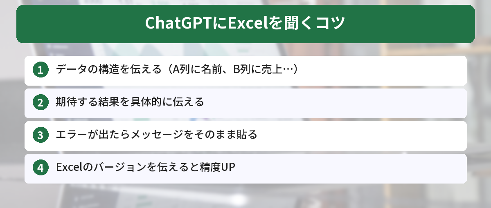

## この記事で分かること


Excelの関数が分からなくて毎回ググってるんだけど…。ChatGPTに聞いた方が早いの？



圧倒的に早いよ。関数名を知らなくても「やりたいこと」を日本語で伝えるだけで数式を教えてくれるんだ。マクロまで書いてもらえるから、具体的な聞き方を紹介するね。


「Excelの関数が分からない」「マクロって何？」

そんなとき、ChatGPTに聞けば数秒で答えが返ってきます。ググるより速いです。ChatGPTをまだ使ったことがない方は、[ChatGPTの始め方](/posts/chatgpt-first-step/)から始めてみてください。



## 基本の聞き方

### 関数を教えてもらう

```
Excelで、A列の数値が100以上のセルだけを合計したいです。
使うべき関数と、具体的な数式を教えてください。
```

ChatGPTの回答例：

> SUMIF関数を使います。
> `=SUMIF(A:A,">=100")`

### やりたいことを日本語で伝える

関数名を知らなくても大丈夫です。やりたいことをそのまま伝えてください。


```
Excelで、名前の列に「田中」が含まれる行だけを
別のシートにコピーしたいです。手動でやる方法と、
自動でやる方法の両方を教えてください。
```

## 実践例


なるほど、やりたいことをそのまま伝えればいいんだ。具体的にどんな感じで聞けばいいの？



よく使う3パターンを紹介するね。関数・IF文のネスト・マクロ、それぞれの聞き方を見てみよう。


### 例1: VLOOKUP が分からない

```
ExcelのVLOOKUP関数の使い方を、具体例付きで教えてください。
商品コードから商品名を検索したいです。
```

### 例2: IF関数のネスト

```
Excelで、点数に応じてA〜Dの評価をつけたいです。
90点以上: A
70点以上: B
50点以上: C
それ以下: D
IF関数で書く方法を教えてください。
```

### 例3: マクロの作成

```
Excelで以下の作業を自動化するマクロを作ってください。

1. A列の空白セルがある行を削除する
2. B列の日付を新しい順に並べ替える
3. 結果を新しいシートにコピーする

VBAのコードと、マクロの実行方法も教えてください。
```

マクロ（VBA）は、Excelの操作を自動化するプログラムです。ChatGPTにコードを書いてもらえば、プログラミングの知識がなくても使えます。AIにコードを書いてもらう手法は「バイブコーディング」とも呼ばれ、注目を集めています。詳しくは[バイブコーディングとは？AIに指示するだけでアプリが作れる時代](/posts/vibe-coding-beginner/)をご覧ください。

## コツ

- データの構造を伝える（「A列に名前、B列に売上、C列に日付が入っています」）
- 期待する結果を伝える（「〜という表を作りたい」）
- エラーが出たらエラーメッセージをそのまま貼る



## 筆者がExcel作業で実際に時短できた事例

ChatGPTを使い始めてから、Excel作業にかかる時間が劇的に減りました。具体的な事例を紹介します。

### 事例1: 月次レポートの作成（2時間→30分）

毎月作っていた売上レポート。以前は関数を調べながら手作業で集計していましたが、ChatGPTに「部署別・月別のクロス集計表を作るピボットテーブルの設定方法」を聞いたら、5分で設定完了。さらにグラフの作り方まで教えてもらえました。

### 事例2: 重複データの削除（30分→3分）

5,000行のデータから重複を見つけて削除する作業。手動でやると30分かかっていましたが、ChatGPTに聞いたら「COUNTIF関数で重複を検出→フィルターで抽出→削除」の手順を教えてくれて、3分で完了しました。

### 事例3: VBAマクロで定型作業を自動化（毎日15分の作業がワンクリックに）

毎朝やっていた「前日のデータを別シートにコピー→日付でソート→空白行を削除」という作業。ChatGPTにVBAコードを書いてもらい、ボタン一つで実行できるようになりました。

## 注意点

- 会社の機密データをそのままChatGPTに貼り付けるのは避けてください
- 個人名や金額などは「田中→Aさん」「100万円→XXX円」のように置き換えてから質問しましょう
- ChatGPTの回答は必ず自分で動作確認してから使ってください

Excelのデータをさらに深く分析したい場合は、[ChatGPTでCSVデータを分析する方法](/posts/chatgpt-data-analysis/)も参考になります。また、毎回同じ前提条件を伝えるのが面倒な方は、[ChatGPTカスタム指示の設定方法](/posts/chatgpt-custom-instructions/)で事前に設定しておくと便利です。

## よくある質問（FAQ）

### Q: ChatGPTが教えてくれた関数がエラーになります。どうすればいいですか？
A: エラーメッセージをそのままChatGPTに貼り付けて「このエラーを修正してください」と伝えてください。Excelのバージョンや環境によって使えない関数もあるので、バージョン情報も伝えると精度が上がります。

### Q: ChatGPTにExcelファイルを直接アップロードできますか？
A: ChatGPT Plus（有料版）であれば、Excelファイルを直接アップロードして分析や加工を依頼できます。無料版の場合は、データをコピーしてテキストとして貼り付ける方法を使ってください。

### Q: マクロ（VBA）を使ったことがなくても大丈夫ですか？
A: はい、ChatGPTにやりたいことを伝えれば、VBAコードと実行手順の両方を教えてくれます。「マクロの実行方法も教えてください」と一言添えるのがポイントです。

### Q: Google スプレッドシートでも同じように使えますか？
A: はい、ChatGPTはGoogle スプレッドシートの関数やGoogle Apps Script（GAS）にも対応しています。「Google スプレッドシートで」と指定して質問してください。


やりたいことを日本語で伝えるだけでいいんだ…！明日の仕事でさっそくVLOOKUP聞いてみる！



いいね！エラーが出たらエラーメッセージをそのまま貼り付けて聞けば、原因と修正方法も教えてくれるよ。データの構造を伝えるのがコツだから、忘れずにね。


## まとめ

- Excelの関数やマクロはChatGPTに聞くのが最速
- 関数名を知らなくても、やりたいことを日本語で伝えればOK
- 機密データは置き換えてから質問する

---
### あわせて読みたい
- [コピペで使えるChatGPTプロンプト10選 ― 仕事がすぐ楽になる](/posts/chatgpt-prompt-template/)
- [ChatGPTカスタム指示の設定方法 ― 毎回同じ説明をしなくて済む裏技](/posts/chatgpt-custom-instructions/)

