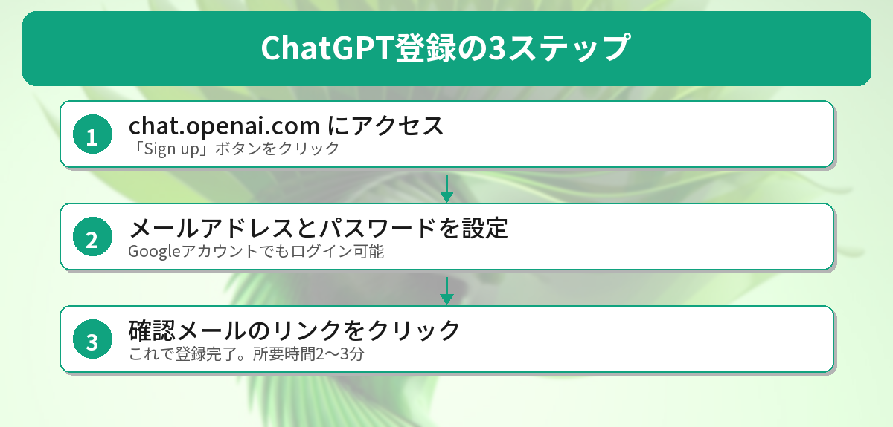
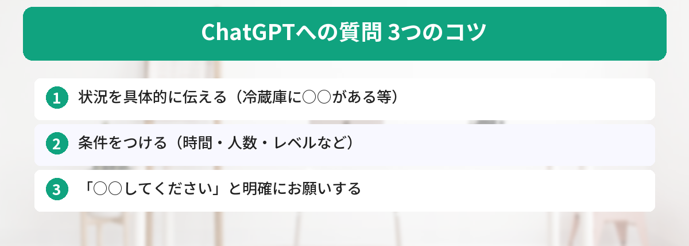
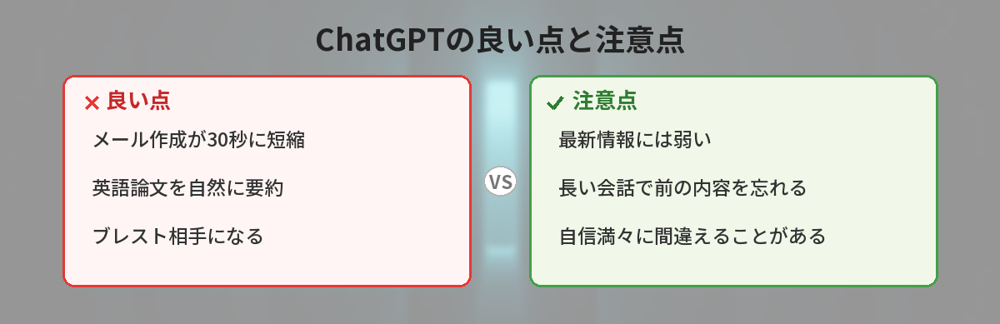

## この記事で分かること


ChatGPTって最近よく聞くけど、難しそう…。私でも使えるの？



5分あれば始められるよ！登録してテキストを打ち込むだけだから、スマホの検索と同じ感覚で使えるんだ。一緒にやってみよう。


「ChatGPTって最近よく聞くけど、どうやって使うの？」

この記事では、アカウント登録から最初の質問をするまでを5分で解説します。



## ChatGPTとは（15秒で理解）

ChatGPTは、AIと文章で会話できるサービスです。質問すると、人間のように答えてくれます。

- 分からないことを聞ける
- 文章を書いてもらえる
- アイデアを一緒に考えてもらえる

無料で使えます。

ChatGPTはOpenAIが開発した対話型AIですが、他にもGoogleの「Gemini」や検索特化の「Perplexity」など、さまざまなAIサービスがあります。それぞれの違いが気になる方は、[Gemini vs ChatGPT ― どっちを使うべき？](/posts/gemini-vs-chatgpt/)や[Perplexity vs ChatGPT ― 検索AI対決](/posts/perplexity-vs-chatgpt/)も参考にしてみてください。

## ステップ1: アカウントを作る

1. https://chat.openai.com にアクセス
2. 「Sign up」をクリック
3. メールアドレスを入力（Googleアカウントでもログインできます）
4. パスワードを設定
5. メールに届いた確認リンクをクリック

これで登録完了です。所要時間は2〜3分程度。



## ステップ2: 最初の質問をする

ログインすると、画面の下にテキスト入力欄があります。ここに質問を打ち込んでEnterを押すだけです。

最初の質問は何でもOKです。たとえば：

```
今日の晩ごはんのメニューを3つ提案して
```

数秒で回答が返ってきます。


え、もう返事きた！すごい…。でもなんか回答がざっくりしてる気がする…



それは質問の仕方にコツがあるんだ。ちょっとした工夫で回答の質がガラッと変わるよ。次のセクションで説明するね。


## 上手に質問するコツ

ChatGPTは「質問の仕方」で回答の質が大きく変わります。

### NG例（ざっくりすぎる）
```
料理教えて
```

### OK例（具体的）
```
冷蔵庫に鶏むね肉と玉ねぎがあります。
15分以内で作れる簡単なレシピを教えてください。
```

ポイントは：
- 状況を具体的に伝える
- 条件をつける（時間、人数、レベルなど）
- 「〜してください」と明確にお願いする



質問の仕方をもっと詳しく知りたい方は、[コピペで使えるChatGPTプロンプト10選 ― 仕事がすぐ楽になる](/posts/chatgpt-prompt-template/)で、すぐに使えるテンプレートを紹介しています。

## ChatGPTでできること ― 具体的な活用シーン


登録できた！でも質問以外にも使えるの？



めちゃくちゃ使えるよ。メール作成、翻訳、勉強のサポート…。僕が実際に毎日使ってる場面を紹介するね。


登録が終わったら、いろいろな使い方を試してみましょう。ChatGPTは質問に答えるだけでなく、仕事や日常のさまざまな場面で活躍します。

### 仕事での活用

- **メール作成**：ビジネスメールの下書きを数秒で作成。[ChatGPTでビジネスメールを一瞬で作る方法](/posts/chatgpt-email-template/)で詳しく解説しています
- **レポート・報告書**：データをもとにした報告書の下書き作成
- **翻訳**：英語のメールや資料を自然な日本語に翻訳

### 学習での活用

- **勉強計画の作成**：目標に合わせた学習スケジュールを提案してもらえます
- **概念の説明**：難しい専門用語をわかりやすく説明してもらう
- **問題演習**：練習問題を作ってもらい、解答のフィードバックをもらう

### 日常での活用

- **料理のレシピ提案**：冷蔵庫の中身を伝えるだけでレシピを提案
- **旅行の計画**：行き先や日数を伝えると、旅程を組んでくれる
- **文章の添削**：書いた文章の改善点を指摘してもらう

## 無料版と有料版の違い

| | 無料版 | Plus（月20ドル） |
|---|---|---|
| 基本的な会話 | ○ | ○ |
| 回答速度 | 普通 | 速い |
| 最新モデル | 制限あり | 使い放題 |
| 画像生成 | 制限あり | 使い放題 |

最初は無料版で十分です。使い込んで「もっと使いたい」と思ったら有料版を検討すればOK。

## 筆者が最初の1週間で感じたこと（体験談）

実際にChatGPTを使い始めた最初の1週間で感じたことを正直に書きます。

### 感動したこと

- **メール作成が3分→30秒に短縮された**。取引先への返信メールの下書きを頼んだら、そのまま送れるレベルの文章が出てきた
- **英語の論文を要約してもらえた**。Google翻訳だと不自然だった文章が、ChatGPTだと自然な日本語で要約してくれた
- **ブレスト相手になってくれた**。「こういう企画を考えてるんだけど、改善点ある？」と聞くと、自分では思いつかなかった視点を出してくれた

### 正直イマイチだったこと

- **最新情報には弱い**。「今日のニュース教えて」と聞いても正確な回答は返ってこないことがある
- **長い会話だと前の内容を忘れる**。20往復くらいすると、最初に伝えた条件を忘れることがある
- **自信満々に間違える**。「〇〇の住所は？」と聞くと、存在しない住所をもっともらしく答えることがあった

これらを踏まえて、「ChatGPTは万能ではないけど、使い方を工夫すれば確実に生産性が上がるツール」というのが1週間使った結論です。



## ChatGPTを使うときの注意点


便利すぎて何でも聞いちゃいそう…。気をつけることってある？



いい質問だね。3つだけ覚えておけば安心して使えるよ。


便利なChatGPTですが、使う上で知っておきたいポイントがあります。

### 情報の正確性を確認する

ChatGPTの回答は必ずしも正確とは限りません。特に最新のニュースや専門的な情報については、回答を鵜呑みにせず、公式サイトなどで裏取りすることをおすすめします。調べものには、出典付きで回答してくれる[Perplexity](/posts/perplexity-vs-chatgpt/)を併用するのも一つの方法です。

### 個人情報を入力しない

ChatGPTに入力した内容は、AIの学習に使われる可能性があります。氏名、住所、クレジットカード番号などの個人情報は入力しないようにしましょう。

### AIの回答をそのまま提出しない

仕事のレポートや学校の課題にChatGPTの回答をそのまま使うのは避けましょう。あくまで下書きや参考として活用し、自分の言葉で仕上げることが大切です。

## よくある質問（FAQ）

### Q: ChatGPTは本当に無料で使えますか？
A: はい、無料で使えます。アカウント登録にクレジットカードは不要です。無料版でもGPT-4oモデルが利用でき、日常的な質問や文章作成には十分な性能があります。

### Q: スマートフォンからも使えますか？
A: はい、iPhoneとAndroidの両方に公式アプリがあります。App StoreまたはGoogle Playで「ChatGPT」と検索してインストールできます。Webブラウザからも利用可能です。

### Q: ChatGPTの回答は正確ですか？
A: 多くの場合は的確な回答が返ってきますが、事実と異なる情報を生成することもあります（これを「ハルシネーション」と呼びます）。重要な情報については、必ず公式ソースで確認するようにしましょう。

### Q: 日本語で質問しても大丈夫ですか？
A: はい、日本語に対応しています。日本語で質問すれば日本語で回答が返ってきます。英語の方が得意な面もありますが、日常的な利用では日本語で問題ありません。

### Q: ChatGPTに入力した内容は他の人に見られますか？
A: 他のユーザーに直接見られることはありません。ただし、入力した内容がAIの学習に使われる可能性があります。設定画面から「チャット履歴とトレーニング」をオフにすることで、学習への利用を停止できます。


思ったより簡単だった…！さっそく今日の晩ごはん聞いてみようかな。



それ最高の第一歩だね。質問は具体的にするほど良い回答が返ってくるから、「冷蔵庫に〇〇がある」みたいに条件をつけてみて。慣れたらプロンプトテンプレート集も試してみてね。


## まとめと次のステップ

- ChatGPTは無料で使える
- 登録はメールアドレスだけでOK
- 質問は具体的にするほど良い回答が返ってくる

次は「ChatGPTに仕事を手伝ってもらう具体的な使い方」を紹介します。

---
### あわせて読みたい
- [コピペで使えるChatGPTプロンプト10選 ― 仕事がすぐ楽になる](/posts/chatgpt-prompt-template/)
- [Google検索とChatGPT、どっちに聞くべき？使い分けガイド](/posts/ai-vs-google-search/)

