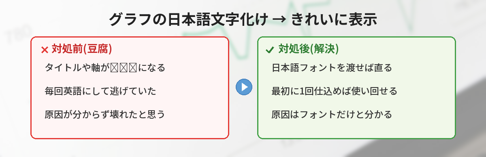
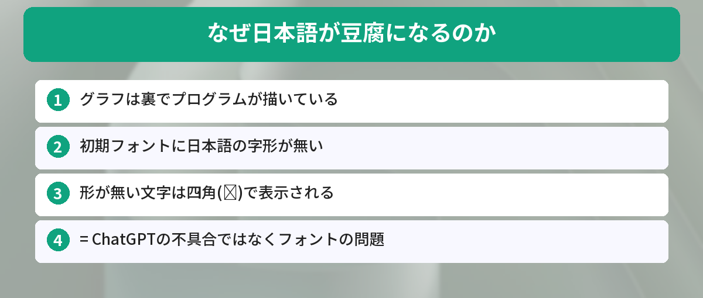
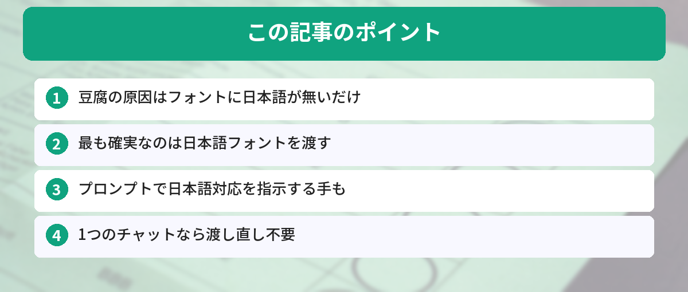

## この記事で分かること


ChatGPTでグラフを作ってもらったら、タイトルが「◻︎◻︎◻︎」って四角だらけになっちゃったの…壊れてるの？



それ「豆腐」って呼ばれる定番の文字化けだね。壊れてないよ。グラフを描くのに使われたフォントに、日本語の形が入ってないだけなんだ。直し方はちゃんとあるから紹介するね。




「ChatGPTにグラフを作らせたら、日本語が全部◻︎◻︎◻︎になった」

これは多くの人がハマる定番のトラブルです。ChatGPTにデータを渡してグラフを描かせると、軸ラベルやタイトルの日本語が四角い記号(通称「豆腐」)になってしまう。でも大丈夫、これは故障ではなく、理由を知れば直せます。この記事では、なぜ豆腐になるのかという仕組みから、非エンジニアでもできる直し方まで解説します。



## そもそもなぜ日本語が「豆腐」になるのか

結論から言うと、**グラフを描くのに使われたフォントに、日本語の字形(文字の形)が入っていない**のが原因です。

ChatGPTはグラフを作るとき、裏側でプログラム(Pythonのmatplotlibなど)を動かして画像を生成します。このとき使われる初期フォントは、多くの場合アルファベット用で、日本語の形を持っていません。

文字の形が無い文字を表示しようとすると、「ここに文字があるけど形が分からない」という意味で四角い箱(◻︎)が表示されます。これが「豆腐」の正体です。

つまり、**ChatGPTが日本語を理解していないわけではありません**。表示に使うフォントが日本語非対応なだけです。ChatGPTでデータを扱う基本は[ChatGPTでデータ分析をする方法](/posts/chatgpt-data-analysis/)でも解説しています。



## 直し方1: 日本語フォントを渡す(最も確実)

一番確実なのは、**日本語フォントのファイルをChatGPTにアップロードして、それを使ってもらう**方法です。

### 手順

1. 日本語フォントのファイル(例: Noto Sans JPの `.ttf` や `.otf`)を用意する
2. ChatGPTのチャットにそのフォントファイルをアップロードする
3. 次のように頼む

```
アップロードした日本語フォントを使って、グラフのタイトルと軸ラベルを
日本語で表示してください。文字化けしないようにしてください。
```

フォントは無料で配布されているもの(Noto Sans JP、IPAフォントなど)を使えます。一度アップロードすれば、そのチャット内では使い回せます。

## 直し方2: プロンプトで日本語対応を指示する

フォントを用意しなくても、頼み方を工夫するだけで改善することがあります。

```
グラフの日本語が文字化け(豆腐)しないように、
日本語対応フォントを指定してから描画してください。
```

ChatGPTが環境内の日本語対応フォントを探して使ってくれる場合があります。確実性はフォントを渡す方法に劣りますが、手軽です。うまくいかないときは直し方1に切り替えてください。プロンプトの基本的な書き方は[コピペで使えるChatGPTプロンプト集](/posts/chatgpt-prompt-template/)が参考になります。

## 直し方3: ラベルだけ英語にして回避する

「とにかく今すぐグラフが欲しい」ときの応急処置です。

```
グラフのタイトルと軸ラベルは英語で表示してください。
凡例も英語でお願いします。
```

日本語の文字化けは起きませんが、グラフが英語になります。社内資料などで日本語が必須なら、直し方1を使ってください。あくまで一時しのぎです。

## 実際にやってみた

3つの方法を順番に試しました。

### 結果

- **フォントを渡す**: 一発で日本語がきれいに表示された。最も確実
- **プロンプトで指示だけ**: 環境によっては成功、だめなときもあった。手軽だが不安定
- **英語で回避**: 当然文字化けはしないが、日本語資料には使えない

### 気づき

一番ラクで確実だったのは「最初に日本語フォントを1回渡しておく」でした。チャットの冒頭でフォントをアップロードしておけば、そのあとは何回グラフを作っても豆腐になりません。毎回対処するより、最初に仕込むのが正解でした。

### イマイチだった点

新しいチャットを開くと、またフォントを渡し直す必要があります。長い作業は1つのチャットで続けるのがコツです。

## こんな場面で役立つ

- 売上やアンケート結果を日本語ラベルのグラフにしたいとき
- 会議資料のグラフを日本語で作りたいとき
- Excelのデータを渡して可視化してもらうとき([ChatGPTでExcel作業を効率化](/posts/chatgpt-excel/)もあわせてどうぞ)

## よくある質問（FAQ）



### Q: 文字化けするのはChatGPTが壊れているからですか？
A: いいえ。グラフ描画に使うフォントに日本語の字形が入っていないだけです。日本語フォントを使わせれば直ります。

### Q: フォントはどこで入手すればいいですか？
A: 無料で配布されている「Noto Sans JP」や「IPAフォント」が定番です。公式サイトからダウンロードして、ChatGPTにアップロードして使います。

### Q: 毎回フォントを渡すのが面倒です。
A: 1つのチャット内では一度渡せば使い回せます。グラフを続けて作るときは、同じチャットで作業すると渡し直しが不要です。

### Q: 画像生成（イラストや写真風）の日本語とは別の話ですか？
A: 別物です。この記事はデータから作る「グラフ」の文字化けの話です。イラスト系の画像生成で文字が崩れる問題は、モデルの進化で改善が進んでいます。

### Q: 無料版でも直せますか？
A: フォントのアップロードやコード実行が使える環境なら対処できます。使える機能はプランで変わるので、できない場合は英語ラベルでの回避も検討してください。


なるほど…！壊れてたんじゃなくて、日本語の形が入ったフォントが無かっただけなんだ！最初にフォントを渡しておけばいいんだね！



その通り！「豆腐=フォントの問題」って覚えておけば、もう慌てないよ。日本語資料を作るなら、チャットの最初にフォントを仕込む習慣をつけるといいね。


## まとめ

- グラフの日本語が豆腐になるのは、描画フォントに日本語の字形が無いのが原因
- 最も確実なのは、日本語フォント(Noto Sans JP等)をアップロードして使わせること
- 手軽に済ませたいならプロンプトで日本語対応を指示する
- 急ぎのときはラベルを英語にして回避する(一時しのぎ)
- 1つのチャットで作業を続ければ、フォントの渡し直しが不要

---
### あわせて読みたい
- [ChatGPTでデータ分析をする方法 ― 表やグラフを作らせるコツ](/posts/chatgpt-data-analysis/)
- [ChatGPTでExcel作業を効率化する](/posts/chatgpt-excel/)

<!-- affiliate -->
## 関連リソース

ChatGPTを仕事で使いこなしたい方に、評価の高い活用本をまとめました。

<!-- START MoshimoAffiliateEasyLink -->
<script type="text/javascript">
(function(b,c,f,g,a,d,e){b.MoshimoAffiliateObject=a;b[a]=b[a]||function(){arguments.currentScript=c.currentScript||c.scripts[c.scripts.length-2];(b[a].q=b[a].q||[]).push(arguments)};c.getElementById(a)||(d=c.createElement(f),d.src=g,d.id=a,e=c.getElementsByTagName("body")[0],e.appendChild(d))})(window,document,"script","//dn.msmstatic.com/site/cardlink/bundle.js?20220329","msmaflink");
msmaflink({
  "n":"ChatGPT仕事術の本",
  "b":"","t":"",
  "d":"https://thumbnail.image.rakuten.co.jp",
  "c_p":"",
  "p":[""],
  "u":{"u":"https://search.rakuten.co.jp/search/mall/ChatGPT+%E4%BB%95%E4%BA%8B%E8%A1%93/","t":"rakuten","r_v":""},
  "v":"2.1",
  "b_l":[
    {"id":1,"u_tx":"楽天市場で見る","u_bc":"#f76956","u_url":"https://search.rakuten.co.jp/search/mall/ChatGPT+%E4%BB%95%E4%BA%8B%E8%A1%93/","a_id":5490814,"p_id":54,"pl_id":27059,"pc_id":54,"s_n":"rakuten","u_so":1},
    {"u_bc":"#f79256","u_tx":"Amazonで見る","u_url":"https://www.amazon.co.jp/s/ref=nb_sb_noss_1?__mk_ja_JP=%E3%82%AB%E3%82%BF%E3%82%AB%E3%83%8A&url=search-alias%3Daps&field-keywords=ChatGPT+%E4%BB%95%E4%BA%8B%E8%A1%93","s_n":"amazon","u_so":2,"a_id":5490817,"p_id":170,"pc_id":185,"pl_id":27060,"id":2}
  ],
  "eid":"chatgpttofu",
  "s":"s"
});
</script>
<div id="msmaflink-chatgpttofu">リンク</div>
<!-- MoshimoAffiliateEasyLink END -->
<!-- /affiliate -->
