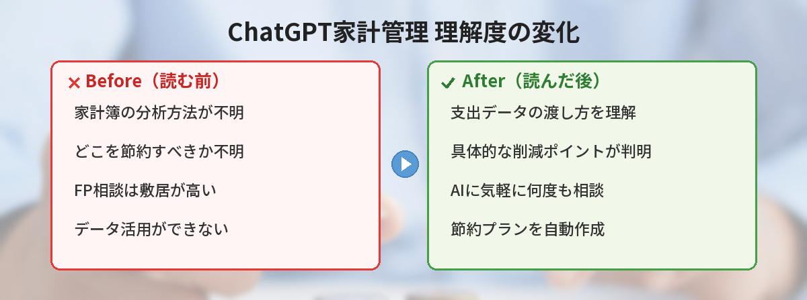
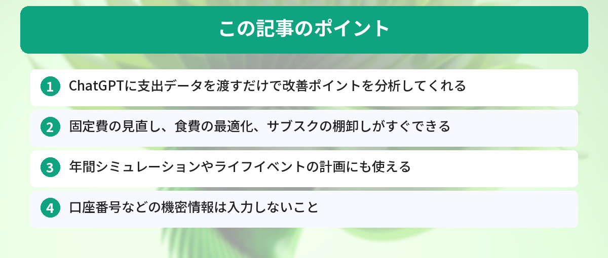

## この記事で分かること


家計簿つけてるけど、結局どこを削ればいいか分からなくて…。ChatGPTに相談できるの？



できるよ！支出データを渡すだけで「ここ削れるよ」って具体的に教えてくれるんだ。FPに相談するより気軽だし、何度聞いても嫌な顔しないのがポイント。プロンプト付きで紹介するね。




「家計簿つけてるけど、結局どこを節約すればいいかわからない…」

ChatGPTに支出データを見せれば、改善ポイントの分析から具体的な節約プランの提案まで一気にやってくれます。すぐ使えるプロンプトを紹介します。



## ChatGPTが家計管理に向いている理由

- 数字の整理・分類が得意
- 「なんとなく使いすぎ」を具体的に指摘してくれる
- 自分の状況に合わせた節約プランを提案してくれる
- 何度聞いても嫌な顔をしない（FPに相談するより気軽）

## 3ヶ月間ChatGPTで家計管理した結果

筆者は3ヶ月間、毎月の支出データをChatGPTに分析してもらい、提案された節約プランを実行しました。

**期間：** 3ヶ月（2026年1月〜3月）

**結果：**
- 月の支出が平均12,000円削減（主に固定費の見直し）
- スマホを格安SIMに変更：月5,000円削減
- 使っていないサブスク3つを解約：月2,500円削減
- 外食頻度を週3→週1に：月15,000円削減（ただし食材費は5,000円増）

**良かった点：**
- 「なんとなく使いすぎ」を数字で可視化してくれるので、行動に移しやすい
- 献立提案で食費を抑えつつ栄養バランスも考慮してくれた

**イマイチだった点：**
- 保険の見直し提案は一般論すぎて、そのまま実行するのは危険（専門家に相談した）
- 投資のアドバイスは信頼性に欠ける

**結論：** 固定費の見直しと食費の最適化にはChatGPTが非常に有効。ただし保険や投資の判断は専門家に相談すべき。

ChatGPTをまだ使ったことがない方は[ChatGPTの始め方ガイド](/posts/chatgpt-first-step/)で基本を押さえておくのがおすすめです。

## 基本の使い方：支出を分析してもらう

### ステップ1：支出データを貼り付ける

家計簿アプリやクレジットカードの明細から、1ヶ月分の支出をコピーしてChatGPTに渡します。

```
以下は先月の支出データです。カテゴリ別に集計して、
改善できそうなポイントを3つ教えてください。

食費：68,000円（外食32,000円、スーパー28,000円、コンビニ8,000円）
住居費：85,000円
水道光熱費：12,000円
通信費：15,000円（スマホ8,000円、ネット回線5,000円、サブスク2,000円）
交通費：10,000円
日用品：8,000円
衣服：15,000円
交際費：20,000円
趣味・娯楽：18,000円
保険：12,000円
その他：7,000円

手取り月収：280,000円
貯蓄目標：月50,000円
```

### ステップ2：ChatGPTの分析を確認する

ChatGPTは支出の割合を計算し、一般的な目安と比較して改善ポイントを提示してくれます。たとえば「外食費が食費の47%を占めている」「通信費は見直しの余地がある」といった具体的な指摘が返ってきます。

### ステップ3：節約プランを作ってもらう

```
上記の分析をもとに、月50,000円の貯蓄目標を達成するための
具体的な節約プランを作ってください。
無理なく続けられる現実的な内容でお願いします。
```

## すぐ使えるプロンプト集


基本の分析方法は分かった！他にもすぐ使えるプロンプトってある？固定費とか食費とか…。



もちろん！固定費の見直し、食費の最適化、サブスクの棚卸し、ボーナスの配分相談…全部コピペで使えるプロンプトを用意したよ。


### 固定費の見直し

```
以下の固定費を見直したいです。
それぞれについて、削減できる可能性と具体的な方法を教えてください。

・スマホ代：月8,000円（大手キャリア、データ20GB）
・ネット回線：月5,000円（光回線）
・保険：月12,000円（生命保険8,000円、医療保険4,000円）
・サブスク：月2,000円（動画配信サービス×2）

家族構成：30代夫婦、子ども1人（3歳）
```

固定費は一度見直すと毎月の効果が続くので、最初に手をつけるべきポイントです。

### 食費の最適化

```
以下の条件で、1週間分の献立と買い物リストを作ってください。

・予算：週7,000円（4人家族）
・制約：子ども（3歳）が食べられるメニュー
・調理時間：1食30分以内
・作り置きOK
```

### サブスクの棚卸し

```
以下のサブスクリプションを契約しています。
利用頻度と費用対効果を考えて、解約すべきものを提案してください。

1. Netflix：月1,490円（週2回くらい見る）
2. Spotify：月980円（毎日使う）
3. Amazon Prime：年5,900円（月2回くらい買い物）
4. クラウドストレージ：月250円（写真バックアップ）
5. ニュースアプリ：月500円（たまに読む）
6. フィットネスアプリ：月1,000円（最近使ってない）
```

### ボーナスの使い道を相談

```
夏のボーナスが手取り400,000円の予定です。
以下の状況を踏まえて、配分の提案をしてください。

・貯蓄：現在100万円（目標300万円）
・ローン：なし
・欲しいもの：新しいPC（15万円くらい）
・家族旅行の予算も確保したい
・30代、子ども1人
```

## 応用テクニック


月単位の分析はできるようになったけど、もっと長期的な視点で家計を見る方法ってある？



あるよ！年間の支出傾向を分析したり、ライフイベントのシミュレーションをしたり。ChatGPTは長期的な計画づくりにも使えるんだ。


### テクニック1：年間の支出を俯瞰する

```
以下は過去6ヶ月の月別支出です。
季節ごとの傾向と、年間で見たときの改善ポイントを分析してください。

11月：265,000円
12月：320,000円（忘年会、クリスマス）
1月：240,000円
2月：230,000円
3月：280,000円（引越し関連）
4月：270,000円（新生活用品）
```

月単位では見えない「年間の波」をChatGPTに分析してもらうと、事前に備えるべき出費が見えてきます。

### テクニック2：ライフイベントのシミュレーション

```
以下の条件で、今後5年間の家計シミュレーションを作ってください。

現在の状況：
・世帯年収：600万円
・貯蓄：200万円
・月の生活費：25万円

予定しているライフイベント：
・2年後：車の買い替え（予算200万円）
・3年後：第二子の出産
・5年後：マイホーム購入の頭金を貯めたい（500万円）
```

ChatGPTのデータ分析機能を使えば、グラフ付きのシミュレーションも作れます。データ分析の詳しい使い方は[ChatGPTデータ分析の活用法](/posts/chatgpt-data-analysis/)で解説しています。

### テクニック3：レシートの読み取り

ChatGPTの画像認識機能を使えば、レシートの写真を撮って送るだけで支出を記録できます。

```
このレシートの内容を読み取って、以下の形式で整理してください。

日付：
店名：
品目と金額：
合計：
カテゴリ：（食費/日用品/その他）
```

画像機能の使い方については[ChatGPT画像編集の活用法](/posts/chatgpt-image-edit/)も参考になります。

## Excelと組み合わせてさらに便利に

ChatGPTで分析した結果をExcelで管理すると、継続的な家計管理がしやすくなります。

```
家計管理用のExcelテンプレートを作ってください。
以下の機能を含めてください。

・月別の収支入力シート
・カテゴリ別の集計（自動計算）
・前月比の増減表示
・貯蓄目標との差分表示
・グラフ（円グラフと棒グラフ）
```

ChatGPTにExcelの数式やマクロを作ってもらう方法は[ChatGPT × Excel活用術](/posts/chatgpt-excel/)で詳しく紹介しています。

## 注意点

### 個人情報の取り扱い

家計データには個人情報が含まれる場合があります。以下の点に注意してください。

- 口座番号やクレジットカード番号は入力しない
- 具体的な住所や勤務先名は伏せる
- 気になる場合はChatGPTの「チャット履歴とトレーニング」をオフにする

プライバシー設定の詳細は[ChatGPTカスタム指示の設定方法](/posts/chatgpt-custom-instructions/)でも触れています。

### AIの提案は参考程度に

ChatGPTはファイナンシャルプランナーではありません。投資や保険の具体的な判断は、専門家に相談することをおすすめします。ChatGPTの提案は「考えるきっかけ」として活用してください。

### 数字の正確性を確認する

ChatGPTは計算を間違えることがあります。特に合計金額や割合の計算は、自分でも確認してください。

## ChatGPTで家計管理を1ヶ月試した結果

※この記事はFP（ファイナンシャルプランナー）の監修を受けたものではありません。あくまで筆者個人の体験談です。

### やったこと

- 毎日のレシートをスマホで撮影→ChatGPTに「これを食費・日用品・交通費に分類して」と送信
- 週末に「今週の支出を集計して、先週と比較して」と依頼

### 1ヶ月の結果

- 食費が前月比15%減った（無駄な買い物が可視化されたため）
- 「コンビニでの衝動買い」が月8,000円もあったことに気づけた
- 手書き家計簿より圧倒的に続けやすかった（入力の手間がないため）

### 注意点

- 金額の読み取りミスがたまにある（必ず確認する）
- 個人情報（クレジットカード番号等）が写り込まないよう注意
- 投資や保険の判断はChatGPTに任せず、専門家に相談すること

## よくある質問（FAQ）



### Q: 家計簿アプリとChatGPT、どっちがいいですか？
A: 併用がおすすめです。家計簿アプリは日々の記録に便利で、ChatGPTは貯まったデータの分析や改善提案に向いています。記録はアプリ、分析はChatGPTという使い分けが効率的です。

### Q: 無料プランでも家計管理に使えますか？
A: 十分使えます。支出の分析、節約プランの提案、献立作成など、この記事で紹介した内容はすべて無料プランで実行できます。

### Q: 毎月の支出データを毎回入力するのが面倒です
A: ChatGPTのカスタム指示に家族構成や収入などの基本情報を設定しておくと、毎回入力する手間が省けます。設定方法は[カスタム指示の解説記事](/posts/chatgpt-custom-instructions/)をご覧ください。

### Q: ChatGPTに家計データを入力しても安全ですか？
A: 口座番号やカード番号などの機密情報は入力しないでください。支出の金額やカテゴリ程度であれば問題ありません。心配な場合は設定で「チャット履歴とトレーニング」をオフにできます。


まずは先月の支出を貼り付けて分析してもらおうかな。サブスクの棚卸しもやってみたい！



いいね！固定費の見直しは一度やると毎月効果が続くから、最初に手をつけるのがおすすめだよ。口座番号とかの機密情報は入力しないように気をつけてね。


## まとめ

- ChatGPTに支出データを渡すだけで改善ポイントを分析してくれる
- 固定費の見直し、食費の最適化、サブスクの棚卸しがすぐできる
- 年間シミュレーションやライフイベントの計画にも使える
- 口座番号などの機密情報は入力しないこと
- AIの提案は参考にしつつ、最終判断は自分で

---
### あわせて読みたい
- [ChatGPT × Excel活用術 ― 関数・マクロを自動生成する方法](/posts/chatgpt-excel/)
- [ChatGPTの始め方 ― 登録から最初の質問まで5分で完了](/posts/chatgpt-first-step/)

