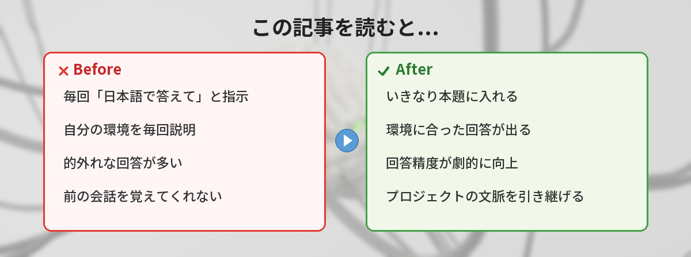
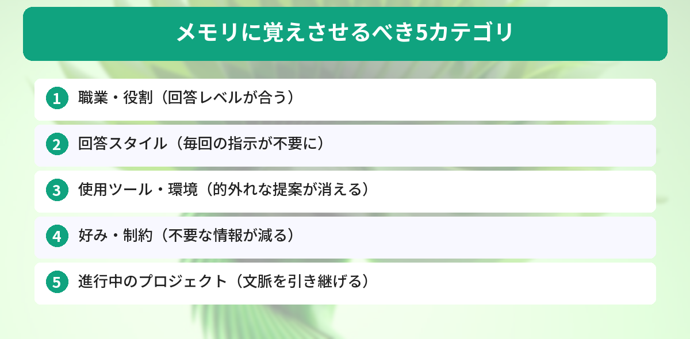

## この記事で分かること


ChatGPTのメモリ機能って何？勝手に色々覚えてるみたいで、ちょっと怖いんだけど…



メモリは「毎回同じことを説明しなくて済む」ための機能だよ。何を覚えさせるかは自分でコントロールできるから、使いこなすとかなり楽になるんだ。




## 「毎回同じこと説明するの面倒…」という悩み

ChatGPTを使っていて、こんな経験はありませんか？

- 毎回「日本語で答えて」と指示している
- 「私はWebエンジニアです」と毎回前置きしている
- 「簡潔に答えて」と何度も言っている
- 前に話した内容を覚えていなくて、最初から説明し直し

Yahoo知恵袋やXでも「ChatGPTが前の会話を覚えてくれない」「毎回同じ指示を出すのが面倒」という声をよく見かけます。

**メモリ機能を使えば、これらの悩みは全て解決します。**



## 結論: メモリに覚えさせるべき5つのカテゴリ

先に結論を見せます。以下の5カテゴリを覚えさせておくと、ChatGPTの回答精度が劇的に上がります。



1. **あなたの職業・役割** — 回答のレベル感が合う
2. **回答のスタイル** — 毎回「簡潔に」と言わなくて済む
3. **よく使うツール・環境** — 的外れな提案がなくなる
4. **好み・制約** — 不要な情報が減る
5. **進行中のプロジェクト** — 文脈を引き継げる

## メモリ機能の基本（30秒で理解）

メモリ機能は、ChatGPTが会話の中で得た情報を**アカウント単位で記憶する**仕組みです。

### 覚えさせる方法

会話の中で自然に伝えるだけでOKです。

```
「私はフリーランスのWebデザイナーです。覚えておいて」
```

または明示的に：

```
「以下を記憶して：回答は必ず日本語で、箇条書きを多用して」
```

### 確認・削除する方法

- 確認: 「何を覚えてる？」と聞く
- 削除: 設定 → パーソナライゼーション → メモリ管理 → 個別に削除
- 一時停止: 「一時チャット」モードを使う（メモリが適用されない）


会話の中で言うだけで覚えてくれるんだ…！設定画面とか開かなくていいの？



そう、チャットで「覚えて」と言うだけ。削除したいときだけ設定画面を使えばいいよ。


## 具体的な設定例5つ（コピペで使える）

### 1. 職業・役割を覚えさせる

```
以下を記憶して：
- 私は30代のWebエンジニア（フロントエンド中心）
- 実務経験3年
- TypeScript、React、Next.jsをメインで使っている
- チームリーダーとして後輩の指導もしている
```

**効果:** 「初心者向けの説明」と「実務レベルの回答」を自動で使い分けてくれるようになる。

### 2. 回答スタイルを覚えさせる

```
以下を記憶して：
- 回答は日本語で
- 結論を最初に述べる
- 箇条書きを多用する
- 1文は60文字以内で短く
- 専門用語を使ったら直後に一言で説明を添える
```

**効果:** 毎回「簡潔に」「日本語で」と指示する手間がゼロになる。

### 3. 使用ツール・環境を覚えさせる

```
以下を記憶して：
- OS: Windows 11
- エディタ: VS Code
- ターミナル: PowerShell
- ブラウザ: Chrome
- パッケージマネージャー: npm（yarnは使わない）
```

**効果:** 「Macの場合は…」「yarnを使う場合は…」のような不要な情報が消える。コマンド例も自分の環境に合ったものが出てくる。

### 4. 好み・制約を覚えさせる

```
以下を記憶して：
- コードにはコメントを日本語で入れてほしい
- CSSフレームワークはTailwindを使う（Bootstrap不要）
- テストはVitest（Jestは使わない）
- 「簡単です」「誰でもできます」という表現は使わないで
```

**効果:** 自分のプロジェクトに合わない提案が来なくなる。

### 5. 進行中のプロジェクトを覚えさせる

```
以下を記憶して：
- 現在「社内タスク管理ツール」を開発中
- Next.js 15 + Prisma + PostgreSQL構成
- 認証はNextAuth.js
- デプロイ先はVercel
- 来月リリース予定
```

**効果:** 「このプロジェクトで〇〇するには？」と聞くだけで、技術スタックを踏まえた回答が返ってくる。

## 筆者が実際にメモリを設定して変わったこと

### Before（メモリ設定前）

- 毎回「日本語で答えて」と書いていた（1日10回 × 5秒 = 50秒/日の無駄）
- 「私はReactを使っています」と前置きしないと、Vue.jsの例が出てきた
- 長い会話の途中で「さっき言った条件忘れてない？」と確認していた

### After（メモリ設定後）

- いきなり本題に入れるようになった
- コード例が最初から自分の環境に合っている
- 「前に話したプロジェクトの件だけど」で通じるようになった

**体感の時短効果:** 1日あたり5〜10分。月に換算すると2〜5時間の節約。

## メモリ機能の注意点

### 覚えさせてはいけないもの

- パスワード、APIキー、クレジットカード番号
- 他人の個人情報（氏名、住所、電話番号）
- 会社の機密情報

メモリに保存された情報はOpenAIのサーバーに保持されます。機密情報は絶対に覚えさせないでください。

### 「勝手に覚えてる」問題の対処法

ChatGPTは会話の中から自動的に情報を記憶することがあります。意図しない情報が覚えられていた場合：

1. 「何を覚えてる？」と聞いて確認
2. 不要なものは「〇〇は忘れて」と指示
3. 設定画面から個別に削除

### メモリとカスタム指示の違い

| | メモリ | カスタム指示 |
|---|---|---|
| 設定方法 | 会話の中で自然に | 設定画面で入力 |
| 容量 | 多い（数百項目） | 少ない（1500文字） |
| 柔軟性 | 会話ごとに追加・削除可能 | 全会話に固定適用 |
| おすすめ | 変わりやすい情報 | 変わらない基本設定 |

カスタム指示の詳しい設定方法は[ChatGPTカスタム指示の設定方法](/posts/chatgpt-custom-instructions/)で解説しています。メモリとカスタム指示を**併用する**のがベストです。

## よくある質問（FAQ）

### Q: メモリ機能は無料版でも使えますか？
A: はい、無料版でも使えます。ただし無料版は「軽量版メモリ」で、短期的な会話の継続性のみ。有料版（Plus以上）は長期的な記憶が可能で、数百項目を保持できます。

### Q: メモリを全部消したい場合はどうすればいいですか？
A: 設定 → パーソナライゼーション → メモリ → 「メモリをクリア」で全削除できます。または「全てのメモリを忘れて」とチャットで指示してもOKです。

### Q: メモリに覚えさせた内容は他の人に見られますか？
A: いいえ、メモリはアカウントに紐づいているため、他のユーザーには見えません。ただしOpenAIのサーバーには保存されるため、機密情報は入れないでください。

### Q: 「一時チャット」モードとは何ですか？
A: メモリが適用されない一時的な会話モードです。メモリに影響を与えたくない会話（他人のPCで使うとき等）に便利です。チャット画面の上部から切り替えられます。

### Q: メモリとGPTsのナレッジは何が違いますか？
A: メモリは「あなた個人の情報」を覚える機能。GPTsのナレッジは「特定のタスクに必要な参考資料」をアップロードする機能です。用途が異なるので、両方活用するのがおすすめです。


5つのカテゴリ、さっそく設定してみる！毎回「日本語で」って言わなくて済むだけでも嬉しい。



最初に5分かけて設定するだけで、毎日の使い勝手が全然変わるよ。まずは「職業」と「回答スタイル」の2つから始めてみて。


## まとめ

- メモリ機能は「毎回同じ説明をしなくて済む」ための機能
- 覚えさせるべきは5カテゴリ: 職業、回答スタイル、ツール環境、好み、プロジェクト
- 会話の中で「覚えて」と言うだけで設定できる
- 機密情報は絶対に覚えさせない
- カスタム指示と併用するのがベスト

---
### あわせて読みたい
- [ChatGPTカスタム指示の設定方法 ― 毎回同じ説明をしなくて済む裏技](/posts/chatgpt-custom-instructions/)
- [コピペで使えるChatGPTプロンプト10選 ― 仕事がすぐ楽になる](/posts/chatgpt-prompt-template/)
