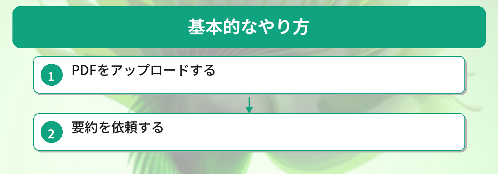
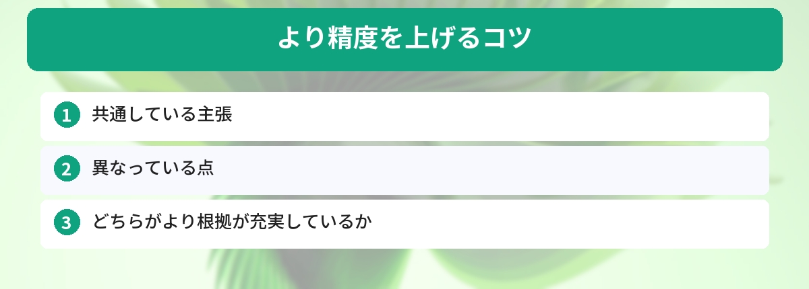

## この記事で分かること


会社で50ページの報告書を渡されたんだけど、読む時間がなくて…。ChatGPTに読んでもらうことってできるの？



できるよ！PDFをアップロードするだけで、数秒で要約してくれるんだ。プロンプトの書き方次第で精度もグッと上がるから、そのコツも一緒に紹介するね。


「50ページの報告書を読む時間がない…」

ChatGPTにPDFをアップロードすれば、長い資料を数秒で要約してくれます。やり方とコツを解説します。



## 基本的なやり方



### ステップ1: PDFをアップロードする

ChatGPT（GPT-4o）の画面で、メッセージ入力欄の左にあるクリップアイコンをクリックし、PDFファイルを選択します。

### ステップ2: 要約を依頼する

PDFをアップロードしたら、以下のように指示します。

```
このPDFの内容を以下の形式で要約してください。

- 全体の要約（3行以内）
- 主要なポイント（箇条書き5つ以内）
- 結論または提案事項
```

これだけで、長い資料のエッセンスが手に入ります。プロンプトの書き方のコツについては、[コピペで使えるChatGPTプロンプト10選](/posts/chatgpt-prompt-template/)も参考にしてみてください。

## 用途別のプロンプト例


基本のやり方は分かった！でも報告書と論文と契約書じゃ、欲しい情報が全然違うよね…。



その通り！用途に合わせてプロンプトを変えるのがコツだよ。ビジネス報告書、学術論文、契約書の3パターンを紹介するね。


### ビジネス報告書の場合

```
この報告書を上司に説明する想定で、以下を抽出してください。

1. 結論（1文）
2. 主要な数値データ（表形式）
3. 今後のアクションアイテム
4. リスクや注意点
```

### 学術論文の場合

```
この論文を以下の構成で要約してください。

- 研究の目的
- 手法の概要
- 主要な結果
- 限界と今後の課題
- 一般の人にも分かる一言まとめ
```

### 契約書・規約の場合

契約書のような長大なドキュメントを扱う場合は、[Claudeの100万トークンを活用した長文処理](/posts/claude-long-document/)も検討してみてください。

```
この契約書の中で、以下の点を確認してください。

- 契約期間と更新条件
- 解約条件とペナルティ
- 費用に関する条項
- 注意すべき特殊な条項

※法的判断ではなく、内容の整理としてお願いします。
```

## より精度を上げるコツ




プロンプトのパターンは分かったけど、もっと精度を上げる方法ってある？



3つのコツがあるよ。「目的を明確にする」「出力形式を指定する」「複数PDFを比較する」。これを意識するだけで要約の質がグッと上がるんだ。


### コツ1: 目的を明確にする

```
NG: このPDFを要約して
OK: このPDFの中から、来月の予算会議で使える数値データだけを抽出してください
```

目的が明確なほど、必要な情報だけを的確に抜き出してくれます。

### コツ2: 出力形式を指定する

```
以下の形式で出力してください。

| 項目 | 内容 |
|---|---|
| テーマ | ○○ |
| 結論 | ○○ |
| 根拠 | ○○ |
```

表形式やMarkdown形式を指定すると、そのまま資料に使えます。

### コツ3: 複数のPDFを比較する

```
アップロードした2つのPDFを比較して、以下を教えてください。

- 共通している主張
- 異なっている点
- どちらがより根拠が充実しているか
```

## 注意点

- 機密情報を含むPDFのアップロードは社内ルールを確認する
- AIの要約は100%正確とは限らない（重要な判断は原文を確認）
- 画像やグラフの読み取りは完璧ではない場合がある
- 無料版では利用回数に制限がある

ChatGPTとGeminiのどちらを使うか迷っている方は、[ChatGPTとGemini、結局どっちがいい？](/posts/gemini-vs-chatgpt/)で比較しています。

## 50ページの社内報告書を要約してみた実例

筆者は実際に50ページの四半期報告書をChatGPTにアップロードして要約しました。

**資料の内容：** 四半期の売上報告書（50ページ、図表含む）

**所要時間：** アップロードから要約完了まで約30秒（手動で読むと2時間以上）

**良かった点：**
- 全体の要約が3行で的確にまとまっていた
- 「前年同期比で売上が15%減少している部門」を即座に特定してくれた
- 追加で「改善提案を3つ出して」と頼んだら、データに基づいた提案が返ってきた

**イマイチだった点：**
- グラフの読み取りは完璧ではなかった（数値を1箇所間違えていた）
- 図表のキャプションは読めるが、グラフの傾向分析は不正確な場合がある

**結論：** テキスト部分の要約精度は非常に高い。グラフや図表の分析は参考程度にして、重要な数字は原文で確認するのがベスト。

## 実際に論文・レポートを要約させた結果

30ページの技術レポートと80ページの学術論文をChatGPTに要約させました。

### 30ページの技術レポート

- 要約時間: 約30秒
- 品質: 主要な結論と数値データを正確に抽出。十分実用的
- 注意点: 図表の内容は要約に含まれないことがある

### 80ページの学術論文

- 要約時間: 約1分
- 品質: 全体の概要は掴めるが、細かい議論が省略される
- 対策: 章ごとに分けて要約させると精度が上がった

### 要約のコツ

- 「3行で要約して」より「要点を5つの箇条書きで」の方が情報量が多い
- 「専門用語は噛み砕いて説明して」と追加すると読みやすくなる
- 重要な章だけ「この章を詳しく要約して」と深掘りする

## よくある質問（FAQ）

### Q: 無料版のChatGPTでもPDFの要約はできますか？
A: 無料版でもPDFのアップロードと要約は可能です。ただし、利用回数に制限があるため、大量のPDFを処理したい場合は有料プラン（ChatGPT Plus）がおすすめです。

### Q: スキャンしたPDF（画像PDF）も要約できますか？
A: GPT-4oは画像認識機能を持っているため、スキャンPDFでもある程度読み取れます。ただし、手書き文字や画質が低い場合は精度が落ちるため、OCR処理済みのPDFを使う方が確実です。

### Q: 英語のPDFを日本語で要約してもらえますか？
A: はい、「このPDFの内容を日本語で要約してください」と指示すれば、英語のPDFでも日本語で要約を出力してくれます。

### Q: 何ページくらいまでのPDFに対応していますか？
A: ChatGPT（GPT-4o）は約100ページ程度のPDFまで処理できます。それ以上の長さの場合は、章ごとに分割してアップロードするか、[Claudeの100万トークン機能](/posts/claude-long-document/)を活用する方法があります。


出力形式を指定するだけでこんなに変わるんだ…！明日の報告書、さっそくアップロードしてみる！



いいね！ポイントは「何のために要約するか」を最初に伝えることだよ。上司への説明用なのか、自分の理解用なのかで、出力内容が全然変わるからね。


## まとめ

- ChatGPTにPDFをアップロードするだけで要約できる
- 目的と出力形式を明確に指示するのがコツ
- ビジネス報告書、論文、契約書など幅広く対応
- 重要な判断は必ず原文も確認する

---

### あわせて読みたい
- [ChatGPTの始め方 ― 登録から最初の質問まで5分で完了](/posts/chatgpt-first-step/)
- [Claudeの長文処理が凄い ― 10万字の文書を一気に分析](/posts/claude-long-document/)

