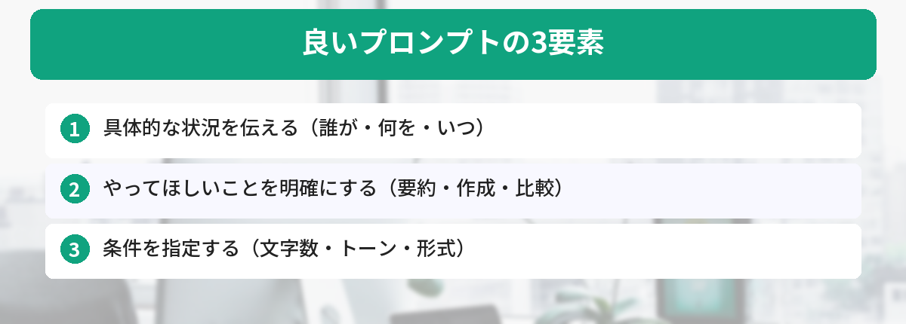
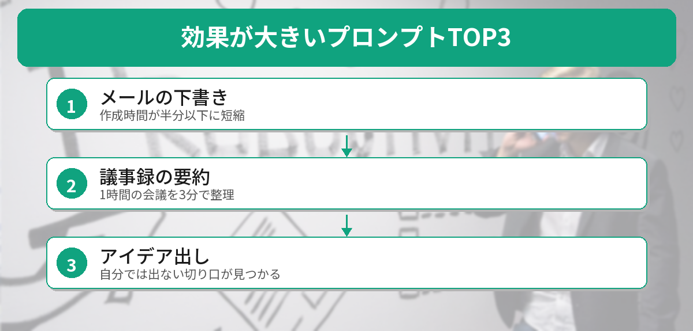

## この記事で分かること


ChatGPT使い始めたんだけど、何を聞けばいいか分からなくて…。みんなどうやって使ってるの？



最初はみんなそうだよ。実は「プロンプト」っていう指示文のテンプレートがあると、すぐに仕事で使えるんだ。コピペするだけでOKなやつを10個紹介するね。



ChatGPTを使い始めたけど、「何を聞けばいいか分からない」「うまく答えてくれない」という人向けに、コピペで使えるプロンプトを10個用意しました。

プロンプトとは、ChatGPTへの指示文のことです。ChatGPTをまだ使ったことがない方は、[ChatGPTの始め方](/posts/chatgpt-first-step/)から始めてみてください。




## 1. メールの下書き

```
以下の条件でビジネスメールの下書きを作ってください。

宛先: 取引先の担当者
目的: 打ち合わせの日程調整
候補日: 4月20日、4月22日、4月24日
トーン: 丁寧
```

## 2. 議事録の要約


```
以下の議事録を、箇条書きで要約してください。
決定事項、TODO、次回までの宿題を分けて整理してください。

（ここに議事録を貼り付ける）
```

## 3. 長い文章の要約

```
以下の文章を、中学生でも分かるように3行で要約してください。

（ここに文章を貼り付ける）
```

## 4. Excel関数を教えてもらう

Excelの活用法をもっと知りたい方は、[ChatGPTにExcelの作業を手伝ってもらう方法](/posts/chatgpt-excel/)もあわせてご覧ください。

```
Excelで以下のことをしたいです。使うべき関数と具体的な書き方を教えてください。

やりたいこと: A列の売上データから、B列の部署が「営業部」のものだけ合計したい
```

## 5. 英語メールの翻訳＋返信

```
以下の英語メールを日本語に翻訳してください。
その後、「了解しました。来週中に対応します」という内容の英語の返信文も作ってください。

（ここに英語メールを貼り付ける）
```

## 6. プレゼン資料の構成案


ここまで全部仕事で使えそう…！他にもある？



まだまだあるよ。次はプレゼンや文章の校正、アイデア出しに使えるプロンプトを紹介するね。


```
以下のテーマでプレゼン資料の構成案を作ってください。
スライド10枚程度で、各スライドのタイトルと要点を箇条書きで。

テーマ: 新商品の社内提案
対象: 部長クラスの意思決定者
時間: 15分
```

## 7. 文章の校正

```
以下の文章を校正してください。
誤字脱字、文法の間違い、読みにくい表現を修正して、修正箇所を教えてください。

（ここに文章を貼り付ける）
```

## 8. アイデア出し

```
以下の条件でアイデアを10個出してください。
実現可能性は気にせず、自由に発想してください。

テーマ: 社内コミュニケーションを活性化する施策
制約: 予算は月5万円以内
```

## 9. 比較表の作成

```
以下の項目を比較する表を作ってください。

比較対象: Zoom、Google Meet、Microsoft Teams
比較項目: 無料プランの制限時間、最大参加人数、録画機能、画面共有、料金
```

## 10. 断りメールの作成

```
以下の状況で、角が立たない断りメールを作ってください。

状況: 取引先からの飲み会の誘いを断りたい
理由: スケジュールが合わない（本当の理由は言いたくない）
トーン: 丁寧だけど堅すぎない
```

## 使い方のコツ

- 「（ここに〜を貼り付ける）」の部分に実際のテキストを入れる
- 条件を変えれば自分の状況に合わせられる
- 回答がイマイチなら「もう少しカジュアルに」「もっと短く」と追加で指示する



毎回同じ条件を指定するのが面倒な場合は、[ChatGPTカスタム指示の設定方法](/posts/chatgpt-custom-instructions/)で事前に登録しておくのがおすすめです。

## 筆者が実際に使って効果が大きかったプロンプトTOP3

10個紹介しましたが、筆者が毎日のように使っているのは以下の3つです。

### 第1位: メールの下書き（プロンプト1）

1日に5〜10通のメールを書く仕事をしていますが、ChatGPTに下書きを頼むようになってから、メール作成にかかる時間が半分以下になりました。特に「断りメール」や「催促メール」など、文面に気を使うメールほど効果が大きいです。

### 第2位: 議事録の要約（プロンプト2）

1時間の会議の議事録を3分で要約してくれます。自分で要約すると「何が重要か」の判断に迷いますが、ChatGPTは「決定事項」「TODO」「宿題」をきれいに分けてくれるので、上司への報告がスムーズになりました。

### 第3位: アイデア出し（プロンプト8）

一人で考えていると同じ方向のアイデアしか出てきませんが、ChatGPTに「自由に10個出して」と頼むと、自分では思いつかない切り口が混ざってきます。そこから1〜2個ピックアップして深掘りする使い方がおすすめです。



## プロンプトがうまくいかないときの対処法


プロンプト通りに入力したのに、なんか微妙な回答が返ってきた…



そういうときは「追加指示」を出すのがコツだよ。最初の回答を見てから調整するのが上手な使い方なんだ。


ChatGPTの回答が期待通りでないとき、よくある原因と対処法をまとめます。

| 症状 | 原因 | 対処法 |
|---|---|---|
| 回答が長すぎる | 文字数を指定していない | 「200文字以内で」と追加 |
| 回答が一般的すぎる | 状況が曖昧 | 具体的な数字や固有名詞を入れる |
| トーンが合わない | トーン指定がない | 「カジュアルに」「ビジネス調で」と追加 |
| 的外れな回答 | 目的が不明確 | 「目的は〇〇です」と明記する |

大事なのは、1回で完璧な回答を求めないこと。最初の回答を見て「もう少し〇〇して」と追加指示を出す方が、結果的に良い回答が得られます。

## よくある質問（FAQ）

### Q: プロンプトを入力しても期待通りの回答が返ってきません。どうすればいいですか？
A: 「具体的な状況」「やってほしいこと」「条件（トーン・文字数など）」の3つが揃っているか確認してください。情報が足りないと、一般的すぎる回答になりがちです。

### Q: プロンプトは日本語と英語、どちらで書くべきですか？
A: 日本語で問題ありません。ChatGPTは日本語のプロンプトを正確に理解できます。英語の出力がほしい場合だけ「英語で出力してください」と指定すればOKです。

### Q: 同じプロンプトでも毎回違う回答が返ってくるのはなぜですか？
A: ChatGPTは確率的に文章を生成するため、同じ入力でも毎回少し異なる回答になります。回答の方向性を固定したい場合は、条件をより具体的に指定してください。

### Q: ChatGPT以外のAIでもこのプロンプトは使えますか？
A: はい、ClaudeやGeminiでもほぼ同じプロンプトが使えます。AIごとの特徴や使い分けについては、[ChatGPTとGeminiの比較](/posts/gemini-vs-chatgpt/)や[Claudeの特徴と使い方](/posts/claude-what-is-it/)を参考にしてください。


10個もあると迷っちゃうけど…まずはメールの下書きから試してみようかな！



それがいいよ！慣れてきたら条件を自分なりにアレンジしてみて。「具体的な状況＋やってほしいこと＋条件」の3点セットを意識するだけで、回答の質がグッと上がるからね。


## まとめ

プロンプトは「具体的な状況 + やってほしいこと + 条件」の3つを入れると、良い回答が返ってきます。まずはこの10個をコピペして試してみてください。

---
### あわせて読みたい
- [ChatGPTでビジネスメールを一瞬で作る方法](/posts/chatgpt-email-template/)


