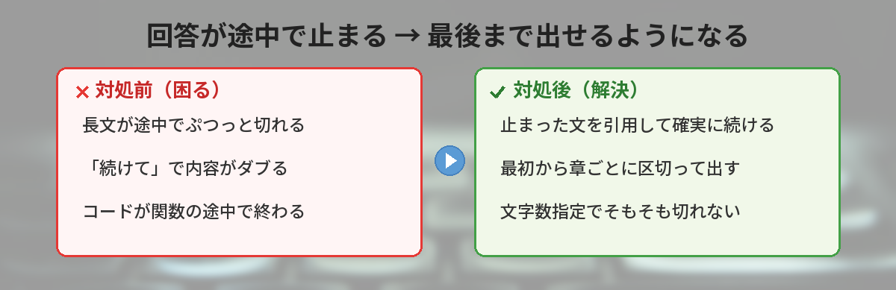
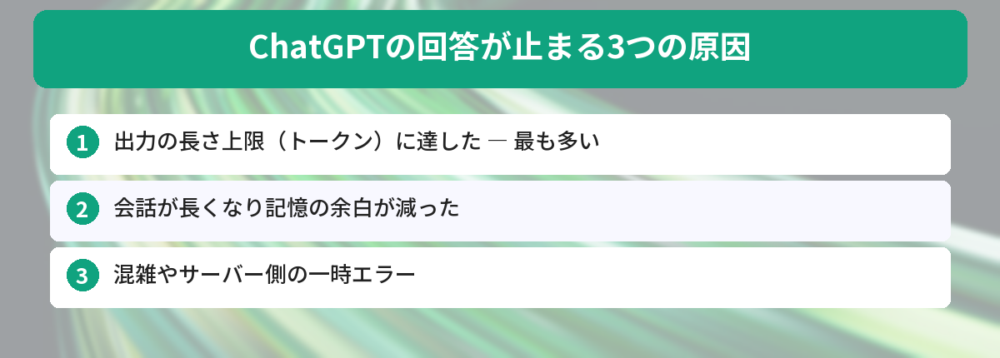
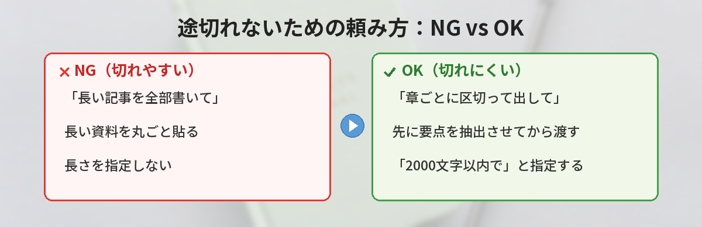
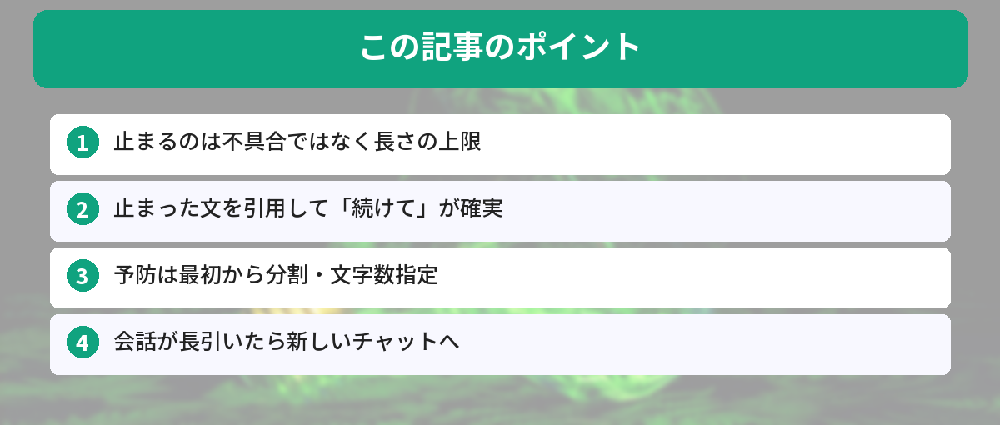

## この記事で分かること


ChatGPTに長めの文章を頼んだら、途中でピタッと止まっちゃったの…「続けて」って打っても変な続きになるし、どうすればいいの？



あるあるだね。あれは故障じゃなくて、ChatGPTが一度に出せる長さに上限があるのが原因なんだ。仕組みが分かれば確実に続きを出せるし、そもそも切れないように頼むコツもあるよ。順番に見ていこう。




「ChatGPTの回答が途中で止まる」「長文が途切れて最後まで出てこない」

このページに辿り着いた人は、こんな場面で困っているはずです。

- 長い文章の生成を頼んだら、文の途中でぷつっと切れた
- コードを書かせたら関数の途中で止まった
- 「続けて」と打ったら、続きではなく最初からやり直された

結論から言うと、これは**ChatGPTの不具合ではなく仕様**です。原因を知れば数秒で対処できます。この記事では、なぜ止まるのかという仕組みから、続きを確実に出す方法、そして最初から切れないように頼むコツまで、実際に試しながら解説します。



## なぜChatGPTの回答は途中で止まるのか

ChatGPTには「一度の返信で出せる文章の長さ」に上限があります。この上限を超えそうになると、文の途中でも生成を打ち切ります。

長さの単位は「トークン」と呼ばれます。トークンは単語や文字をAIが扱うための細かい単位で、日本語だとだいたい1文字＝1〜2トークンくらいが目安です。1回の返信にはこのトークン数に上限があり、そこに達すると止まります。

つまり、止まる主な理由はこの3つです。

- **出力の長さ上限に達した** — 一番多いケース。長文・長いコードで起きる
- **会話が長くなりすぎた** — それまでのやり取り全体が上限に近づくと、新しい返信に使える余白が減る
- **一時的な通信・サーバー側のエラー** — 混雑時に生成が中断される

この「会話全体の記憶の広さ」はコンテキストウィンドウと呼ばれます。会話が長くなるほど途切れやすくなるのはこのためです。ChatGPTの記憶の仕組みについては[ChatGPTのメモリ機能の使い方](/posts/chatgpt-memory-tips/)でも詳しく解説しています。



## まず試す：続きを確実に出す方法

止まってしまったときの対処です。上から順に試すのがおすすめです。

### 方法1: 「続けて」と入力する

一番シンプルな方法です。入力欄に「続けて」とだけ送ると、止まったところから続きを生成してくれることが多いです。

ただし、たまに続きではなく似た内容を最初から出し直すことがあります。その場合は次の方法が確実です。

### 方法2: 止まった場所を指定して続けてもらう

「続けて」で変な続きになるときは、**どこから続けてほしいかを具体的に伝える**と精度が上がります。

```
さっきの回答が「〇〇という文」で途切れました。
その続きから、同じ形式で最後まで出力してください。
```

止まった直前の数文字を引用して渡すのがコツです。ChatGPTが「どこまで出したか」を正確に把握できます。

### 方法3: コードが途切れたときの頼み方

コードが途中で切れた場合は、最初から全部出させると長くなってまた切れます。切れた関数名やブロックを指定しましょう。

```
さっきのコードが関数 calculate_total の途中で切れました。
calculate_total 以降だけを続けて出力してください。
```

### 方法4: 新しい会話で頼み直す

会話が長くなりすぎて途切れる場合は、新しいチャットを開いて、必要な前提だけを貼り直してから頼むとうまくいきます。回答を短く区切って受け取る頼み方は[ChatGPTの回答を短くするプロンプト](/posts/chatgpt-prompt-shorter-answer/)も参考になります。

## そもそも途切れないようにする頼み方

対処より大事なのが予防です。最初の頼み方を少し変えるだけで、途切れる回数はぐっと減ります。

### 分割して出力させる

長い成果物は、最初から「分けて出して」と伝えます。

```
長めのマニュアルを作ってください。
一度に全部出さず、章ごとに区切ってください。
1章を出したら「次へ」と送るので、そこで2章を出してください。
```

これなら1回の出力が短く収まるので、途中で切れません。

### 文字数の上限を指定する

```
2000文字以内でまとめてください。
```

出力の長さをこちらで指定すると、ChatGPTがその範囲に収めようとするので途切れにくくなります。

### 長い入力は要約してから渡す

長い資料を貼り付けて処理させると、入力だけでトークンを使い切り、出力の余白が減ります。長文を扱うときは先に要点を抽出させると安定します。PDFなど長い資料の扱いは[ChatGPTでPDFを要約する方法](/posts/chatgpt-pdf-summary/)でまとめています。



## 実際に試してみた

長文が途切れる状況を、実際に再現して対処を試しました。

### やったこと

ChatGPTに「3000文字程度のブログ記事を書いて」と頼んだところ、2000文字あたりで途切れました。そこで対処法を順番に試しました。

### 結果

- **「続けて」だけ**: 7割くらいは続きが出た。ただし3回に1回は内容が少しダブった
- **止まった文を引用して「続けて」**: ほぼ100%きれいに続いた。ダブりもなし
- **最初から「章ごとに区切って」と指定**: そもそも一度も途切れなかった

一番ラクで確実だったのは、**最初から分割を指定しておく**方法でした。対処するより、頼み方を工夫する方が手間がかからないという結論です。

### イマイチだった点

「続けて」を連発すると、だんだん前の内容を忘れて話がずれていくことがありました。会話が長くなったら、新しいチャットで前提を貼り直す方が結局早いです。

## こんなときは別の原因かも

長さ以外で止まる場合もあります。

- **「Something went wrong」と出る** — サーバー側の一時エラー。少し待って再送信する
- **何を頼んでも短く切れる** — 混雑している時間帯。時間を置くか、画面を再読み込みする
- **特定の内容だけ止まる** — 規約に触れる内容だと生成が止まることがある

長文を日常的に扱うなら、長い文章の処理が得意な[Claudeの長文処理の使い方](/posts/claude-long-document/)と使い分けるのも手です。

## よくある質問（FAQ）



### Q: 「続けて」と打っても続きが出ません。どうすれば？
A: 止まった直前の文を引用して「この続きから出力してください」と伝えてください。ChatGPTがどこまで出したかを正確に把握できるので、きれいに続きが出ます。

### Q: 無料版と有料版で途切れやすさは違いますか？
A: 有料版の方が一度に扱える長さの上限が大きいため、途切れにくい傾向があります。ただし無料版でも、分割して頼めば長い成果物を最後まで作れます。

### Q: 毎回途切れるのを防ぐ一番の方法は？
A: 最初から「章ごとに区切って出して」「2000文字以内で」のように、出力の長さや区切りを指定することです。対処するより予防する方が確実で手間がかかりません。

### Q: コードが途中で切れたとき、全部出し直してもらうべき？
A: 全部出すとまた切れやすいので、切れた関数やブロックを指定して「そこから続けて」と頼むのがおすすめです。

### Q: 会話が長くなると途切れやすいのはなぜ？
A: それまでのやり取り全体が記憶の上限（コンテキストウィンドウ）に近づくと、新しい返信に使える余白が減るためです。長くなったら新しいチャットで前提を貼り直すと安定します。


なるほど…！壊れてたんじゃなくて、長さの上限だったんだね。最初から「章ごとに出して」って頼めばいいのか！



そういうこと！止まったら「止まった文を引用して続けて」、長文は「最初から分割指定」。この2つを覚えておけばもう困らないよ。


## まとめ

- ChatGPTの回答が途中で止まるのは不具合ではなく、出力の長さ上限（トークン）に達するのが主な原因
- 止まったら「続けて」。効かないときは止まった文を引用して続きを指定すると確実
- コードは切れた関数を指定して続けてもらう
- 一番ラクなのは予防。最初から「章ごとに区切って」「〇文字以内で」と指定する
- 会話が長くなりすぎたら、新しいチャットで前提を貼り直す

---
### あわせて読みたい
- [ChatGPTの回答を短くするプロンプト ― 長すぎる返事をスッキリさせる](/posts/chatgpt-prompt-shorter-answer/)
- [ChatGPTでPDFを要約する方法 ― 長い資料を数分で把握する](/posts/chatgpt-pdf-summary/)

<!-- affiliate -->
## 関連リソース

ChatGPTをもっと使いこなしたい方に、評価の高い入門書をまとめました。

<!-- START MoshimoAffiliateEasyLink -->
<script type="text/javascript">
(function(b,c,f,g,a,d,e){b.MoshimoAffiliateObject=a;b[a]=b[a]||function(){arguments.currentScript=c.currentScript||c.scripts[c.scripts.length-2];(b[a].q=b[a].q||[]).push(arguments)};c.getElementById(a)||(d=c.createElement(f),d.src=g,d.id=a,e=c.getElementsByTagName("body")[0],e.appendChild(d))})(window,document,"script","//dn.msmstatic.com/site/cardlink/bundle.js?20220329","msmaflink");
msmaflink({
  "n":"ChatGPT活用入門書",
  "b":"","t":"",
  "d":"https://thumbnail.image.rakuten.co.jp",
  "c_p":"",
  "p":[""],
  "u":{"u":"https://search.rakuten.co.jp/search/mall/ChatGPT+%E6%9C%AC/","t":"rakuten","r_v":""},
  "v":"2.1",
  "b_l":[
    {"id":1,"u_tx":"楽天市場で見る","u_bc":"#f76956","u_url":"https://search.rakuten.co.jp/search/mall/ChatGPT+%E6%9C%AC/","a_id":5490814,"p_id":54,"pl_id":27059,"pc_id":54,"s_n":"rakuten","u_so":1}
  ],
  "eid":"chatgptcutoff",
  "s":"s"
});
</script>
<div id="msmaflink-chatgptcutoff">リンク</div>
<!-- MoshimoAffiliateEasyLink END -->
<!-- /affiliate -->
