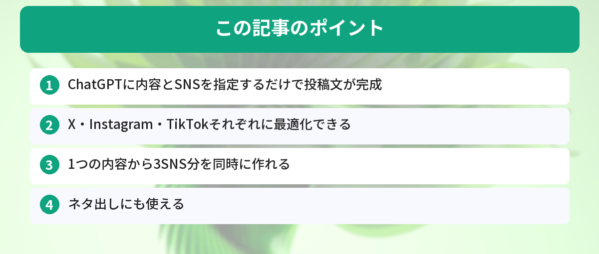

## この記事で分かること


SNSの投稿文を考えるのに毎回30分くらいかかっちゃうの…。しかもX、Instagram、TikTok全部やってるから大変で…。



それは大変だね。ChatGPTなら、1つの内容から3つのSNS向けの投稿文を同時に作れるよ。各プラットフォームに合わせた文字数やトーンも自動で調整してくれるんだ。


「SNSの投稿文を考えるのに時間がかかる」

ChatGPTに内容を伝えるだけで、各SNSに最適化された投稿文が一瞬で完成します。

## なぜChatGPTでSNS投稿を作るのか

SNS運用で最も時間がかかるのが「投稿文を考える」作業です。特に複数のSNSを運用している場合、それぞれのプラットフォームに合わせた文章を書くのは大きな負担になります。

ChatGPTを使えば、この作業を大幅に短縮できます。

- 各SNSの文字数制限やトーンに合わせた文章を自動生成
- ハッシュタグの提案もしてくれる
- 1つの内容から複数SNS向けの投稿を同時に作れる
- 投稿のネタ出しにも使える

まだChatGPTのアカウントを持っていない方は、[ChatGPTの始め方 ― 登録から最初の質問まで5分で完了](/posts/chatgpt-first-step/)を参考に、まず登録を済ませておきましょう。



## 基本のプロンプト

プロンプトの書き方に慣れていない方は、[コピペで使えるChatGPTプロンプト10選 ― 仕事がすぐ楽になる](/posts/chatgpt-prompt-template/)も参考にしてみてください。SNS投稿に限らず、プロンプトの基本パターンが身につきます。

```
以下の内容で、X（Twitter）用の投稿文を作ってください。

内容：ブログで新しい記事を公開した。テーマはChatGPTでタスク管理を効率化する方法。
トーン：親しみやすく、押し付けがましくない
ハッシュタグ：3〜5個
文字数：280文字以内
```

## SNS別のプロンプト


基本のプロンプトは分かったけど、SNSごとに最適な書き方って違うよね？



全然違うよ！Xは280文字以内で目を引く必要があるし、Instagramはハッシュタグが命。TikTokは短くキャッチーに。それぞれのテンプレートを紹介するね。


### X（Twitter）用

```
以下の内容でXの投稿文を作ってください。
- 280文字以内
- 絵文字を2〜3個使う
- ハッシュタグは3〜5個
- 最初の1行で目を引く

内容：（ここに伝えたい内容）
```

### Instagram用

```
以下の内容でInstagramのキャプションを作ってください。
- 最初の1行でスクロールを止める
- 本文は3〜5行で簡潔に
- ハッシュタグは10〜15個（関連性の高いもの）
- 最後にCTA（フォローやコメントの促し）を入れる

内容：（ここに伝えたい内容）
```

### TikTok用

```
以下の内容でTikTokの投稿文を作ってください。
- 短くキャッチーに（2〜3行）
- ハッシュタグは5〜8個
- 若い世代に刺さる表現で

内容：（ここに伝えたい内容）
```

## 1つの内容から3SNS分を同時に作る

```
以下の内容で、X・Instagram・TikTokの投稿文をそれぞれ作ってください。
各SNSの特性に合わせて最適化してください。

内容：ChatGPTを使えば、毎朝のタスク整理が5分で終わる。
やることを箇条書きで伝えるだけで、優先順位と所要時間を付けてくれる。
```

## 投稿ネタに困ったとき

SNSの投稿を続けていると、ネタ切れになることがあります。そんなときもChatGPTが頼りになります。[ChatGPTでブレインストーミングする方法](/posts/chatgpt-brainstorm/)で紹介しているテクニックを応用すれば、投稿ネタを効率的に量産できます。

```
以下のジャンルで、SNSに投稿するネタを10個提案してください。
バズりやすいもの、共感を得やすいものを優先してください。

ジャンル：AI活用・仕事効率化
ターゲット：20〜30代の会社員
```

## 投稿文のクオリティを上げるコツ


AIで投稿文を作れるのは便利だけど、フォロワーに「AIっぽい」って思われたくないな…。



大事なポイントだね。AIが作った文章に自分の言葉を混ぜるだけで、一気に個性が出るよ。3つのコツを紹介するね。


### 自分の言葉を混ぜる

AIが作った文章は整っていますが、個性が薄くなりがちです。自分の体験や感想を1〜2文追加するだけで、フォロワーに刺さる投稿になります。

### 投稿前にAI検出を意識する

SNSプラットフォームによっては、AI生成コンテンツの扱いが変わる可能性があります。[AI文章はバレる？ AI検出ツールの仕組みと対策](/posts/ai-writing-detection/)で紹介しているポイントを押さえておくと安心です。

### トーンを統一する

ChatGPTの[カスタム指示（Custom Instructions）](/posts/chatgpt-custom-instructions/)を設定しておくと、毎回トーンを指定しなくても自分のブランドに合った文章が生成されます。SNS運用を本格的にやるなら、ぜひ設定しておきましょう。

## 2週間ChatGPTでSNS運用した結果

筆者は2週間、X（Twitter）の投稿をすべてChatGPTで下書きしてから投稿する運用を試しました。

**投稿数：** 14日間で28投稿（1日2投稿）

**結果：**
- インプレッション数：ChatGPT活用前の平均比で1.8倍に増加
- いいね数：平均1.5倍に増加
- フォロワー増加：2週間で+47人（それまでは月+20人ペース）

**良かった点：**
- 「投稿文を考える時間」が1投稿あたり20分→3分に短縮
- 「最初の1行で目を引く」構成をAIが自動で作ってくれる
- ハッシュタグの提案が的確で、リーチが伸びた

**イマイチだった点：**
- AIが作った文章をそのまま投稿すると「きれいすぎて」反応が薄い
- 自分の体験を1文追加した投稿の方が明らかにエンゲージメントが高かった

**結論：** ChatGPTは「下書き」として最強。ただし自分の言葉を1〜2文足すだけで反応が全然違う。「AI下書き＋自分の一言」が最適解。

## ChatGPTでSNS投稿を作る実際のワークフロー

X（Twitter）の投稿文をChatGPTで作成する際の、実際のワークフローです。

### 手順

1. 「〇〇について、Xの投稿文を3パターン作って。140文字以内で」と指示
2. 3パターンから一番自然なものを選ぶ
3. 自分の口調に合わせて微調整する（「です・ます」→「だよね」等）
4. 絵文字やハッシュタグを追加

### 効果

- 投稿文を考える時間: 10分→3分
- 投稿頻度が上がった（ネタ切れが減った）
- エンゲージメント率は手書きと変わらなかった

### 注意点

- ChatGPTの出力をそのまま投稿すると「bot感」が出る
- 必ず自分の言葉で書き直す工程を入れる
- 時事ネタは自分で確認してから投稿する（AIの情報が古い場合がある）

## よくある質問（FAQ）



### Q: ChatGPTで作った投稿文をそのまま使っても大丈夫ですか？
A: そのまま投稿しても問題はありませんが、自分の言葉や体験を少し加えることをおすすめします。AIが生成した文章はどうしても「よくある表現」になりがちなので、ひと手間加えるだけでオリジナリティが出ます。

### Q: 無料版のChatGPTでもSNS投稿文は作れますか？
A: はい、無料版で十分に作成できます。SNS投稿文の生成は比較的シンプルなタスクなので、無料版のGPT-4oでも高品質な文章が返ってきます。

### Q: ハッシュタグの選定もChatGPTに任せて大丈夫ですか？
A: ChatGPTはハッシュタグの提案が得意ですが、トレンドのハッシュタグはリアルタイムで変わるため、最新のトレンドを反映できない場合があります。ChatGPTの提案をベースにしつつ、各SNSのトレンド機能で確認するのがおすすめです。

### Q: 1日に何投稿分くらい作れますか？
A: 無料版でも1日に数十投稿分は作成できます。1つのプロンプトで3SNS分を同時に生成すれば、さらに効率的です。投稿のストックを一気に作っておくと、日々の運用が楽になります。

### Q: Instagram用のハッシュタグが多すぎる気がします。減らしてもいいですか？
A: Instagramでは10〜15個のハッシュタグが推奨されていますが、最近は5〜10個程度に絞る方がリーチが伸びるという報告もあります。ChatGPTに「ハッシュタグを5個に絞って」と追加で指示すれば調整できます。


3SNS分を同時に作れるの、めちゃくちゃ助かる…！今週分のストック、一気に作ってみようかな。



いいね！あと、AIが作った文章に自分の体験を1〜2文足すだけで、フォロワーに刺さる投稿になるよ。まずは1投稿作ってみて、反応を見ながら調整していこう。


## まとめ

- ChatGPTに内容とSNSを指定するだけで投稿文が完成
- X・Instagram・TikTokそれぞれに最適化できる
- 1つの内容から3SNS分を同時に作れる
- ネタ出しにも使える

---

### あわせて読みたい
- [コピペで使えるChatGPTプロンプト10選](/posts/chatgpt-prompt-template/)
- [ChatGPTでビジネスメールを一瞬で作る方法](/posts/chatgpt-email-template/)

