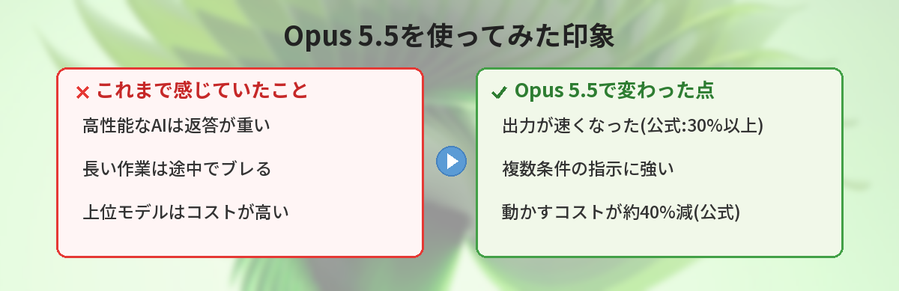

## この記事で分かること


「Claude Opus 5.5」が出たってニュースで見たんだけど…前のと何が違うの？私みたいな普通の人にも関係ある？



9月22日に出たばかりの新しいAIだね。ざっくり言うと「賢くなったのに安く・速くなった」のがポイント。難しい話は置いといて、実際どう変わったか一緒に見ていこう。


「Claude Opus 5.5が出たらしいけど、何がすごいの？」

2026年9月22日、AnthropicがClaude 5.5ファミリーの最初のモデル「Claude Opus 5.5」を公開しました。発表直後なので、見出しの数字だけが先に流れてきて、中身がつかみにくい時期です。この記事では、公式発表の内容を整理しつつ、実際に使って体感を確かめた結果をまとめます。



## Claude Opus 5.5とは

Claude Opus 5.5は、AnthropicのAI「Claude」の新しいモデルです。これまでの最上位だったOpus 5の後継にあたります。

公式発表によると、特徴はこの3つです。

- **コストが約40%下がった**（一般的な使い方の場合、Opus 5と比べて）
- **出力速度が30%以上速くなった**
- **エージェント型の作業（AIが複数の手順を自分で進める作業）やコーディングで性能が向上**

Claude自体がどんなAIかをまず知りたい人は、[Claudeとは？ChatGPTとの違い](/posts/claude-what-is-it/)から読むと分かりやすいです。

## 何が変わったのか（Opus 5との違い）

一番大きいのは「賢さを上げながら、同時に安く・速くした」という方向性です。

これまでのAIの進化は「もっと賢く、その代わり重く高く」という流れが多めでした。Opus 5.5は逆で、**性能を上げつつコストと速度を改善**しています。Anthropicは「ほとんどの作業で上位モデルのFable 5.1と同じ水準の性能を、Opus 5より40%安く動かせる」と説明しています。

### 価格（開発者向けAPI）

公式発表によると、API利用時の価格はOpus 5より下がっています。入力・出力ともに単価が引き下げられました。具体的な金額は時期やプランで変わることがあるので、使う前に[Anthropic公式のモデルページ](https://www.anthropic.com/claude/opus)で最新の数字を確認してください。

### 普通に使う分にはどう関係する？

「APIの価格が下がった」と言われても、チャットで使うだけの人にはピンときません。ただ、安く・速くなるとこういう恩恵があります。

- Claudeを組み込んだアプリやサービスが、より安く提供されやすくなる
- 返答が速くなるので、長い相談でも待ち時間が減る
- 長い作業（資料の読み込み、複数ステップの整理）を任せやすくなる

## 実際に使ってみた

発表直後に、普段ChatGPTでやっている作業をOpus 5.5に投げて比べてみました。

### やったこと

- 長めの文章（約5000字）を渡して要約させる
- 「手順を考えて、順番に実行する」タイプの相談をする
- 簡単なコードを書かせて修正を依頼する

### 体感したこと

- **返答が速い**: 長めの依頼でも、出力が始まるまでと出し切るまでが前より短く感じました
- **指示の取りこぼしが少ない**: 「この条件も守って」と複数条件を出したとき、途中で忘れにくい印象
- **長い作業に強い**: 複数手順の相談で、話が最後までブレにくかった

数値はあくまで公式発表ベースですが、「速くなった」は体感でも分かりやすかったです。長文を扱うなら[Claudeの長文処理の使い方](/posts/claude-long-document/)もあわせてどうぞ。

## 良かった点・イマイチだった点

正直な感想です。

### 良かった点

- とにかく速い。待たされるストレスが減った
- 複数条件の指示に強く、やり直しが減った
- 「安くなった」のは、Claudeを使ったサービス全体に良い影響がありそう

### イマイチだった点

- 発表直後なので、日本語の細かい言い回しや最新情報はまだ検証が必要
- チャットだけで使う人には、価格の話は実感しづらい
- 結局「どのモデルを選ぶか」は目的次第で、万能の正解ではない

AIを目的別に選びたい人は[ChatGPTとGemini、結局どっちがいい？](/posts/gemini-vs-chatgpt/)も参考になります。

## こんな人におすすめ / おすすめしない人

**おすすめな人**

- 長い資料の要約や、複数ステップの作業をAIに任せたい人
- Claudeを使った開発・自動化をしていて、コストを抑えたい人
- 返答の速さを重視する人

**今はまだ急がなくていい人**

- チャットで短い質問をするだけの人（今の環境で十分なことが多い）
- 特定のAIに使い慣れていて、乗り換える明確な理由がない人

## よくある質問（FAQ）

### Q: Opus 5.5は無料で使えますか？
A: Claudeには無料で使える範囲と有料プランがあります。最上位モデルの扱いはプランによって変わるため、公式の案内で最新の提供状況を確認してください。

### Q: ChatGPTから乗り換えるべきですか？
A: 用途次第です。長い作業や複数手順の処理ならOpus 5.5は快適ですが、短い質問中心なら今のままでも困りません。両方を使い分けるのが現実的です。

### Q: 「コスト40%減」は自分の料金も4割下がるという意味ですか？
A: これは主に開発者向けAPIの話で、Opus 5と比べて動かすコストが下がったという意味です。チャットで使う個人料金がそのまま4割下がるわけではありません。

### Q: Opus 5.5はどこで使えますか？
A: Claudeの公式プラットフォームのほか、AWSやGoogle Cloudなどのクラウド経由でも提供されています（公式発表による）。

### Q: 専門知識がなくても使えますか？
A: はい。チャットとして日本語で話しかけるだけで使えます。難しい設定は不要です。


なるほど…！「賢くなったのに安く速くなった」のが新しいんだね。私はまず長い文章の要約で試してみる！



それがいいね。新しいモデルは、まず自分のよくやる作業で試すのが一番わかりやすいよ。合わなければ元のAIに戻ればいいだけだからね。


## まとめ

- Claude Opus 5.5は2026年9月22日に登場したClaude 5.5ファミリーの最初のモデル
- 公式発表では「コスト約40%減・出力30%以上高速化・エージェント型やコーディングで性能向上」
- 体感でも「速さ」と「指示の取りこぼしの少なさ」は分かりやすかった
- 価格や提供状況は変わりうるので、使う前に公式で最新情報を確認する
- 長い作業・複数手順の処理を任せたい人に特に向いている

---
### あわせて読みたい
- [Claudeとは？ChatGPTとの違いをやさしく解説](/posts/claude-what-is-it/)
- [Claudeの長文処理の使い方 ― 長い資料を任せるコツ](/posts/claude-long-document/)

<!-- affiliate -->
## 関連リソース

生成AIの基礎から押さえたい方に、評価の高い入門書をまとめました。

<!-- START MoshimoAffiliateEasyLink -->

リンク

<!-- MoshimoAffiliateEasyLink END -->
<!-- /affiliate -->
