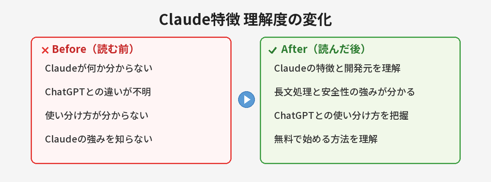

## この記事で分かること


最近「Claude」ってよく聞くんだけど、ChatGPTと何が違うの？わざわざ別のAI使う意味あるのかな…？



いい質問だね！Claudeは長い文章を読むのがめちゃくちゃ得意で、慎重に答えてくれるタイプのAIなんだ。ChatGPTとは得意分野が違うから、使い分けると便利だよ。


「ClaudeっていうAIを聞いたけど、ChatGPTと何が違うの？」

この記事では、Claudeの特徴とChatGPTとの使い分け方を解説します。筆者は3ヶ月以上両方を並行して使い続けているので、公式サイトには載っていない「実際に使って分かった違い」もお伝えします。



## Claudeとは

ClaudeはAnthropic社が開発したAIアシスタントです。ChatGPTと同じように、文章で会話しながら質問や作業を依頼できます。

https://claude.ai で無料で使えます。

### Anthropic社について

Anthropicは元OpenAIの研究者たちが2021年に設立した会社です。「安全なAIの開発」を掲げており、Claudeにもその方針が色濃く反映されています。AIの安全性研究に力を入れている企業が作ったAIだからこそ、回答が慎重で正確な傾向があるんです。

---

## ChatGPTとの違い

| | Claude | ChatGPT |
|---|---|---|
| 開発元 | Anthropic | OpenAI |
| 無料プラン | あり | あり |
| 長文の処理 | ◎（非常に長い文章を読める） | ○ |
| 文章の自然さ | ◎ | ◎ |
| プログラミング | ◎ | ◎ |
| 画像生成 | × | ◎ |
| Web検索 | ○ | ○ |
| 安全性への配慮 | ◎（慎重な回答が多い） | ○ |
| 回答速度 | ○ | ◎ |
| 入力上限 | 非常に長い（20万トークン超） | 長い |


表で見ると違いが分かりやすいね。でも実際に使ったときの「体感の違い」ってどんな感じ？



一番分かりやすいのは「回答のトーン」かな。ChatGPTは明るくハキハキ答えてくれる感じ、Claudeは落ち着いて丁寧に説明してくれる感じ。同じ質問でも答え方の雰囲気が結構違うよ。


---

## Claudeが得意なこと

### 長い文章の読み込み

Claudeは非常に長い文章を一度に読み込めます。たとえば：

- 100ページのPDFを読んで要約する
- 長い契約書の内容を確認する
- 大量のデータを分析する
- 技術書1冊分の内容について質問する

具体的な使い方は[Claudeで100ページのPDFを一瞬で要約する方法](/posts/claude-long-document/)で詳しく解説しています。

ChatGPTでも可能ですが、Claudeの方が長文処理に強いです。特に「元の文章のニュアンスを正確に捉える」能力に関してはClaude が頭一つ抜けている印象です。

### 丁寧で慎重な回答

Claudeは「分からないことは分からない」と正直に答える傾向があります。不確かな情報を断定的に言わないので、正確性を重視する場面で安心です。

実際に使っていると、ChatGPTが自信満々に答える場面でも、Claudeは「この点については不確かですが」と前置きしてくれることがあります。「嘘をつかないAI」を重視する人にはClaudeの方が向いています。

### 文章のリライト・校正

文章の書き直しや校正はClaudeが得意です。元の文章のニュアンスを保ちながら、より読みやすく整えてくれます。

筆者がブログ記事の校正を両方に依頼したとき、Claudeは「ここは読者に伝わりにくいかもしれません」と具体的な改善理由を添えてくれました。ChatGPTは修正後の文章だけ返してくることが多いので、「なぜ直すのか」を理解したい場合はClaudeが便利です。

### プログラミング（特にコードレビュー）

コードを書くこと自体はどちらも得意ですが、「なぜそう書くべきか」の説明はClaudeが丁寧です。初心者がプログラミングを学ぶときに「先生役」として使うなら、Claudeの方が分かりやすい説明をしてくれます。

---

## Claudeの始め方

1. https://claude.ai にアクセス
2. Googleアカウントまたはメールアドレスで登録
3. テキスト入力欄に質問を打ち込む

ChatGPTとほぼ同じ操作感です。登録から最初の質問まで3分もかかりません。ChatGPTの始め方については[ChatGPTの始め方 ― 登録から最初の質問まで5分で完了](/posts/chatgpt-first-step/)で解説しています。

### 最初に試すおすすめの質問

Claudeの良さを体感するなら、以下のような質問がおすすめです：

- 「この文章を校正してください：（自分の文章をペースト）」→ 校正力を体感
- 「〇〇について500字で説明してください」→ 文章の自然さを確認
- 「以下の長文を300字に要約してください：（長い文章をペースト）」→ 要約力を確認

---

## 無料プランと有料プランの違い

### 無料プラン

- 基本的な機能は全て使える
- 1日あたりの利用回数に制限あり（時間帯や混雑状況で変動）
- 最新モデルも利用可能（ただし制限あり）

### 有料プラン（Claude Pro：月額20ドル）

- 利用上限が大幅に増加
- 混雑時でも優先的にアクセス可能
- 最新モデルをフルに使える
- プロジェクト機能で複数の会話を管理

### 筆者の体感：どのくらい使ったら有料にすべき？

正直なところ、カジュアルに1日3〜5回使う程度なら無料プランで十分です。筆者が有料にしたのは「仕事でがっつりコード書きに使い始めた」タイミングでした。1日10回以上質問するようになったら、有料プランを検討する価値があります。

---

## 使い分けガイド

| やりたいこと | おすすめ | 理由 |
|---|---|---|
| 長い文書の要約・分析 | Claude | 入力上限が広く、ニュアンスを捉える力が強い |
| 画像を生成したい | ChatGPT | DALL-E統合で画像生成が可能 |
| 文章の校正・リライト | Claude | 修正理由の説明が丁寧 |
| プログラミングの質問 | どちらでも | 強いて言えば説明の丁寧さでClaude |
| 最新情報を調べたい | ChatGPT or Gemini | Web検索機能の精度 |
| 慎重な回答がほしい | Claude | 不確かな情報を断定しない |
| 速度重視のタスク | ChatGPT | レスポンスが全体的に速い |
| スプレッドシート操作 | ChatGPT | プラグインやコード実行が充実 |

Google製のAIであるGeminiとの比較については、[ChatGPTとGemini、結局どっちがいい？](/posts/gemini-vs-chatgpt/)もあわせてご覧ください。また、AIを使った検索の違いについては[AI検索 vs Google検索](/posts/ai-vs-google-search/)も参考になります。


なるほど、得意分野が違うから「どっちが上」じゃなくて「使い分け」なんだね。



その通り！「AIはひとつだけ使う」時代から「複数のAIを使い分ける」時代になってきてるよ。両方無料で試せるから、まず体感してみるのが一番。


---

## 実際にClaudeとChatGPTを使い比べてみた！

筆者が実際に3ヶ月間、同じ質問をChatGPTとClaudeの両方に投げ続けた結果をお伝えします。

### Claudeが良かった場面

- **コードレビュー**: 「なぜこう書くべきか」の説明が丁寧。「この書き方はバグの原因になりやすいです。なぜなら〜」と理由を教えてくれる
- **長文の要約**: 原文のニュアンスを保ったまま要約してくれる。重要なポイントを見逃さない
- **倫理的な質問**: 「分からない」「判断が難しい」と正直に言ってくれる。ChatGPTはつい断定的に答えがち
- **議論の壁打ち**: 「こういう視点もあります」と多角的な意見をくれる
- **文章の添削**: ニュアンスを壊さずに直してくれる。「ここはこう変えた方が読者に伝わりやすいです」と説明付き

### ChatGPTが良かった場面

- **速度**: 回答が速い。サクサクやり取りしたいときに快適
- **画像生成**: DALL-E統合で画像も作れる。ブログ用の画像作成に便利
- **プラグイン・機能の多さ**: Web検索、コード実行、ファイル分析など多機能
- **会話の気軽さ**: トーンが明るくて、ちょっとした雑談にも付き合ってくれる
- **データ分析**: ExcelやCSVを読み込んでグラフ化してくれる機能が便利

### 両方使って気づいたこと

- 同じ質問でも回答の切り口が違うので、**両方に聞いて比較する**と理解が深まる
- Claudeに「ChatGPTはこう答えたけどどう思う？」と聞くとセカンドオピニオンが得られる
- 片方で解決しなかった問題が、もう片方ではあっさり解決することがある
- 「どちらが正しいか」ではなく「どちらの回答が自分の用途に合うか」で選ぶのがコツ

### 結論

- 「正確さ・丁寧さ」重視 → Claude
- 「速度・多機能」重視 → ChatGPT
- 両方無料で使えるので、用途に応じて使い分けるのがベスト

---

## Claude活用のコツ（体験から分かったこと）

### コツ1：前提を丁寧に伝える

Claudeは前提情報をしっかり読んでくれるタイプなので、質問の背景を詳しく書くほど良い回答が返ってきます。

**悪い例**: 「Pythonのエラーを直して」

**良い例**: 「Python 3.11で、pandasのDataFrameをmergeしたときにKeyErrorが出ます。左のDFのカラム名はuser_id、右はuserIdで、大文字小文字が違うのが原因だと思いますが、直し方を教えてください」

### コツ2：長文は遠慮なく貼る

Claudeの入力上限は非常に長いので、「こんなに長い文章を貼っていいのかな…」と遠慮する必要はありません。レポートや契約書をまるごと貼り付けて「要約して」と依頼するのがClaudeの本領です。

### コツ3：「なぜそうなのか」を聞く

Claudeは「なぜ？」に答えるのが得意です。単に答えをもらうだけでなく、「なぜその方法がいいのか」「なぜそうなるのか」を追加で聞くと、理解が深まる回答をしてくれます。

---

## やってはいけないこと

### 機密情報をそのまま入力する

ClaudeもChatGPTも、入力した内容がモデルの学習に使われる可能性があります（設定で変更可能）。会社の機密情報や個人情報はそのまま入力しないように注意しましょう。

### AIの回答を鵜呑みにする

Claudeは慎重に答えてくれますが、それでも間違えることはあります。重要な判断には必ず自分で確認を。特に法律・医療・金融に関する情報はAIの回答をそのまま信じないでください。

### 1つのAIだけに依存する

AIの回答はモデルによってバイアスがあります。重要なことは複数のAIに聞いて比較するのがおすすめです。

---

## よくある質問（FAQ）

### Q: Claudeは日本語に対応していますか？
A: はい、Claudeは日本語に対応しています。日本語での質問に対して自然な日本語で回答してくれます。英語の方が若干精度が高い傾向はありますが、日常利用では全く問題ありません。

### Q: Claudeの無料プランと有料プランの違いは何ですか？
A: 無料プランでも基本的な機能は使えますが、1日あたりの利用回数に制限があります。有料プラン（Claude Pro：月額20ドル）では利用上限が大幅に増え、優先的にアクセスできます。仕事で毎日使うなら有料、週に数回なら無料で十分です。

### Q: ChatGPTとClaude、両方使った方がいいですか？
A: 用途によって得意分野が異なるため、両方使い分けるのがおすすめです。長文処理や慎重な回答が必要な場面ではClaude、画像生成や汎用的な作業にはChatGPTが向いています。まずは同じ質問を両方に投げて、違いを体感してみてください。

### Q: Claudeでプログラミングの質問はできますか？
A: はい、Claudeはプログラミングにも強いです。コード生成、デバッグ、コードレビューなど幅広く対応しています。特に「なぜこう書くべきか」の説明が丁寧なので、学習目的には最適です。AIを使ったプログラミングについては[バイブコーディングとは？](/posts/vibe-coding-beginner/)も参考にしてください。

### Q: スマホからも使えますか？
A: はい、Claudeはスマホのブラウザからも利用可能です。また、iOS/Androidの公式アプリも提供されています。通勤中や外出先でもサッと質問できるので、スマホにインストールしておくと便利です。

---


長文を読ませるならClaude、画像を作りたいならChatGPTって感じなんだね。両方無料だし、とりあえずClaude登録してみようかな！



そうそう、まずは同じ質問を両方に投げてみて。回答のトーンや得意分野の違いが体感できるよ。自分に合う方をメインにすればOK！


## まとめ

- Claudeは長文処理と慎重な回答が強み。Anthropic社の「安全なAI」の理念が反映されている
- ChatGPTは画像生成、速度、多機能さが強み
- 両方無料で使えるので、試して自分に合う方を選ぶのがベスト
- 同じ質問を両方に投げて比較すると、それぞれの特徴が体感できる
- 仕事で本格的に使うなら有料プラン、週数回のカジュアル利用なら無料で十分
- 「正確さ重視」ならClaude、「スピード・多機能重視」ならChatGPTがおすすめ

---
### あわせて読みたい
- [100ページのPDFを一瞬で要約する方法 ― Claudeの100万トークンの使い方](/posts/claude-long-document/)
- [ChatGPTとGemini、結局どっちがいい？違いを比較](/posts/gemini-vs-chatgpt/)
