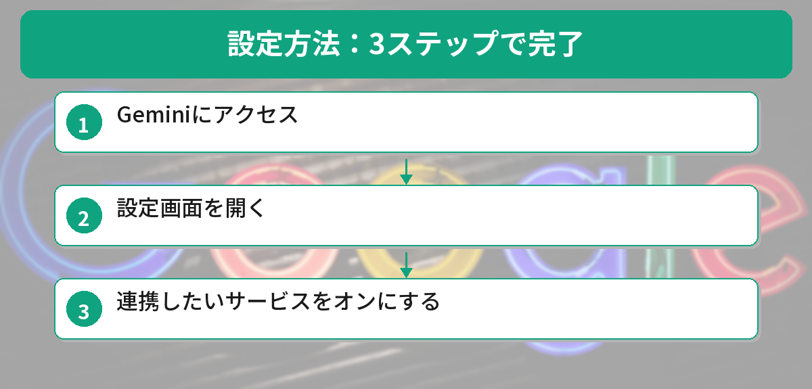
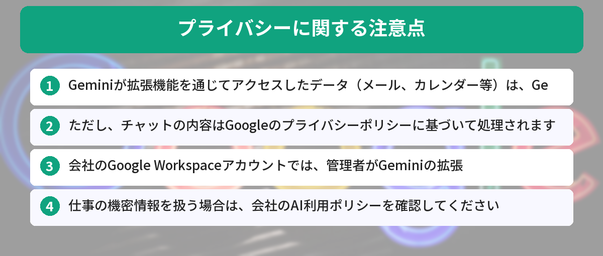

GeminiがGoogleの各サービスと連携できることをご存知ですか？

Gmail、Googleドキュメント、Googleカレンダーなどと直接つながることで、Geminiは**無料で使えるAI秘書**になります。この記事では、設定方法と具体的な活用法を解説します。

Geminiの基本的な特徴については、[GeminiとChatGPTの違いを比較した記事](/posts/gemini-vs-chatgpt/)で詳しく紹介しています。まだGeminiを使ったことがない方は、そちらも参考にしてみてください。

## Geminiが連携できるGoogleサービス一覧

| サービス | できること |
|---------|-----------|
| **Gmail** | メールの検索・要約・返信文の作成 |
| **Googleドキュメント** | 文書の要約・編集・作成 |
| **Googleカレンダー** | 予定の確認・追加・調整 |
| **Googleフォト** | 写真の検索・整理 |
| **YouTube** | 動画の要約・内容の質問 |

これらの連携は**Geminiの拡張機能（Extensions）**として提供されており、設定をオンにするだけで使えます。




## 設定方法：3ステップで完了



### ステップ1：Geminiにアクセス

[gemini.google.com](https://gemini.google.com) にアクセスし、Googleアカウントでログインします。

### ステップ2：設定画面を開く

画面右上の**設定アイコン（⚙️）**をクリックし、**「拡張機能」**を選択します。

### ステップ3：連携したいサービスをオンにする

以下のサービスのトグルをオンにします：

- ✅ Google Workspace（Gmail、Googleドキュメント、Googleドライブ）
- ✅ Googleカレンダー
- ✅ Googleフォト
- ✅ YouTube

これで設定は完了です。Geminiのチャット画面から、各サービスの情報にアクセスできるようになります。

## 実践例

### 1. Gmailのメールを検索する

```text
@Gmail 先週届いたAmazonからの注文確認メールを探して
```

Geminiが自動的にGmailを検索し、該当するメールの内容を表示してくれます。

**こんな使い方も：**
- 「@Gmail 今月届いた請求書メールをすべてリストアップして」
- 「@Gmail 田中さんから届いた最新のメールの内容を教えて」
- 「@Gmail 未読メールの中で重要そうなものを3つ教えて」

### 2. メールの返信文を作成する

```text
@Gmail 山田さんからの打ち合わせ依頼メールに、来週火曜の午後2時で承諾する返信を作成して
```

Geminiが該当メールを見つけて、適切な返信文を生成してくれます。ビジネスメールの作成をAIに任せたい方は、[ChatGPTでビジネスメールを一瞬で作る方法](/posts/chatgpt-email-template/)も参考になります。ChatGPTとGeminiで使い分けると、さらに効率的です。

### 3. Googleカレンダーの予定を確認する

```text
@Googleカレンダー 明日の予定を教えて
```

```text
@Googleカレンダー 来週の空いている時間帯を教えて
```

### 4. Googleカレンダーに予定を追加する

```text
@Googleカレンダー 来週の水曜日14時から15時に「プロジェクト定例会議」を追加して
```

Geminiがカレンダーに予定を追加してくれます（確認画面が表示されるので、内容を確認してから確定します）。

### 5. YouTube動画を要約する

```text
@YouTube この動画を要約して：[動画のURL]
```

長い動画でも、主要なポイントを箇条書きで要約してくれます。勉強や情報収集の時間を大幅に短縮できます。

**こんな使い方も：**
- 「@YouTube この動画で紹介されているツールの一覧を教えて」
- 「@YouTube この動画の内容について質問：〇〇の部分をもっと詳しく教えて」

## Geminiだけの強み：ChatGPTにはできないこと

この**Googleサービスとの直接連携は、Geminiだけの強み**です。

ChatGPTでも外部サービスとの連携は可能ですが、Googleの各サービスとネイティブに統合されているのはGeminiだけです。

| 機能 | Gemini | ChatGPT |
|------|--------|---------|
| Gmailの検索・返信 | ◎ | ✕ |
| Googleカレンダー連携 | ◎ | ✕ |
| Googleドキュメント連携 | ◎ | ✕ |
| YouTube動画の要約 | ◎ | △（URLを貼れば可能） |
| Googleフォト検索 | ◎ | ✕ |

普段からGoogleのサービスを使っている方にとって、Geminiは最も便利なAIアシスタントと言えます。

一方で、調べものに特化したAIを探している方は、[Perplexity vs ChatGPT ― 検索AI対決](/posts/perplexity-vs-chatgpt/)も参考にしてみてください。用途によって使い分けるのが効率的です。

## プライバシーに関する注意点



Geminiの拡張機能を使う際は、以下の点に注意してください。

### データの取り扱い

- Geminiが拡張機能を通じてアクセスしたデータ（メール、カレンダー等）は、Geminiの改善には使用されないとGoogleは説明しています
- ただし、チャットの内容はGoogleのプライバシーポリシーに基づいて処理されます

### 仕事用アカウントでの利用

- 会社のGoogle Workspaceアカウントでは、管理者がGeminiの拡張機能を無効にしている場合があります
- 仕事の機密情報を扱う場合は、会社のAI利用ポリシーを確認してください

### 拡張機能のオン・オフ

- 必要のないサービスの連携はオフにしておくことをおすすめします
- いつでも設定画面から個別にオン・オフを切り替えられます

## Gemini × Google Workspace連携で実際に時短できたこと

GeminiとGoogle Workspaceの連携を1ヶ月使った結果です。

### Gmail連携

- 「先週届いた請求書のメールを探して」→ 5秒で見つかる（手動検索だと2分）
- 「このメールに返信して。了解した旨を伝えて」→ 返信文を自動生成

### Googleドキュメント連携

- 「この議事録を箇条書きで要約して」→ 10秒で要約完成
- 「この文書の誤字脱字をチェックして」→ 校正結果を提示

### Googleカレンダー連携

- 「来週の空いてる時間を教えて」→ 空き時間を一覧表示
- 「〇〇さんとの打ち合わせを来週のどこかに入れて」→ 候補日を提案

### 体感の時短効果

メール検索・文書要約・スケジュール確認で、1日あたり約20分の時短になりました。

## よくある質問（FAQ）

### Q: Geminiの拡張機能は無料で使えますか？
A: はい、Googleアカウントがあれば無料で利用できます。Gmail、Googleカレンダー、Googleドキュメントなどとの連携機能は、追加料金なしで使えます。ただし、Gemini Advancedの一部機能は有料プラン（Google One AI Premium）が必要です。

### Q: 会社のGoogle Workspaceアカウントでも使えますか？
A: 組織の管理者がGeminiの利用を許可している場合は使えます。ただし、管理者が拡張機能を無効にしていることもあるため、利用前にIT部門や管理者に確認することをおすすめします。

### Q: Geminiに読ませたメールの内容は学習に使われますか？
A: Googleの説明によると、拡張機能を通じてアクセスしたデータ（メール、カレンダーなど）はGeminiのモデル改善には使用されません。ただし、チャットの内容自体はGoogleのプライバシーポリシーに基づいて処理されるため、機密性の高い情報を扱う際は注意が必要です。

### Q: GeminiとChatGPT、どちらを使うべきですか？
A: Googleサービスとの連携が必要な場合はGeminiが圧倒的に便利です。一方、文章作成やアイデア出しにはChatGPTが強みを持っています。詳しい比較は[ChatGPTとGemini、結局どっちがいい？違いを比較](/posts/gemini-vs-chatgpt/)で解説しています。

### Q: スマートフォンからでもGeminiの拡張機能は使えますか？
A: はい、GeminiアプリやWebブラウザからアクセスすれば、スマートフォンでも拡張機能を利用できます。外出先でメールの確認やスケジュールの調整をしたいときに便利です。


「@Gmail」って付けるだけでメール探してくれるの…！？設定も3ステップだけだし、今すぐやってみたい！



ぜひ試してみて！まずはGmailの連携をオンにして、「先週届いた○○のメールを探して」って聞いてみるのがおすすめだよ。便利さにびっくりするはず。


## まとめ

GeminiのGoogle連携機能を使えば、メールの検索・返信、スケジュール管理、動画の要約など、日常の作業を大幅に効率化できます。

設定は3ステップで完了し、無料で使えるので、Googleアカウントをお持ちの方はぜひ試してみてください。

1. **gemini.google.com** にアクセス
2. **設定 → 拡張機能** を開く
3. **使いたいサービスをオン** にする

これだけで、あなた専用のAI秘書が完成します。

---
### あわせて読みたい
- [ChatGPTとGemini、結局どっちがいい？違いを比較](/posts/gemini-vs-chatgpt/)
- [ChatGPTの始め方 ― 登録から最初の質問まで5分で完了](/posts/chatgpt-first-step/)

---


