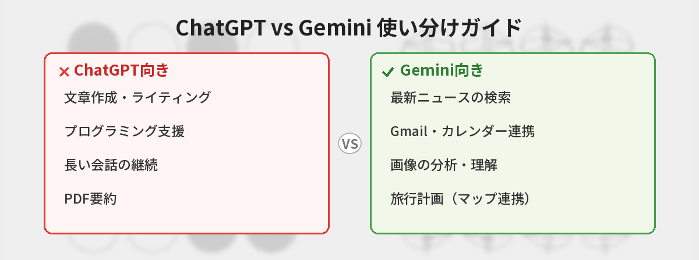

## この記事で分かること


ChatGPTとGeminiってどっちがいいの？両方無料で使えるみたいだけど、違いが分からなくて…



どっちも優秀だけど、得意分野が違うんだ。用途に合わせて使い分けるのがベストだよ。具体的に比較していこう。


「ChatGPTとGemini、どっちを使えばいいの？」という質問をよく見かけます。

結論から言うと、**どちらも優秀なので、用途に合わせて使い分けるのがベスト**です。この記事では、両者の違いを初心者にも分かりやすく比較します。

## 基本スペック比較表

| 項目 | ChatGPT | Gemini |
|------|---------|--------|
| 開発元 | OpenAI | Google |
| 無料プラン | あり（GPT-4o制限付き） | あり（Gemini Pro） |
| 有料プラン | Plus：月額20ドル | Advanced：月額2,900円 |
| 日本語対応 | ◎（自然な日本語） | ○（やや直訳調の場合あり） |
| 画像生成 | ◎（DALL·E 3統合） | ◎（Imagen 3統合） |
| Web検索 | ○（Bing連携） | ◎（Google検索連携） |
| ファイルアップロード | ◎（PDF・Excel等対応） | ◎（PDF・画像等対応） |



## ChatGPTが得意なこと

### 1. 文章作成・ライティング

ChatGPTは日本語の文章作成において非常に高い品質を発揮します。ビジネスメール、ブログ記事、レポートなど、幅広い文章を自然な日本語で生成できます。

### 2. プログラミング支援

コード生成・デバッグ・コードレビューなど、プログラミング関連のタスクはChatGPTが一歩リードしています。Code Interpreterを使えば、コードの実行結果も確認できます。AIを使ったプログラミングに興味がある方は、[バイブコーディングとは？AIに指示するだけでアプリが作れる時代](/posts/vibe-coding-beginner/)もご覧ください。

### 3. 長い会話の維持

ChatGPTは会話の文脈を長く保持するのが得意です。複雑なプロジェクトについて何度もやり取りする場合に便利です。

## Geminiが得意なこと


じゃあGeminiの方が得意なことって何？



Geminiの最大の強みはGoogleサービスとの連携だよ。Gmail、カレンダー、ドキュメントと直接つながるのはGeminiだけなんだ。


### 1. 最新情報の取得（Google検索連携）

GeminiはGoogle検索とネイティブに連携しているため、最新のニュースやトレンド情報を正確に取得できます。「今日の天気」「最新のニュース」といったリアルタイム情報に強いです。

### 2. Googleサービスとの統合

Gmail、Googleドキュメント、Googleカレンダー、Googleマップなど、Googleのサービスと直接連携できるのはGeminiだけの強みです。

例えば：
- 「先週届いたAmazonの注文確認メールを探して」
- 「明日の予定を教えて」
- 「このドキュメントを要約して」

### 3. 画像理解・分析

Geminiは画像の理解力が高く、写真やスクリーンショットの内容を詳しく分析できます。手書きのメモを読み取ったり、グラフを解釈したりするのが得意です。

## 用途別おすすめ使い分けガイド

| やりたいこと | おすすめ | 理由 |
|-------------|---------|------|
| ビジネスメール作成 | ChatGPT | 日本語の自然さが優秀 |
| プログラミング | ChatGPT | コード品質が高い |
| 最新ニュースの要約 | Gemini | Google検索連携が強力 |
| Gmail内のメール検索 | Gemini | Gmail連携はGeminiだけ |
| 画像生成 | どちらでも | 両方とも高品質 |
| PDF要約 | ChatGPT | ファイル処理が安定 |

PDF要約の具体的なやり方は[ChatGPTでPDFを要約する方法](/posts/chatgpt-pdf-summary/)で解説しています。また、長大なドキュメントの処理には[Claudeの100万トークン活用法](/posts/claude-long-document/)も選択肢に入ります。
| 旅行計画 | Gemini | Googleマップ連携が便利 |
| 英語学習 | ChatGPT | 会話の文脈保持が優秀 |
| スケジュール管理 | Gemini | Googleカレンダー連携 |

## 料金プランの比較

### 無料で使う場合

- **ChatGPT**：GPT-4oが回数制限付きで利用可能。基本的な用途には十分
- **Gemini**：Gemini Proが利用可能。Google検索連携も無料で使える

### 有料プランの場合

- **ChatGPT Plus**（月額20ドル）：GPT-4oの利用上限アップ、DALL·E 3、Code Interpreter
- **Gemini Advanced**（月額2,900円）：Gemini Ultra、2TBのGoogleストレージ付き

コスパで選ぶなら、Googleストレージ（通常月額1,300円）が付いてくるGemini Advancedがお得です。

## 筆者が両方使って感じた正直な感想

実際に3ヶ月間、ChatGPTとGeminiを毎日使い比べた感想を書きます。

### ChatGPTの方が良かった場面

- **ブログ記事の下書き**: 日本語の自然さが段違い。Geminiだと「〜することが可能です」のような硬い表現が多くなりがち
- **コードのデバッグ**: エラーメッセージを貼り付けたとき、ChatGPTの方が的確に原因を特定してくれた
- **長い会話の継続**: 20往復以上のやり取りでも、最初に伝えた条件を覚えていてくれた

### Geminiの方が良かった場面

- **「先週のメールで〇〇って書いてあったやつ探して」**: Gmail連携が神。ChatGPTにはできない
- **最新ニュースの要約**: Google検索と直結しているので、情報の鮮度が高い
- **Googleドキュメントの編集**: 「この文書の3ページ目を要約して」が一発でできる

### 結局どう使い分けているか

- 文章を書くとき → ChatGPT
- 調べものをするとき → Gemini
- Googleサービスと連携したいとき → Gemini
- プログラミング → ChatGPT

## 結論：どっちがいい？

**万能さで選ぶならChatGPT、Google連携で選ぶならGemini**です。

- 迷ったらまずは**ChatGPT**を使ってみましょう。日本語の品質が高く、幅広い用途に対応できます
- Googleのサービス（Gmail・カレンダー・ドキュメント）をよく使う人は**Gemini**が便利です

ChatGPTの始め方は[ChatGPTの始め方 ― 登録から最初の質問まで5分で完了](/posts/chatgpt-first-step/)で解説しています。Geminiの活用法は[GeminiでGmail・Googleドキュメントと連携する方法](/posts/gemini-google-workspace/)をご覧ください。
- 両方とも無料で使えるので、**実際に試して自分に合う方を選ぶ**のが一番です

どちらか一つに絞る必要はありません。用途に応じて使い分けるのが、AIを最大限活用するコツです。


なるほど、両方使い分ければいいんだ！まずはChatGPTから試してみる！



それがいいよ。どっちも無料で使えるから、実際に触ってみて自分に合う方を見つけてね。


## よくある質問（FAQ）

### Q: 完全無料で使い続けるならどちらがおすすめですか？
A: Google検索との連携を重視するならGemini、文章作成やプログラミングを重視するならChatGPTがおすすめです。どちらも無料プランで十分に使えます。

### Q: 有料プランはどちらがコスパがいいですか？
A: Gemini Advanced（月額2,900円）にはGoogle One 2TB（通常月額1,300円相当）が付いてくるため、Googleストレージも必要な方にはお得です。ChatGPT Plus（月額20ドル）はCode InterpreterやDALL·E 3が使える点が魅力です。

### Q: ChatGPTとGemini以外のAIも検討すべきですか？
A: はい、Claudeも有力な選択肢です。特に長文処理や慎重な回答が必要な場面ではClaudeが強いです。詳しくは[Claudeの特徴とChatGPTとの違い](/posts/claude-what-is-it/)をご覧ください。

### Q: 仕事で使うならどちらがいいですか？
A: ビジネスメールや報告書の作成にはChatGPT、Googleカレンダーやメールとの連携にはGeminiが向いています。両方を試して、自分の業務に合う方を選んでください。

## まとめ

- ChatGPTは文章作成・プログラミングが得意
- GeminiはGoogle検索連携・Googleサービス統合が強み
- 両方無料で使えるので、用途に応じて使い分けるのがベスト
- 迷ったらまずChatGPTから始めるのがおすすめ

---
### あわせて読みたい
- [Claudeの特徴とChatGPTとの違いを解説](/posts/claude-what-is-it/)
- [GeminiでGmail・Googleドキュメントと連携する方法](/posts/gemini-google-workspace/)
