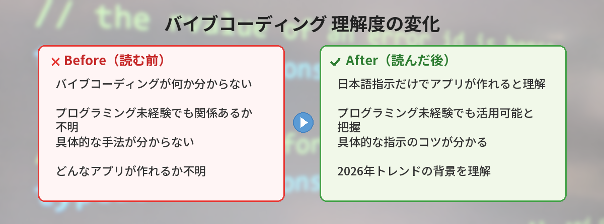

## この記事で分かること


「バイブコーディング」って最近よく聞くんだけど…プログラミングできない私でも関係あるの？



むしろプログラミング未経験の人にこそ関係あるよ！日本語で「こういうの作って」って指示するだけでアプリが作れちゃう手法なんだ。2026年の大トレンドだから、仕組みとコツを紹介するね。




「バイブコーディングって最近よく聞くけど、何のこと？」

2025年末にOpenAIの元研究者アンドレイ・カルパシーが提唱し、2026年に爆発的に広まった新しいプログラミングの形を解説します。



## バイブコーディングとは

バイブコーディング（Vibe Coding）は、AIに日本語で「こういうものを作って」と指示するだけでプログラムを作る手法です。

従来のプログラミング：
```
自分でコードを1行ずつ書く → テスト → デバッグ → 完成
```

バイブコーディング：
```
AIに「こういうアプリ作って」と伝える → AIがコードを生成 → 確認 → 完成
```

つまり、プログラミング言語を知らなくても、日本語で指示を出せればアプリが作れるということです。AIへの指示（プロンプト）の書き方については、[コピペで使えるChatGPTプロンプト10選](/posts/chatgpt-prompt-template/)も参考になります。

## なぜ2026年に流行っているのか

- 2026年時点で、GitHubにコミットされるコードの51%以上がAI生成または支援
- Collins英語辞典が「vibe coding」を2025年のWord of the Yearに選出
- ChatGPT、Claude、Geminiなど主要AIの性能が大幅に向上し、実用レベルに到達

各AIの違いについては[ChatGPTとGemini、結局どっちがいい？](/posts/gemini-vs-chatgpt/)や[Claudeの特徴とChatGPTとの違い](/posts/claude-what-is-it/)で比較しています。

## 実際にやってみる

### 例1: ChatGPTでWebページを作る

```
以下の条件でHTMLのWebページを作ってください。

- タイトル：「私の自己紹介ページ」
- 背景色：薄い青
- 中央に名前と趣味を表示
- レスポンシブ対応（スマホでも見やすく）
- CSSはHTMLファイル内に含める
```

ChatGPTがHTMLコードを生成してくれます。それをファイルに保存してブラウザで開くだけで、Webページが完成します。

### 例2: 簡単なツールを作る

```
Pythonで以下のツールを作ってください。

- CSVファイルを読み込む
- 「売上」列の合計と平均を計算する
- 結果をターミナルに表示する
- ファイル名はコマンドライン引数で指定する
```

### 例3: ゲームを作る

```
JavaScriptで以下のブラウザゲームを作ってください。

- 画面に数字が表示される
- 制限時間10秒以内にその数字をクリックする
- 正解するとスコアが増える
- 制限時間が来たらスコアを表示する
- HTML1ファイルで完結させる
```

## バイブコーディングのコツ

### 具体的に指示する

```
NG: アプリ作って
OK: ToDoリストアプリを作ってください。タスクの追加・削除・完了チェックができて、
    データはブラウザのローカルストレージに保存してください。
```

### 段階的に作る

一度に全部作ろうとせず、小さく分けて指示する方がうまくいきます。

```
1回目: まず基本的な画面を作って
2回目: ここにボタンを追加して
3回目: ボタンを押したらデータを保存する機能を追加して
```

### エラーが出たらそのまま貼る

動かないときは、エラーメッセージをそのままAIに貼り付けてください。AIを使ったコーディング支援ツールについては、[AIコーディングアシスタントの選び方](/posts/ai-coding-assistant/)でも詳しく紹介しています。

```
このエラーが出ました。修正してください。

TypeError: Cannot read properties of undefined (reading 'map')
```

## バイブコーディングの限界

万能ではありません。以下の点は理解しておきましょう。

- 大規模なアプリケーションは難しい（小さなツールやプロトタイプ向き）
- セキュリティの考慮が不十分な場合がある（本番環境では専門家のレビューが必要）
- AIが生成したコードの動作は必ず自分で確認する
- 「なぜそう動くのか」を理解していないと、問題が起きたときに対処できない

バイブコーディングで作ったアプリを副業に活かしたい方は、[AIを使った副業の始め方](/posts/ai-side-job-beginner/)もあわせてご覧ください。

## 実際にバイブコーディングでアプリを作ってみた

プログラミング経験なしの状態で、ChatGPTに指示するだけでWebアプリを作る実験をしました。

### 作ったもの: シンプルなTODOアプリ

- 指示: 「タスクを追加・完了・削除できるTODOアプリをHTMLとJavaScriptで作って」
- 所要時間: 約30分（指示の修正を含む）
- 結果: 動くものが完成した

### うまくいったこと

- 基本機能は一発で動いた
- デザインの修正も「もっとシンプルに」「色を青系に」で対応してくれた

### うまくいかなかったこと

- 複雑な機能（ドラッグ&ドロップで並べ替え）は何度も修正が必要だった
- エラーが出たとき、自分で原因を理解できないので修正に時間がかかった
- 「なぜそう動くのか」が分からないまま完成するので、カスタマイズが難しい

### 結論

簡単なツールなら本当に作れる。ただし「プログラミングを学ばなくていい」わけではなく、基礎知識があった方が圧倒的に効率が良い。

## よくある質問（FAQ）


### Q: プログラミングの知識がゼロでもバイブコーディングはできますか？
A: はい、日本語で「こういうものを作って」と指示するだけで始められます。ただし、エラーが出たときの対処や、生成されたコードの動作確認は必要です。基礎的な知識があると、より効率的に進められます。

### Q: バイブコーディングにはどのAIがおすすめですか？
A: ChatGPT、Claude、Geminiのいずれでも可能です。コード生成の品質ではChatGPTとClaudeが一歩リードしています。まずは[ChatGPTの始め方](/posts/chatgpt-first-step/)から試してみてください。

### Q: バイブコーディングで作ったアプリを公開・販売してもいいですか？
A: はい、AIが生成したコードの著作権は基本的に利用者に帰属します（各AIの利用規約を確認してください）。ただし、セキュリティや品質の面で、公開前に専門家のレビューを受けることをおすすめします。

### Q: 本格的なアプリ開発にもバイブコーディングは使えますか？
A: 小さなツールやプロトタイプには向いていますが、大規模なアプリケーションの開発にはプログラミングの知識が必要です。まずは小さなプロジェクトから始めて、徐々にスキルを身につけていくのがおすすめです。

### Q: バイブコーディングで作れるものの具体例は？
A: Webページ、簡単なゲーム、データ処理ツール、TODOアプリ、計算ツールなどが代表的です。HTMLやPythonの小さなプログラムから始めるのが取り組みやすいです。


え、私でもWebページ作れちゃうの…！？「具体的に、段階的に」指示するのがコツなんだね。自己紹介ページから作ってみたい！



いいね！最初は簡単なHTMLページから始めてみて。エラーが出ても慌てずにそのままAIに貼り付ければ直してくれるから、気軽にチャレンジしてみてね。



---

## 実際にバイブコーディングを試してみた！（筆者の体験）

筆者が「Todoアプリ」をバイブコーディング（AIに指示だけ出して全部書かせる）で作ってみた結果です。

### かかった時間

- **プロンプト入力**: 5分（「React+TypeScriptでTodoアプリを作って。追加・削除・完了チェックの機能付き」）
- **AI生成待ち**: 30秒
- **動作確認+修正**: 15分（レイアウト崩れの修正を3回指示）
- **合計**: 約20分

### 手動で書いた場合との比較

同じアプリを自分で書くと約2時間。**6倍の時短**になりました。

### バイブコーディングの限界

- 要件が曖昧だと的外れなコードが出てくる
- 既存プロジェクトへの追加は苦手（ファイル構成を理解させるのが手間）
- セキュリティ面の検証は自分でやる必要がある

「ゼロからシンプルなものを作る」ときはバイブコーディング最強。「既存コードの修正・拡張」は従来通り自分で書く方が早い。

バイブコーディングは「プログラミングの民主化」とも言える動き。コードが書けなくても、アイデアさえあればプロトタイプが作れる時代が来ています。まずはシンプルなアプリ（Todoリスト、カウンター等）から試して、AIとの対話でコードを作る体験をしてみてください。


### バイブコーディングでよくある失敗と対処法

| 失敗パターン | 対処法 |
|-------------|--------|
| 要件が曖昧でAIが見当違いのコードを出す | 入力・出力・画面イメージを具体的に伝える |
| 生成されたコードにバグがある | 「テストコードも書いて」と依頼して自動検証 |
| 動くけどセキュリティに問題がある | 「セキュリティ面で問題ないか確認して」と追加質問 |
| 大きなプロジェクトで文脈が途切れる | 機能ごとに小さく分割して依頼する |

### バイブコーディングに向いている人・向いていない人

**向いている人**: アイデアはあるがコーディングスキルが追いつかない人、プロトタイプを高速で作りたい人

**向いていない人**: プログラミングの基礎を学びたい人（AIに任せすぎると学習にならない）、複雑なシステムを構築したい人


### 今日から試せるアクション

1. ChatGPTに「Todoアプリを作って」と聞いてみる（言語指定なしでOK）
2. 生成されたコードをコピーしてファイルに保存し、実行してみる
3. 「追加で削除機能をつけて」と追加依頼して、コードが更新される体験をする
4. 「自分ならどこを変えたいか」を考えて、AIに修正を依頼する


### バイブコーディングで最初に作るべきアプリ3選

1. **Todoアプリ**: CRUD操作の基本。AIに一番作らせやすい題材
2. **カウンター**: 状態管理の基本が学べる。10行程度で完成
3. **じゃんけんゲーム**: 条件分岐の学習。ランダム要素もAIが得意

いきなり複雑なアプリを作ろうとせず、これら3つから始めるのがおすすめです。

## まとめ

- バイブコーディングは「AIに日本語で指示してプログラムを作る」手法
- 2026年の最大トレンドで、プログラミング未経験者でも始められる
- 具体的に、段階的に指示するのがコツ
- 小さなツールやプロトタイプ作りに最適

---
### あわせて読みたい
- [ChatGPTの始め方 ― 登録から最初の質問まで5分で完了](/posts/chatgpt-first-step/)
- [AIを使った副業の始め方 ― 月1万円を目指すロードマップ](/posts/ai-side-job-beginner/)

